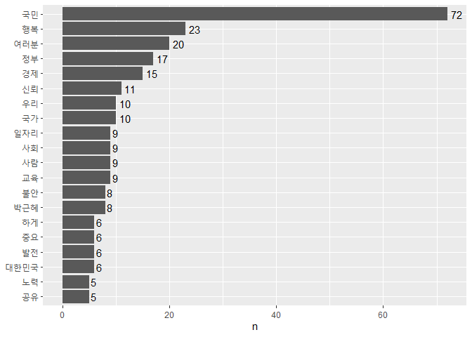

Quiz Part 2
===========

#### 박근혜 전 대통령의 대선 출마 선언문이 들어있는 `speech_park.txt`를 이용해 문제를 해결해 보세요.

[Q1. `speech_park.txt`를 불러와 분석에 적합하게 전처리한 다음 연설문에서
명사를 추출하세요.](#Q1)

[Q2. 가장 자주 사용된 단어 20개를 추출하세요.](#Q2)

[Q3. 가장 자주 사용된 단어 20개의 빈도를 나타낸 막대 그래프를
만드세요.](#Q3)

[Q4. 전처리하지 않은 연설문에서 연속된 공백을 제거하고 tibble 구조로
변환한 다음 문장 기준으로 토큰화하세요.](#Q4)

[Q5. 연설문에서 `"경제"`가 사용된 문장을 출력하세요.](#Q5)

------------------------------------------------------------------------

#### Q1. `speech_park.txt`를 불러와 분석에 적합하게 전처리한 다음 연설문에서 명사를 추출하세요.<a name="Q1"></a>

##### 전처리

``` r
raw_park <- readLines("speech_park.txt", encoding = "UTF-8")
```

``` r
library(dplyr)
library(stringr)
park <- raw_park %>%
  str_replace_all("[^가-힣]", " ") %>%  # 한글만 남기기
  str_squish() %>%                      # 연속된 공백 제거
  as_tibble()                           # tibble로 변환

park
```

    ## # A tibble: 96 x 1
    ##    value                                                                        
    ##    <chr>                                                                        
    ##  1 "존경하는 국민 여러분 저는 오늘 국민 한 분 한 분의 꿈이 이루어지는 행복한 대한민국을 만들기 위해 저의 모든 것을 바치겠다는 각오로 ~
    ##  2 ""                                                                           
    ##  3 "국민 여러분 저의 삶은 대한민국과 함께 해온 시간이었습니다 우리나라가 가난을 이기고 꿈을 이뤄가는 위대한 과정을 어린 시절부터 가슴깊이~
    ##  4 ""                                                                           
    ##  5 "어머니가 흉탄에 돌아가신 후 견딜 수 없는 고통과 어려움 속에서도 그 힘든 시간을 이겨낼 수 있었던 것은 어머니의 빈자리에 대한 책임감~
    ##  6 ""                                                                           
    ##  7 "그때부터 제 삶은 완전히 다른 길을 가야했습니다 개인의 삶 대신 국민과 함께 하는 공적인 삶이 시작되었습니다 각계각층의 국민들을 만나고~
    ##  8 ""                                                                           
    ##  9 "아버지를 잃는 또 다른 고통과 아픔을 겪고 저는 평범한 삶을 살고자 했습니다 하지만 국민들의 땀과 눈물로 이룩해 온 나라가 외환위기를 ~
    ## 10 ""                                                                           
    ## # ... with 86 more rows

##### 명사 기준 토큰화

``` r
library(tidytext)
library(KoNLP)
word_noun <- park %>%
  unnest_tokens(input = value,
                output = word,
                token = extractNoun)

word_noun
```

    ## # A tibble: 1,240 x 1
    ##    word  
    ##    <chr> 
    ##  1 존경  
    ##  2 하    
    ##  3 국민  
    ##  4 여러분
    ##  5 저    
    ##  6 오늘  
    ##  7 국민  
    ##  8 한    
    ##  9 분    
    ## 10 한    
    ## # ... with 1,230 more rows

------------------------------------------------------------------------

#### Q2. 가장 자주 사용된 단어 20개를 추출하세요.<a name="Q2"></a>

``` r
top20 <- word_noun %>%
  count(word, sort = T) %>%
  filter(str_count(word) > 1) %>%
  head(20)

top20
```

    ## # A tibble: 20 x 2
    ##    word         n
    ##    <chr>    <int>
    ##  1 국민        72
    ##  2 행복        23
    ##  3 여러분      20
    ##  4 정부        17
    ##  5 경제        15
    ##  6 신뢰        11
    ##  7 국가        10
    ##  8 우리        10
    ##  9 교육         9
    ## 10 사람         9
    ## 11 사회         9
    ## 12 일자리       9
    ## 13 박근혜       8
    ## 14 불안         8
    ## 15 대한민국     6
    ## 16 발전         6
    ## 17 중요         6
    ## 18 하게         6
    ## 19 공유         5
    ## 20 노력         5

------------------------------------------------------------------------

#### Q3. 가장 자주 사용된 단어 20개의 빈도를 나타낸 막대 그래프를 만드세요.<a name="Q3"></a>

``` r
library(ggplot2)
ggplot(top20, aes(x = reorder(word, n), y = n)) +
  geom_col() +
  coord_flip () +
  geom_text(aes(label = n), hjust = -0.3) +
  labs(x = NULL)
```



------------------------------------------------------------------------

#### Q4. 전처리하지 않은 연설문에서 연속된 공백을 제거하고 tibble 구조로 변환한 다음 문장 기준으로 토큰화하세요.<a name="Q4"></a>

``` r
sentences_park <- raw_park %>%
  str_squish() %>%                    # 연속된 공백 제거
  as_tibble() %>%                     # tibble로 변환
  unnest_tokens(input = value,
                output = sentence,
                token = "sentences")

sentences_park
```

    ## # A tibble: 117 x 1
    ##    sentence                                                                     
    ##    <chr>                                                                        
    ##  1 존경하는 국민 여러분!                                                        
    ##  2 저는 오늘, 국민 한 분 한 분의 꿈이 이루어지는 행복한 대한민국을 만들기 위해, 저의 모든 것을 바치겠다는 각오로 이 자리에 섰습니다.~
    ##  3 저 박근혜, 이번 18대 대통령선거 출마를 선언합니다.                           
    ##  4 국민 여러분!                                                                 
    ##  5 저의 삶은 대한민국과 함께 해온 시간이었습니다.                               
    ##  6 우리나라가 가난을 이기고, 꿈을 이뤄가는 위대한 과정을 어린 시절부터 가슴깊이 새겨왔습니다.~
    ##  7 어머니가 흉탄에 돌아가신 후, 견딜 수 없는 고통과 어려움 속에서도 그 힘든 시간을 이겨낼 수 있었던 것은, 어머니의 빈자리에 대한 책임~
    ##  8 그리고 늘 함께 해주시고 힘이 되어 주셨던 국민 여러분이 계셨기 때문이었습니다.
    ##  9 제가 그 막중한 일을 해내고, 고통을 이겨내고 다시 일어설 수 있었던 것은 모두 국민 여러분이 계셨기 때문이었습니다.~
    ## 10 그때부터 제 삶은 완전히 다른 길을 가야했습니다.                              
    ## # ... with 107 more rows

------------------------------------------------------------------------

#### Q5. 연설문에서 `"경제"`가 사용된 문장을 출력하세요.<a name="Q5"></a>

``` r
sentences_park %>%
  filter(str_detect(sentence, "경제"))
```

    ## # A tibble: 11 x 1
    ##    sentence                                                                     
    ##    <chr>                                                                        
    ##  1 국가는 발전했고, 경제는 성장했다는데, 나의 삶은 나아지지 않았고, 나의 행복은 커지지 않았습니다.~
    ##  2 저는 ‘경제민주화 실현’, ‘일자리 창출’, 그리고 ‘한국형 복지의 확립’을 국민행복을 위한 3대 핵심과제로 삼겠습니다.~
    ##  3 국민행복의 길을 열어갈 첫 번째 과제로, 저는 경제민주화를 통해 중소기업인을 비롯한 경제적 약자들의 꿈이 다시 샘솟게 하겠습니다.~
    ##  4 그동안 우리 경제는 효율성을 지나치게 강조하면서 공정성의 중요성을 간과하였고, 그 결과 경제주체간에 격차가 확대되고, 불균형이 심화되어 ~
    ##  5 공정하고 투명한 시장경제 질서를 확립해 경제민주화를 실현하는 일은 시대적 과제입니다.~
    ##  6 정당한 기업활동은 최대한 보장하고 불필요한 규제는 철폐하여 경제에 활력을 불어넣겠지만, 영향력이 큰 기업일수록 사회적 책임을 다할 수 있~
    ##  7 수출 일변도의 경제구조에서 벗어나 수출과 내수가 동시에 성장을 견인하는 쌍끌이 경제를 만들어 내수 중소기업을 키워나가면서 더 많은 일자리~
    ##  8 복지가 국민 개개인이 가진 자기 역량을 뒷받침하고 끌어내서 자립·자활을 가능하게 함으로써 경제와 복지의 선순환이 일어나도록 만들어 가겠습~
    ##  9 국민 여러분, 올해는 우리나라 경제발전의 틀을 마련한 경제개발 5개년 계획을 시작한지 50주년 되는 해입니다.~
    ## 10 저는 국민행복을 위해 ‘경제민주화-일자리-복지’를 아우르는 (가칭)‘오천만 국민행복 플랜’을 수립하여 추진하겠습니다.~
    ## 11 50년 전 경제개발 5개년 계획이 산업화의 기적을 이뤄냈듯,‘오천만 국민행복 플랜’을 통해, 앞으로 50년 이상 지속될 수 있는 국민행복~
