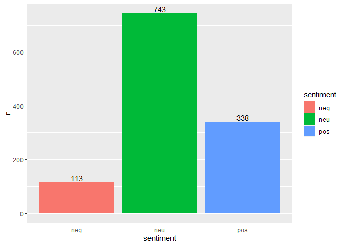
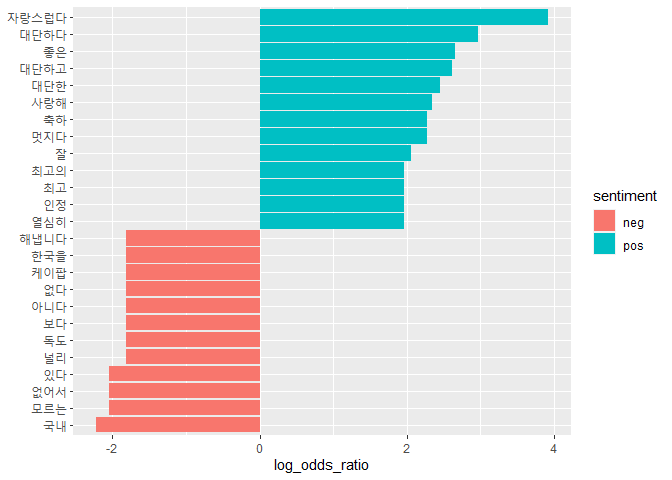

Quiz Part 4
===========

#### `"news_comment_BTS.csv"`에는 2020년 9월 21일 방탄소년단이 ‘빌보드 핫 100 차트’ 1위에 오른 소식을 다룬 기사에 달린 댓글이 들어있습니다. `"news_comment_BTS.csv"`를 이용해 문제를 해결해 보세요.

[Q1. `"news_comment_BTS.csv"`를 불러온 다음 행 번호를 나타낸 변수를
추가하고 분석에 적합하게 전처리하세요.](#Q1)

[Q2. 댓글을 띄어쓰기 기준으로 토큰화하고 감정 사전을 이용해 댓글의 감정
점수를 구하세요.](#Q2)

[Q3. 감정 범주별 댓글 빈도를 나타낸 막대 그래프를 만드세요.](#Q3)

[Q4. 댓글을 띄어쓰기 기준으로 토큰화한 다음 감정 범주별 단어 빈도를
구하세요.](#Q4)

[Q5. 로그 오즈비를 이용해 긍정 댓글과 부정 댓글에 상대적으로 자주 사용된
단어를 10개씩 추출하세요.](#Q5)

[Q6. 긍정 댓글과 부정 댓글에 상대적으로 자주 사용된 단어를 나타낸 막대
그래프를 만드세요.](#Q6)

[Q7. ’Q3’에서 만든 데이터를 이용해 ’긍정 댓글에 가장 자주 사용된 단어’를
언급한 댓글을 감정 점수가 높은 순으로 출력하세요.](#Q7)

[Q8. ’Q3’에서 만든 데이터를 이용해 ’부정 댓글에 가장 자주 사용된 단어’를
언급한 댓글을 감정 점수가 낮은 순으로 출력하세요.](#Q8)

------------------------------------------------------------------------

#### Q1. `"news_comment_BTS.csv"`를 불러온 다음 행 번호를 나타낸 변수를 추가하고 분석에 적합하게 전처리하세요.<a name="Q1"></a>

##### 기사 댓글 불러오기

``` r
library(readr)
library(dplyr)
raw_news_comment <- read_csv("news_comment_BTS.csv")
glimpse(raw_news_comment)
```

    ## Rows: 1,200
    ## Columns: 5
    ## $ reg_time <dttm> 2020-09-01 22:58:09, 2020-09-01 09:56:46, 2020-09-01 09:0...
    ## $ reply    <chr> "국보소년단<U+0001F49C>", "아줌마가 들어도 좋더라", "팩트체크\r\n\r\n현재 빌보드 H...
    ## $ press    <chr> "한국경제", "한국경제", "한국경제", "한국경제", "한국경제", "한국경제", "한국경제", "한...
    ## $ title    <chr> "[속보]BTS '다이너마이트', 한국 가수 최초로 빌보드 싱글 1위", "[속보]BTS '다이너마이트'...
    ## $ url      <chr> "https://news.naver.com/main/read.nhn?mode=LSD&mid=sec&sid...

##### 전처리

``` r
library(stringr)
library(textclean)
news_comment <- raw_news_comment %>%
  mutate(id = row_number(),
         reply = str_squish(replace_html(reply)))

news_comment %>%
  select(id, reply)
```

    ## # A tibble: 1,200 x 2
    ##       id reply                                                                  
    ##    <int> <chr>                                                                  
    ##  1     1 국보소년단                                                             
    ##  2     2 아줌마가 들어도 좋더라                                                 
    ##  3     3 팩트체크 현재 빌보드 HOT 100 1위 방탄소년단[BTS] 2위 Cardi B ft. Megan Thee Stallion 3~
    ##  4     4 방탄소년단이 한국사람이라 너무 자랑스러워요 ㅠㅠ 우리오래오래 함께하자!
    ##  5     5 대단한 BTS, 월드 클래스는 다르네^^ 좋은 소식!! 응원해요                
    ##  6     6 정국오빠 생일과 더불어 빌보드 1위기사라니ㅠㅠ축제구나                  
    ##  7     7 정말 축하하고 응원하지만 집에서 여러 계정으로 스트리밍 돌리고 사재기하고 다른 팬덤 테러하는 애들은 개념보고 놀랐다 진짜 ㅋ~
    ##  8     8 기자는 자고 일어났지만, 팬들은 못자고 발표 기다림                      
    ##  9     9 자랑스럽다!!!!!! 축하합니다!!!!                                        
    ## 10    10 SuperM 늘 응원하고 사랑합니다~                                         
    ## # ... with 1,190 more rows

------------------------------------------------------------------------

#### Q2. 댓글을 띄어쓰기 기준으로 토큰화하고 감정 사전을 이용해 댓글의 감정 점수를 구하세요.<a name="Q2"></a>

##### 토큰화

``` r
library(tidytext)
library(KoNLP)
word_comment <- news_comment %>%
  unnest_tokens(input = reply,
                output = word,
                token = "words",  # 띄어쓰기 기준
                drop = F)         # 원문 유지

word_comment %>%
  select(word)
```

    ## # A tibble: 11,673 x 1
    ##    word      
    ##    <chr>     
    ##  1 국보소년단
    ##  2 아줌마가  
    ##  3 들어도    
    ##  4 좋더라    
    ##  5 팩트체크  
    ##  6 현재      
    ##  7 빌보드    
    ##  8 hot       
    ##  9 100       
    ## 10 1         
    ## # ... with 11,663 more rows

##### 감정 사전 불러오기

``` r
dic <- read_csv("knu_sentiment_lexicon.csv")
```

##### 단어에 감정 점수 부여

``` r
word_comment <- word_comment %>%
  left_join(dic, by = "word") %>%
  mutate(polarity = ifelse(is.na(polarity), 0, polarity))

word_comment %>%
  select(word, polarity) %>%
  arrange(-polarity)
```

    ## # A tibble: 11,673 x 2
    ##    word       polarity
    ##    <chr>         <dbl>
    ##  1 대단한            2
    ##  2 좋은              2
    ##  3 자랑스럽다        2
    ##  4 자랑스럽다        2
    ##  5 자랑스럽다        2
    ##  6 장하다            2
    ##  7 꾸준히            2
    ##  8 행복한            2
    ##  9 대단한            2
    ## 10 대단한            2
    ## # ... with 11,663 more rows

##### 댓글별로 단어의 감정 점수 합산

``` r
score_comment <- word_comment %>%
  group_by(id, reply) %>%
  summarise(score = sum(polarity)) %>%
  ungroup()

score_comment %>%
  select(score, reply) %>%
  arrange(-score)
```

    ## # A tibble: 1,194 x 2
    ##    score reply                                                                  
    ##    <dbl> <chr>                                                                  
    ##  1     8 멋지다, 자랑스럽다, 대단하다 방탄소년단!!! 다이너마이트 빌보드 핫100 1위 진심으로 축하해요! 정국이 생일인데 최고의 선~
    ##  2     7 팬은 아니야. 그래서 저 노력과 업적이 더 대단해보여. 정말 멋지다. 잘생긴 사람 예쁜 사람 돈 많은 사람 이런 수식어 싸잡아~
    ##  3     6 축하 합니다 우리에 보물이네 대한미국에 애국자 들이다 나라 홍보도하고 달라도벌고 코로나만 아니면 관광객 유도 자랑스럽다 정치는~
    ##  4     6 우리딸이 보는 눈이 있네 호르몬전쟁 노래부터 애네들 좋아했는데 그때는 주변에 우리딸이 방탄 좋아한다면 아무도 모를땐데 그래서 ~
    ##  5     6 ㅜㅜ . 진짜 이 코로나에 너희들이 빛이여. 핫백 1위라니. 모든 기록을 다 갱신해버리는구나. . 진정 감사하고 고맙고 기쁘고~
    ##  6     6 축하 축하 아미분들도 축하^^                                            
    ##  7     6 정말 대단하고 자랑스럽습니다.. 국격이 업그레이드 된거 같습니다..축하 축하...~
    ##  8     6 빌보드 핫100 1위 축하해요 여기까지 오느라 힘들었을텐데 수고했어요 앞으로도 좋은 노래 많이 들려주세요! 좋은 것만 듣고 좋~
    ##  9     6 진짜 대단하다. K팝 아시아 최고 넘어서 빌보드 1위 등극 이제 BTS가 그냥 최고네. 이 기록은 정말 수십년동안 오르내리듯 ~
    ## 10     6 정국이 생일에 빌보드 핫100 1위라니... 정말 뜻깊은 하루네요ㅠㅠ 좋은 음악과 완벽한 무대 그리고 선한 영향력을 위해 항상~
    ## # ... with 1,184 more rows

------------------------------------------------------------------------

#### Q3. 감정 범주별 댓글 빈도를 나타낸 막대 그래프를 만드세요.<a name="Q3"></a>

##### 감정 범주 변수 생성

``` r
score_comment <- score_comment %>%
  mutate(sentiment = ifelse(score >=  1, "pos",
                     ifelse(score <= -1, "neg", "neu")))

score_comment %>%
  select(sentiment, reply)
```

    ## # A tibble: 1,194 x 2
    ##    sentiment reply                                                              
    ##    <chr>     <chr>                                                              
    ##  1 neu       국보소년단                                                         
    ##  2 neu       아줌마가 들어도 좋더라                                             
    ##  3 pos       팩트체크 현재 빌보드 HOT 100 1위 방탄소년단[BTS] 2위 Cardi B ft. Megan Thee Stalli~
    ##  4 neg       방탄소년단이 한국사람이라 너무 자랑스러워요 ㅠㅠ 우리오래오래 함께하자!~
    ##  5 pos       대단한 BTS, 월드 클래스는 다르네^^ 좋은 소식!! 응원해요            
    ##  6 neg       정국오빠 생일과 더불어 빌보드 1위기사라니ㅠㅠ축제구나              
    ##  7 neu       정말 축하하고 응원하지만 집에서 여러 계정으로 스트리밍 돌리고 사재기하고 다른 팬덤 테러하는 애들은 개념보고 놀랐다 진~
    ##  8 neu       기자는 자고 일어났지만, 팬들은 못자고 발표 기다림                  
    ##  9 pos       자랑스럽다!!!!!! 축하합니다!!!!                                    
    ## 10 neu       SuperM 늘 응원하고 사랑합니다~                                     
    ## # ... with 1,184 more rows

##### 감정 범주 빈도 구하기

``` r
frequency_score <- score_comment %>%
  count(sentiment)

frequency_score
```

    ## # A tibble: 3 x 2
    ##   sentiment     n
    ##   <chr>     <int>
    ## 1 neg         113
    ## 2 neu         743
    ## 3 pos         338

##### 막대 그래프 만들기

``` r
library(ggplot2)
ggplot(frequency_score, aes(x = sentiment, y = n, fill = sentiment)) +
  geom_col() +
  geom_text(aes(label = n), vjust = -0.3)
```



------------------------------------------------------------------------

#### Q4. 댓글을 띄어쓰기 기준으로 토큰화한 다음 감정 범주별 단어 빈도를 구하세요.<a name="Q4"></a>

##### 토큰화

``` r
comment <- score_comment %>%
  unnest_tokens(input = reply,
                output = word,
                token = "words",
                drop = F)
```

##### 감정 범주별 단어 빈도 구하기

``` r
frequency_word <- comment %>%
  count(sentiment, word, sort = T)

frequency_word
```

    ## # A tibble: 6,900 x 3
    ##    sentiment word           n
    ##    <chr>     <chr>      <int>
    ##  1 neu       1            126
    ##  2 pos       진짜          90
    ##  3 pos       1             82
    ##  4 neu       진짜          79
    ##  5 pos       자랑스럽다    77
    ##  6 neu       bts           72
    ##  7 pos       너무          70
    ##  8 neu       빌보드        66
    ##  9 pos       정말          57
    ## 10 neu       군면제        48
    ## # ... with 6,890 more rows

------------------------------------------------------------------------

#### Q5. 로그 오즈비를 이용해 긍정 댓글과 부정 댓글에 상대적으로 자주 사용된 단어를 10개씩 추출하세요.<a name="Q5"></a>

##### long form을 wide form으로 변환

``` r
library(tidyr)
comment_wide <- frequency_word %>%
  filter(sentiment != "neu") %>%
  pivot_wider(names_from = sentiment,
              values_from = n,
              values_fill = list(n = 0))

comment_wide
```

    ## # A tibble: 3,247 x 3
    ##    word         pos   neg
    ##    <chr>      <int> <int>
    ##  1 진짜          90    20
    ##  2 1             82    29
    ##  3 자랑스럽다    77     0
    ##  4 너무          70    14
    ##  5 정말          57     5
    ##  6 위            46    11
    ##  7 빌보드        40    15
    ##  8 방탄          39     8
    ##  9 방탄소년단    39    13
    ## 10 bts           37    21
    ## # ... with 3,237 more rows

##### 로그 오즈비 구하기

``` r
comment_wide <- comment_wide %>%
  mutate(log_odds_ratio = log(((pos + 1) / (sum(pos + 1))) /
                              ((neg + 1) / (sum(neg + 1)))))

comment_wide
```

    ## # A tibble: 3,247 x 4
    ##    word         pos   neg log_odds_ratio
    ##    <chr>      <int> <int>          <dbl>
    ##  1 진짜          90    20          1.03 
    ##  2 1             82    29          0.586
    ##  3 자랑스럽다    77     0          3.93 
    ##  4 너무          70    14          1.12 
    ##  5 정말          57     5          1.84 
    ##  6 위            46    11          0.934
    ##  7 빌보드        40    15          0.510
    ##  8 방탄          39     8          1.06 
    ##  9 방탄소년단    39    13          0.618
    ## 10 bts           37    21          0.115
    ## # ... with 3,237 more rows

##### 긍정, 부정 댓글에 상대적으로 자주 사용된 단어 추출

``` r
top10 <- comment_wide %>%
  group_by(sentiment = ifelse(log_odds_ratio > 0, "pos", "neg")) %>%
  slice_max(abs(log_odds_ratio), n = 10)

top10
```

    ## # A tibble: 25 x 5
    ## # Groups:   sentiment [2]
    ##    word     pos   neg log_odds_ratio sentiment
    ##    <chr>  <int> <int>          <dbl> <chr>    
    ##  1 국내       0     5          -2.22 neg      
    ##  2 모르는     0     4          -2.04 neg      
    ##  3 없어서     0     4          -2.04 neg      
    ##  4 있다       0     4          -2.04 neg      
    ##  5 널리       0     3          -1.82 neg      
    ##  6 독도       0     3          -1.82 neg      
    ##  7 보다       0     3          -1.82 neg      
    ##  8 아니다     0     3          -1.82 neg      
    ##  9 없다       0     3          -1.82 neg      
    ## 10 케이팝     0     3          -1.82 neg      
    ## # ... with 15 more rows

------------------------------------------------------------------------

#### Q6. 긍정 댓글과 부정 댓글에 상대적으로 자주 사용된 단어를 나타낸 막대 그래프를 만드세요.<a name="Q6"></a>

``` r
ggplot(top10, aes(x = reorder(word, log_odds_ratio),
                      y = log_odds_ratio,
                      fill = sentiment)) +
  geom_col() +
  coord_flip() +
  labs(x = NULL)
```



------------------------------------------------------------------------

#### Q7. ’Q3’에서 만든 데이터를 이용해 ’긍정 댓글에 가장 자주 사용된 단어’를 언급한 댓글을 감정 점수가 높은 순으로 출력하세요.<a name="Q7"></a>

``` r
score_comment %>%
  filter(str_detect(reply, "자랑스럽다")) %>%
  arrange(-score) %>%
  select(reply)
```

    ## # A tibble: 82 x 1
    ##    reply                                                                        
    ##    <chr>                                                                        
    ##  1 멋지다, 자랑스럽다, 대단하다 방탄소년단!!! 다이너마이트 빌보드 핫100 1위 진심으로 축하해요! 정국이 생일인데 최고의 선물이다, 진~
    ##  2 축하 합니다 우리에 보물이네 대한미국에 애국자 들이다 나라 홍보도하고 달라도벌고 코로나만 아니면 관광객 유도 자랑스럽다 정치는 한심스러운~
    ##  3 자랑스러운 방탄소년단.... 아~~이거 방탄소년단 아입니까!!!! 사랑하는 막둥이정국 생일에 빌보드핫백1위 너희가 정말 자랑스럽다 사랑해~
    ##  4 자랑스럽다 역사적인 길들을 함께 걸어갈 수 있어 감사하다                      
    ##  5 아시아에서 60년만에 빌보드 핫백 차트 1위 아시아에서 최초로 200차트와 핫백 차트 동시 진입 너무 멋지고 자랑스럽다ㅜㅜㅜ 팬을 떠나서~
    ##  6 와 진짜 너무 대단하고 자랑스럽다 ! 진짜 꿈인지 생시인지 모르겠네요! 이건 정말 방탄소년단이었기에 가능한 일이었어요 . 다시는 없을 기~
    ##  7 정말 대단하고 자랑스럽다~                                                    
    ##  8 이건 진짜 대서특필 감이다.. 혼란스러운 이 시국에 이렇게 기쁜 소식이라니 진짜 고맙다 대한민국 국민으로서 너무 자랑스럽다~
    ##  9 진짜 대박이다 방탄 역사를 썼다 대단하고 자랑스럽다!!!!                       
    ## 10 정말 너무 자랑스럽다. 역사의 순간에 있다는 게 고맙고 뿌듯하다                
    ## # ... with 72 more rows

------------------------------------------------------------------------

#### Q8. ’Q3’에서 만든 데이터를 이용해 ’부정 댓글에 가장 자주 사용된 단어’를 언급한 댓글을 감정 점수가 낮은 순으로 출력하세요.<a name="Q8"></a>

``` r
score_comment %>%
  filter(str_detect(reply, "국내")) %>%
  arrange(score) %>%
  select(reply)
```

    ## # A tibble: 10 x 1
    ##    reply                                                                        
    ##    <chr>                                                                        
    ##  1 "국위선양 한건 대단 하지만 40대 이후로는 BTS 이름만 알지 히트곡은 전혀모름 나만 그런가... 가수 이름 한명도 모름? 늙어서 그런~
    ##  2 "국내 국악대회 거기 입상한 애들도 군대 안간다던데 세계 1위 한거 인정해서 면죄 해줘도 뭐라 할사람 없다.."~
    ##  3 "아니 진짜 군면제하자 뭘더 얼마나 일등을 해야해 국내 클래식 콩쿨 1등해도 면제해주는 군면제를 아 진짜 얘들 아까워서 그래"~
    ##  4 "진짜 세계를 kpop이 이렇게 휩쓸고 있는데, 정작 국내는 뽕짝만 주구장창 나오는 꼴이 참 답답함"~
    ##  5 "아시아 아티스트로서는 57년만이랍니다... 방탄소년단 국내 시상식 대상도 못받았던 시절부터 좋아한 저는 감회가 새롭네요 진짜ㅠㅠㅠㅠ 킹~
    ##  6 "bts 너무 자랑스러워요 국내에는 웃을일이 없는데 bts 때문에 기분이 좋네요"    
    ##  7 "이렇게 국위선양하고 BTS때문에 파생되는 경제효과는 어마어마한데 애들은 군대 가야하고...국내 판소리, 무용 콩쿨등 시민들이 알지도 못~
    ##  8 "그냥 국내 1등 아이돌 가수같은데 감흥이없네 여튼 축하해요"                   
    ##  9 "아니 진짜 방탄 팬도아니고 그냥 노래 나오면 즐겨듣는정돈데 방탄 군대 왜보냄 진짜? 연예인중 국내를 대표할 수 있는 연예인 아닌가?진짜~
    ## 10 "국내 콩쿨에서 입상해도 군면제 해주는데... 신지어 빌보드 1위인데.. 군대 보내는건 ..뭐지.. BTS는 계속 음활동 시키는게 군복부~
