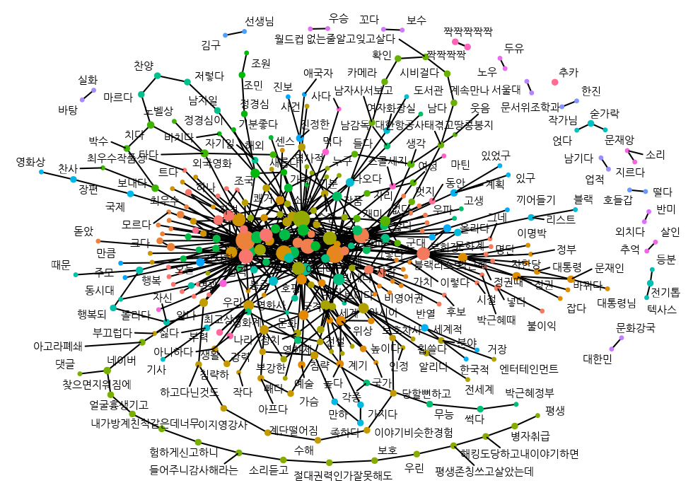
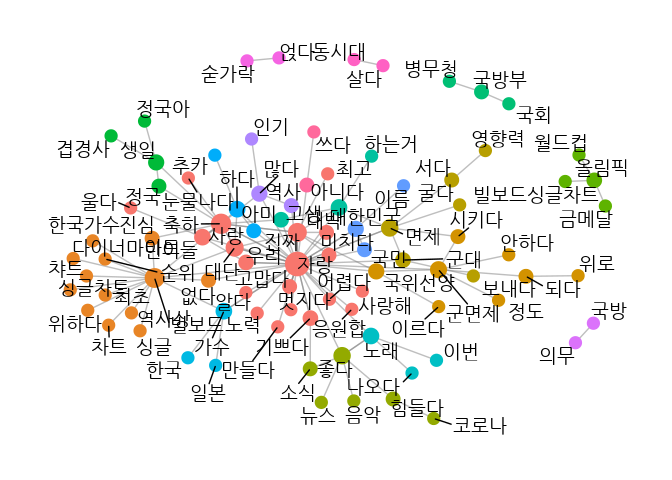
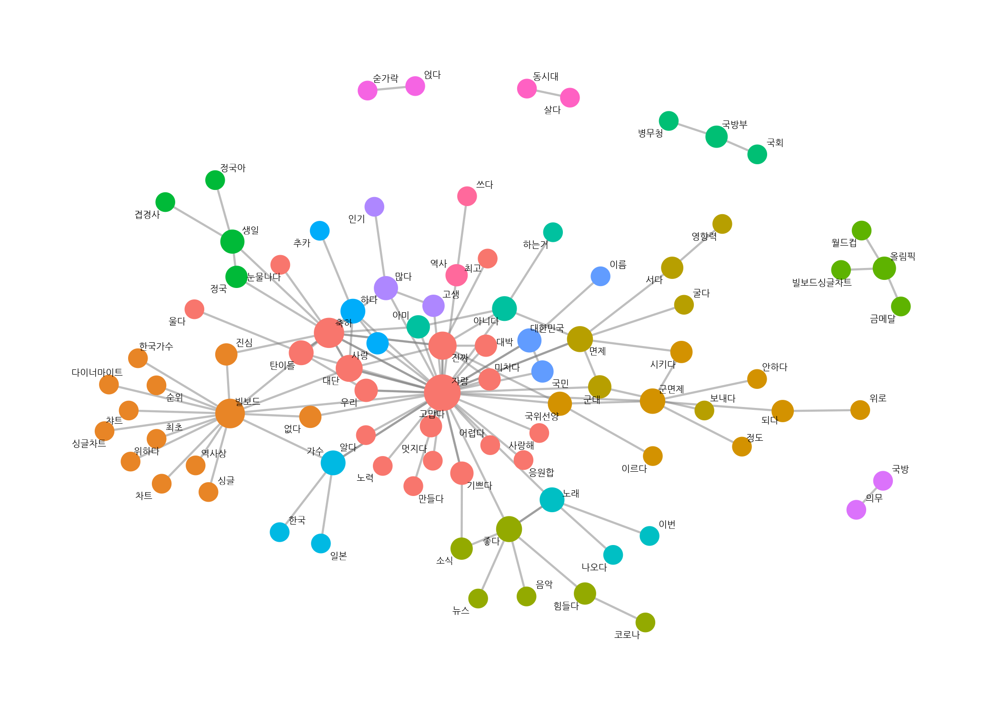
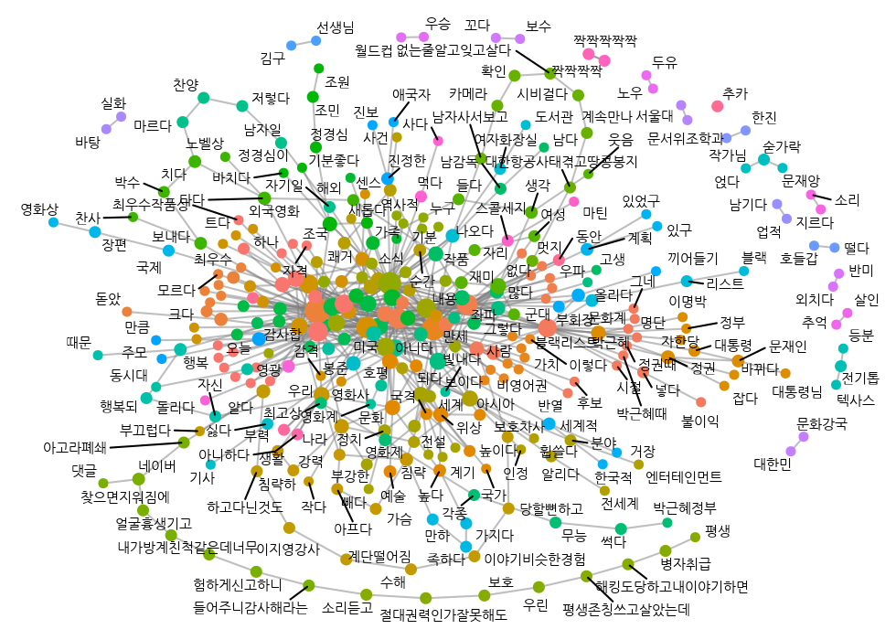

# Quiz Part 5

#### `"news_comment_BTS.csv"`에는 2020년 9월 21일 방탄소년단이 ‘빌보드 핫 100 차트’ 1위에 오른 소식을 다룬 기사에 달린 댓글이 들어있습니다. `"news_comment_BTS.csv"`를 이용해 문제를 해결해 보세요.

[Q1. `"news_comment_BTS.csv"`를 불러온 다음 행 번호를 나타낸 변수를
추가하고 분석에 적합하게 전처리하세요.](#Q1)

[Q2. 댓글에서 명사, 동사, 형용사를 추출하고 ‘/로 시작하는 모든 문자’를
‘다’로 바꾸세요.](#Q2)

[Q3. 다음 코드를 이용해 유의어를 통일한 다음 한 댓글이 하나의 행이
되도록 단어를 결합하세요.](#Q3)

[Q4. 댓글을 바이그램으로 토큰화한 다음 바이그램 단어쌍을
분리하세요.](#Q4)

[Q5. 단어쌍 빈도를 구한 다음 네트워크 그래프 데이터를 만드세요.](#Q5)

[Q6. 바이그램을 이용해 네트워크 그래프를 만드세요.](#Q6)

------------------------------------------------------------------------

#### Q1. `"news_comment_BTS.csv"`를 불러온 다음 행 번호를 나타낸 변수를 추가하고 분석에 적합하게 전처리하세요.<a name="Q1"></a>

``` r
library(readr)
library(dplyr)
raw_news_comment <- read_csv("news_comment_BTS.csv")
glimpse(raw_news_comment)
```

    ## Rows: 1,200
    ## Columns: 5
    ## $ reg_time <dttm> 2020-09-01 22:58:09, 2020-09-01 09:56:46, 2020-09-01 09:08:0…
    ## $ reply    <chr> "국보소년단<U+0001F49C>", "아줌마가 들어도 좋더라", "팩트체크\n\n현재 빌보드 HOT 100\…
    ## $ press    <chr> "한국경제", "한국경제", "한국경제", "한국경제", "한국경제", "한국경제", "한국경제", "한국경제…
    ## $ title    <chr> "[속보]BTS '다이너마이트', 한국 가수 최초로 빌보드 싱글 1위", "[속보]BTS '다이너마이트', 한…
    ## $ url      <chr> "https://news.naver.com/main/read.nhn?mode=LSD&mid=sec&sid1=1…

##### 전처리

``` r
library(stringr)
library(textclean)
news_comment <- raw_news_comment %>%
  select(reply) %>%
  mutate(id = row_number(),
         reply = str_replace_all(reply, "[^가-힣]", " "),
         reply = str_squish(reply))

news_comment %>%
  select(id, reply)
```

    ## # A tibble: 1,200 x 2
    ##       id reply                                                                  
    ##    <int> <chr>                                                                  
    ##  1     1 국보소년단                                                             
    ##  2     2 아줌마가 들어도 좋더라                                                 
    ##  3     3 팩트체크 현재 빌보드 위 방탄소년단 위 위 위 위 위 위 위 위 위          
    ##  4     4 방탄소년단이 한국사람이라 너무 자랑스러워요 우리오래오래 함께하자      
    ##  5     5 대단한 월드 클래스는 다르네 좋은 소식 응원해요                         
    ##  6     6 정국오빠 생일과 더불어 빌보드 위기사라니 축제구나                      
    ##  7     7 정말 축하하고 응원하지만 집에서 여러 계정으로 스트리밍 돌리고 사재기하고 다른 팬덤 테러하는 애들은 개념보고 놀랐다 진짜…
    ##  8     8 기자는 자고 일어났지만 팬들은 못자고 발표 기다림                       
    ##  9     9 자랑스럽다 축하합니다                                                  
    ## 10    10 늘 응원하고 사랑합니다                                                 
    ## # … with 1,190 more rows

------------------------------------------------------------------------

#### Q2. 댓글에서 명사, 동사, 형용사를 추출하고 ‘/로 시작하는 모든 문자’를 ‘다’로 바꾸세요.<a name="Q2"></a>

##### 품사 기준 토큰화

``` r
library(tidytext)
library(KoNLP)
comment_pos <- news_comment %>%
  unnest_tokens(input = reply,
                output = word,
                token = SimplePos22,
                drop = F)
```

##### 한 행이 한 품사를 구성하도록 분리

``` r
library(tidyr)
comment_pos <- comment_pos %>%
  separate_rows(word, sep = "[+]")

comment_pos %>%
  select(word, reply)
```

    ## # A tibble: 20,851 x 2
    ##    word        reply                 
    ##    <chr>       <chr>                 
    ##  1 국보소년/nc 국보소년단            
    ##  2 단/ma       국보소년단            
    ##  3 아줌마/nc   아줌마가 들어도 좋더라
    ##  4 가/jc       아줌마가 들어도 좋더라
    ##  5 들/pv       아줌마가 들어도 좋더라
    ##  6 어도/ec     아줌마가 들어도 좋더라
    ##  7 좋/pa       아줌마가 들어도 좋더라
    ##  8 더/ep       아줌마가 들어도 좋더라
    ##  9 어/ec       아줌마가 들어도 좋더라
    ## 10 라/nc       아줌마가 들어도 좋더라
    ## # … with 20,841 more rows

##### 명사, 동사, 형용사 추출

``` r
comment <- comment_pos %>%
  separate_rows(word, sep = "[+]") %>%
  filter(str_detect(word, "/n|/pv|/pa")) %>%
  mutate(word = ifelse(str_detect(word, "/pv|/pa"),
                       str_replace(word, "/.*$", "다"),
                       str_remove(word, "/.*$"))) %>%
  filter(str_count(word) >= 2) %>%
  arrange(id)

comment %>%
  select(word, reply)
```

    ## # A tibble: 7,539 x 2
    ##    word       reply                                                            
    ##    <chr>      <chr>                                                            
    ##  1 국보소년   국보소년단                                                       
    ##  2 아줌마     아줌마가 들어도 좋더라                                           
    ##  3 들다       아줌마가 들어도 좋더라                                           
    ##  4 좋다       아줌마가 들어도 좋더라                                           
    ##  5 팩트체크   팩트체크 현재 빌보드 위 방탄소년단 위 위 위 위 위 위 위 위 위    
    ##  6 빌보드     팩트체크 현재 빌보드 위 방탄소년단 위 위 위 위 위 위 위 위 위    
    ##  7 방탄소년단 팩트체크 현재 빌보드 위 방탄소년단 위 위 위 위 위 위 위 위 위    
    ##  8 방탄소년단 방탄소년단이 한국사람이라 너무 자랑스러워요 우리오래오래 함께하자
    ##  9 한국사람   방탄소년단이 한국사람이라 너무 자랑스러워요 우리오래오래 함께하자
    ## 10 자랑       방탄소년단이 한국사람이라 너무 자랑스러워요 우리오래오래 함께하자
    ## # … with 7,529 more rows

------------------------------------------------------------------------

#### Q3. 다음 코드를 이용해 유의어를 통일한 다음 한 댓글이 하나의 행이 되도록 단어를 결합하세요.<a name="Q3"></a>

``` r
# 유의어 통일하기
comment <- comment %>%
  mutate(word = case_when(str_detect(word, "축하") ~ "축하",
                          str_detect(word, "방탄") ~ "자랑",
                          str_detect(word, "대단") ~ "대단",
                          str_detect(word, "자랑") ~ "자랑",
                          T ~ word))
```

##### 단어를 댓글별 한 행으로 결합

``` r
line_comment <- comment %>%
  group_by(id) %>%
  summarise(sentence = paste(word, collapse = " "))

line_comment
```

    ## # A tibble: 1,155 x 2
    ##       id sentence                                                             
    ##  * <int> <chr>                                                                
    ##  1     1 국보소년                                                             
    ##  2     2 아줌마 들다 좋다                                                     
    ##  3     3 팩트체크 빌보드 자랑                                                 
    ##  4     4 자랑 한국사람 자랑 우리오래오래 함께하다                             
    ##  5     5 대단 월드 클래스 다르다 좋다 소식 응원해                             
    ##  6     6 정국오빠 생일 더불다 빌보드 위기사 축제구                            
    ##  7     7 축하 응원하지 계정 스트리밍 돌리다 사재기 팬덤 테러하 개념보고 놀라다
    ##  8     8 기자 자다 일어나다 패다 못자 발표                                    
    ##  9     9 자랑 축하                                                            
    ## 10    10 응원 사랑합                                                          
    ## # … with 1,145 more rows

------------------------------------------------------------------------

#### Q4. 댓글을 바이그램으로 토큰화한 다음 바이그램 단어쌍을 분리하세요.<a name="Q4"></a>

##### 바이그램 토큰화

``` r
bigram_comment <- line_comment %>%
  unnest_tokens(input = sentence,
                output = bigram,
                token = "ngrams",
                n = 2)

bigram_comment
```

    ## # A tibble: 6,541 x 2
    ##       id bigram               
    ##    <int> <chr>                
    ##  1     1 <NA>                 
    ##  2     2 아줌마 들다          
    ##  3     2 들다 좋다            
    ##  4     3 팩트체크 빌보드      
    ##  5     3 빌보드 자랑          
    ##  6     4 자랑 한국사람        
    ##  7     4 한국사람 자랑        
    ##  8     4 자랑 우리오래오래    
    ##  9     4 우리오래오래 함께하다
    ## 10     5 대단 월드            
    ## # … with 6,531 more rows

##### 바이그램 단어쌍 분리

``` r
bigram_seprated <- bigram_comment %>%
  separate(bigram, c("word1", "word2"), sep = " ")

bigram_seprated
```

    ## # A tibble: 6,541 x 3
    ##       id word1        word2       
    ##    <int> <chr>        <chr>       
    ##  1     1 <NA>         <NA>        
    ##  2     2 아줌마       들다        
    ##  3     2 들다         좋다        
    ##  4     3 팩트체크     빌보드      
    ##  5     3 빌보드       자랑        
    ##  6     4 자랑         한국사람    
    ##  7     4 한국사람     자랑        
    ##  8     4 자랑         우리오래오래
    ##  9     4 우리오래오래 함께하다    
    ## 10     5 대단         월드        
    ## # … with 6,531 more rows

------------------------------------------------------------------------

#### Q5. 단어쌍 빈도를 구한 다음 네트워크 그래프 데이터를 만드세요.<a name="Q5"></a>

-   난수를 고정한 다음 네트워크 그래프 데이터를 만드세요.

-   빈도가 3 이상인 단어쌍만 사용하세요.

-   연결 중심성과 커뮤니티를 나타낸 변수를 추가하세요.

##### 단어쌍 빈도 구하기

``` r
pair_bigram <- bigram_seprated %>%
  count(word1, word2, sort = T) %>%
  na.omit()

pair_bigram
```

    ## # A tibble: 5,455 x 3
    ##    word1  word2     n
    ##    <chr>  <chr> <int>
    ##  1 축하   하다     43
    ##  2 자랑   축하     40
    ##  3 자랑   자랑     38
    ##  4 축하   자랑     35
    ##  5 대단   자랑     24
    ##  6 진짜   자랑     24
    ##  7 진짜   대단     23
    ##  8 자랑   진짜     17
    ##  9 빌보드 축하     14
    ## 10 군대   면제     13
    ## # … with 5,445 more rows

##### 네트워크 그래프 데이터 만들기

``` r
library(tidygraph)
set.seed(1234)
graph_bigram <- pair_bigram %>%
  filter(n >= 3) %>%
  as_tbl_graph(directed = F) %>%
  mutate(centrality = centrality_degree(),
         group = as.factor(group_infomap()))

graph_bigram
```

    ## # A tbl_graph: 90 nodes and 130 edges
    ## #
    ## # An undirected multigraph with 6 components
    ## #
    ## # Node Data: 90 x 3 (active)
    ##   name   centrality group
    ##   <chr>       <dbl> <fct>
    ## 1 축하           18 1    
    ## 2 자랑           45 1    
    ## 3 대단            9 1    
    ## 4 진짜           12 1    
    ## 5 빌보드         16 2    
    ## 6 군대            3 4    
    ## # … with 84 more rows
    ## #
    ## # Edge Data: 130 x 3
    ##    from    to     n
    ##   <int> <int> <int>
    ## 1     1    61    43
    ## 2     1     2    40
    ## 3     2     2    38
    ## # … with 127 more rows

------------------------------------------------------------------------

#### Q6. 바이그램을 이용해 네트워크 그래프를 만드세요.<a name="Q6"></a>

-   난수를 고정한 다음 네트워크 그래프를 만드세요.

-   레이아웃을 `"fr"`로 설정하세요.

-   연결 중심성에 따라 노드 크기를 정하고, 커뮤니티별로 노드 색깔이
    다르게 설정하세요.

-   노드의 범례를 삭제하세요.

-   텍스트가 노드 밖에 표시되게 설정하고, 텍스트의 크기를 5로
    설정하세요.

``` r
library(ggraph)
set.seed(1234)
ggraph(graph_bigram, layout = "fr") +

  geom_edge_link() +

  geom_node_point(aes(size = centrality,
                      color = group),
                  show.legend = F) +

  geom_node_text(aes(label = name),
                 repel = T,
                 size = 5) +

  theme_graph()
```


<!-- ```{r echo=F} -->
<!-- library(ggraph) -->
<!-- library(showtext) -->
<!-- font_add_google(name = "Nanum Gothic", family = "nanumgothic") -->
<!-- showtext_auto() -->
<!-- showtext_opts(dpi = 96) -->
<!-- set.seed(1234) -->
<!-- p <- ggraph(graph_bigram, layout = "fr") + -->
<!--   geom_edge_link() + -->
<!--   geom_node_point(aes(size = centrality, -->
<!--                       color = group), -->
<!--                   show.legend = F) + -->
<!--   geom_node_text(aes(label = name), -->
<!--                  repel = T, -->
<!--                  size = 4, -->
<!--                  family = "nanumgothic") + -->
<!--   theme_graph() + -->
<!--   theme(plot.margin = margin(5, 5, 5, 5)) -->
<!-- p %>%  -->
<!--   ggsave( -->
<!--     path = here("Quiz/img/"), -->
<!--     file = "Q5_6_1.png", -->
<!--     width = 7, -->
<!--     height = 5, -->
<!--     dpi = 140, type = "cairo-png", units = "in") -->
<!-- ``` -->
<!--  -->

##### 그래프 꾸미기

``` r
# 폰트 설정
library(showtext)
font_add_google(name = "Nanum Gothic", family = "nanumgothic")

set.seed(1234)
ggraph(graph_bigram, layout = "fr") +         # 레이아웃

  geom_edge_link(color = "gray50",            # 엣지 색깔
                 alpha = 0.5) +               # 엣지 명암

  geom_node_point(aes(size = centrality,      # 노드 크기
                      color = group),         # 노드 색깔
                  show.legend = F) +          # 범례 삭제
  scale_size(range = c(4, 8)) +               # 노드 크기 범위

  geom_node_text(aes(label = name),           # 텍스트 표시
                 repel = T,                   # 노드밖 표시
                 size = 5,                    # 텍스트 크기
                 family = "nanumgothic") +    # 폰트

  theme_graph()                               # 배경 삭제
```



##### 그래프 꾸미기 300

``` r
# 폰트 설정
library(showtext)
font_add_google(name = "Nanum Gothic", family = "nanumgothic")

set.seed(1234)
ggraph(graph_bigram, layout = "fr") +         # 레이아웃

  geom_edge_link(color = "gray50",            # 엣지 색깔
                 alpha = 0.5) +               # 엣지 명암

  geom_node_point(aes(size = centrality,      # 노드 크기
                      color = group),         # 노드 색깔
                  show.legend = F) +          # 범례 삭제
  scale_size(range = c(4, 8)) +               # 노드 크기 범위

  geom_node_text(aes(label = name),           # 텍스트 표시
                 repel = T,                   # 노드밖 표시
                 size = 5,                    # 텍스트 크기
                 family = "nanumgothic") +    # 폰트

  theme_graph()                               # 배경 삭제
```



<!-- ```{r echo=F} -->
<!-- # showtext_opts(dpi = 96) -->
<!-- set.seed(1234) -->
<!-- p <- ggraph(graph_bigram, layout = "fr") +         # 레이아웃 -->
<!--   geom_edge_link(color = "gray50",            # 엣지 색깔 -->
<!--                  alpha = 0.5) +               # 엣지 명암 -->
<!--   geom_node_point(aes(size = centrality,      # 노드 크기 -->
<!--                       color = group),         # 노드 색깔 -->
<!--                   show.legend = F) +          # 범례 삭제 -->
<!--   scale_size(range = c(2, 6)) +               # 노드 크기 범위 -->
<!--   geom_node_text(aes(label = name),           # 텍스트 표시 -->
<!--                  repel = T,                   # 노드밖 표시 -->
<!--                  size = 4,                   # 텍스트 크기 -->
<!--                  family = "nanumgothic") +    # 폰트 -->
<!--   theme_graph() +                               # 배경 삭제 -->
<!--   theme(plot.margin = margin(5, 5, 5, 5)) -->
<!-- p %>%  -->
<!--   ggsave( -->
<!--     path = here("Quiz/img/"), -->
<!--     file = "Q5_6_2.png", -->
<!--     width = 7, -->
<!--     height = 5, -->
<!--     dpi = 140, type = "cairo-png", units = "in") -->
<!-- ``` -->
<!--  -->
