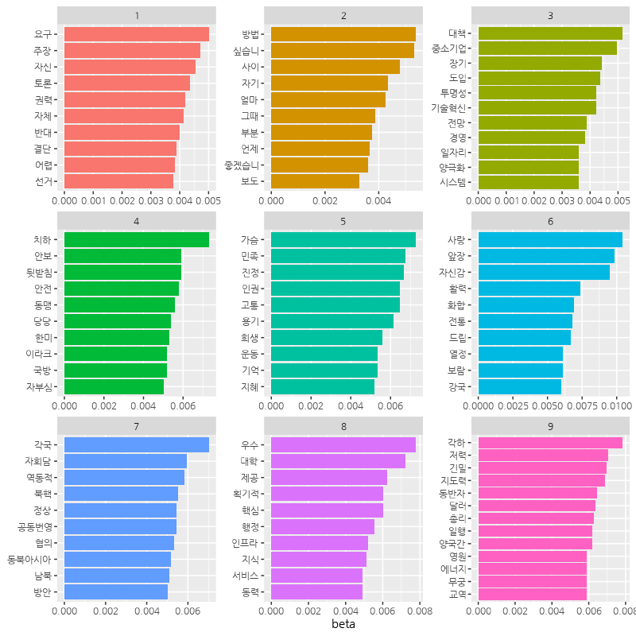

---
output:
  md_document:
    variant: markdown_github
editor_options: 
  chunk_output_type: console
---

```{r include=F}
knitr::opts_chunk$set(warning = F, message = F)
library(here)
```

# Quiz Part 6

#### `speeches_roh.csv`에는 노무현 전 대통령의 연설문 780개가 들어있습니다. `speeches_roh.csv`를 이용해 문제를 해결해 보세요.

[Q1. `speeches_roh.csv`를 불러온 다음 연설문이 들어있는 `content`를 문장 기준으로 토큰화하세요.](#Q1)

[Q2. 문장을 분석에 적합하게 전처리한 다음 명사를 추출하세요.](#Q2)

[Q3. 연설문 내 중복 단어를 제거하고 빈도가 100회 이하인 단어를 추출하세요.](#Q3)

[Q4. 추출한 단어에서 다음의 불용어를 제거하세요.](#Q4)

[Q5. 연설문별 단어 빈도를 구한 다음 DTM을 만드세요.](#Q5)

[Q6. 토픽 수를 2~20개로 바꿔가며 LDA 모델을 만든 다음 최적 토픽 수를 구하세요.](#Q6)

[Q7. 토픽 수가 9개인 LDA 모델을 추출하세요.](#Q7)

[Q8. LDA 모델의 beta를 이용해 각 토픽에 등장할 확률이 높은 상위 10개 단어를 추출한 다음 토픽별 주요 단어를 나타낸 막대 그래프를 만드세요.](#Q8)

[Q9. LDA 모델의 gamma를 이용해 연설문 원문을 확률이 가장 높은 토픽으로 분류하세요.](#Q9)

[Q10. 토픽별 문서 수를 출력하세요.](#Q10)

[Q11. 문서가 가장 많은 토픽의 연설문을 gamma가 높은 순으로 출력하고 내용이 비슷한지 살펴보세요.](#Q11)


---

#### Q1. `speeches_roh.csv`를 불러온 다음 연설문이 들어있는 `content`를 문장 기준으로 토큰화하세요.<a name="Q1"></a>


##### 연설문 불러오기

```{r eval=F}
library(readr)
speeches_raw <- read_csv("speeches_roh.csv")
```

```{r echo=F}
library(readr)
speeches_raw <- read_csv(here("Data/speeches_roh.csv"))
```

##### 문장 기준 토큰화

```{r}
library(dplyr)
library(tidytext)
speeches <- speeches_raw %>%
  unnest_tokens(input = content,
                output = sentence,
                token = "sentences",
                drop = F)
```

> `KoNLP` 패키지의 함수는 토큰화할 텍스트가 너무 길면 오류가 발생합니다. 텍스트를 문장 기준으로 토큰화하고 나서 다시 명사 기준으로 토큰화하면 이런 문제를 피할 수 있습니다.

> - 노무현 전 대통령의 연설문 출처: [bit.ly/easytext_35](https://bit.ly/easytext_35)


---

#### Q2. 문장을 분석에 적합하게 전처리한 다음 명사를 추출하세요.<a name="Q2"></a>


```{r}
# 전처리
library(stringr)
speeches <- speeches %>%
  mutate(sentence = str_replace_all(sentence, "[^가-힣]", " "),
         sentence = str_squish(sentence))
```


```{r eval=FALSE}
# 명사 추출
library(tidytext)
library(KoNLP)
library(stringr)
nouns_speeches <- speeches %>%
  unnest_tokens(input = sentence,
                output = word,
                token = extractNoun,
                drop = F) %>%
  filter(str_count(word) > 1)
```

> 컴퓨터 성능에 따라 명사를 추출하는 데 시간이 오래 걸릴 수 있습니다.

```{r echo=F}
library(tidytext)
library(KoNLP)
library(stringr)
# saveRDS(nouns_speeches, here("files_etc/nouns_speeches_roh.rds"), compress = F)

# set path
source(here("Quiz/path.r"))

nouns_speeches <- readRDS(paste0(path, "nouns_speeches_roh.rds"))
```


---

#### Q3. 연설문 내 중복 단어를 제거하고 빈도가 100회 이하인 단어를 추출하세요.<a name="Q3"></a>


##### 연설문 내 중복 단어 제거

```{r}
nouns_speeches <- nouns_speeches %>%
  group_by(id) %>%
  distinct(word, .keep_all = T) %>%
  ungroup()
```

##### 단어 빈도 100회 이하 단어 추출
```{r}
nouns_speeches <- nouns_speeches %>%
  add_count(word) %>%
  filter(n <= 100) %>%
  select(-n)
```


---

#### Q4. 추출한 단어에서 다음의 불용어를 제거하세요.<a name="Q4"></a>

```{r}
stopword <- c("들이", "하다", "하게", "하면", "해서", "이번", "하네",
              "해요", "이것", "니들", "하기", "하지", "한거", "해주",
              "그것", "어디", "여기", "까지", "이거", "하신", "만큼")
```

##### 불용어 제거

```{r}
nouns_speeches <- nouns_speeches %>%
  filter(!word %in% stopword)
```


---

#### Q5. 연설문별 단어 빈도를 구한 다음 DTM을 만드세요.<a name="Q5"></a>

##### 연설문별 단어 빈도 구하기

```{r }
count_word_doc <- nouns_speeches %>%
  count(id, word, sort = T)
```

##### DTM 만들기

```{r }
dtm_comment <- count_word_doc %>%
  cast_dtm(document = id, term = word, value = n)
```


---

#### Q6. 토픽 수를 2~20개로 바꿔가며 LDA 모델을 만든 다음 최적 토픽 수를 구하세요.<a name="Q6"></a>

##### 토픽 수 바꿔가며 LDA 모델 만들기

```{r eval=F}
library(ldatuning)
models <- FindTopicsNumber(dtm = dtm_comment,
                           topics = 2:20,
                           return_models = T,
                           control = list(seed = 1234))
```


```{r echo=F}
library(ldatuning)
# saveRDS(models, here("files_etc/models_roh.rds"), compress = F)

# set path
source("path.r")

models <- readRDS(paste0(path, "models_roh.rds"))
```

##### 최적 토픽 수 구하기

```{r}
FindTopicsNumber_plot(models)
```


---

#### Q7. 토픽 수가 9개인 LDA 모델을 추출하세요.<a name="Q7"></a>
```{r}
lda_model <- models %>%
  filter (topics == 9) %>%
  pull(LDA_model) %>%
 .[[1]]
```


---

#### Q8. LDA 모델의 beta를 이용해 각 토픽에 등장할 확률이 높은 상위 10개 단어를 추출한 다음 토픽별 주요 단어를 나타낸 막대 그래프를 만드세요.<a name="Q8"></a>

##### beta 추출
```{r}
term_topic <- tidy(lda_model, matrix = "beta")
```

##### 토픽별 beta 상위 단어 추출

```{r}
top_term_topic <- term_topic %>%
  group_by(topic) %>%
  slice_max(beta, n = 10)
```

##### 막대 그래프 만들기

```{r eval=F}
library(ggplot2)
ggplot(top_term_topic,
       aes(x = reorder_within(term, beta, topic),
           y = beta,
           fill = factor(topic))) +
  geom_col(show.legend = F) +
  facet_wrap(~ topic, scales = "free", ncol = 3) +
  coord_flip () +
  scale_x_reordered() +
  labs(x = NULL)
```

```{r echo=F}
library(ggplot2)
library(showtext)
font_add_google(name = "Nanum Gothic", family = "nanumgothic")
showtext_opts(dpi = 100)

p <- ggplot(top_term_topic,
       aes(x = reorder_within(term, beta, topic),
           y = beta,
           fill = factor(topic))) +
  geom_col(show.legend = F) +
  facet_wrap(~ topic, scales = "free", ncol = 3) +
  coord_flip () +
  scale_x_reordered() +
  labs(x = NULL) +
  theme(text = element_text(family = "nanumgothic"))

p %>% 
  ggsave(
    path = "quiz/img",
    file = "Q6_8.png",
    
    width = 8,
    height = 8,
    dpi = 100, type = "cairo-png", units = "in")
```




---

#### Q9. LDA 모델의 gamma를 이용해 연설문 원문을 확률이 가장 높은 토픽으로 분류하세요.<a name="Q9"></a>

##### gamma 추출

```{r}
doc_topic <- tidy(lda_model, matrix = "gamma")
```

##### 문서별로 확률이 가장 높은 토픽 추출

```{r}
doc_class <- doc_topic %>%
  group_by(document) %>%
  slice_max(gamma, n = 1)
```

##### 변수 타입 통일

```{r}
doc_class$document <- as.integer(doc_class$document)
```

##### 연설문 원문에 확률이 가장 높은 토픽 번호 부여

```{r}
speeches_topic <- speeches_raw %>%
  left_join(doc_class, by = c("id" = "document"))
```


---

#### Q10. 토픽별 문서 수를 출력하세요.<a name="Q10"></a>
```{r}
speeches_topic %>%
  count(topic)
```


---

#### Q11. 문서가 가장 많은 토픽의 연설문을 gamma가 높은 순으로 출력하고 내용이 비슷한지 살펴보세요.<a name="Q11"></a>

```{r}
speeches_topic %>%
  filter(topic == 9) %>%
  arrange(-gamma) %>%
  select(content)
```

