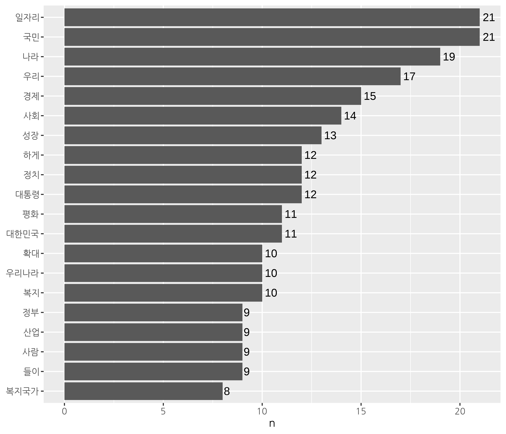
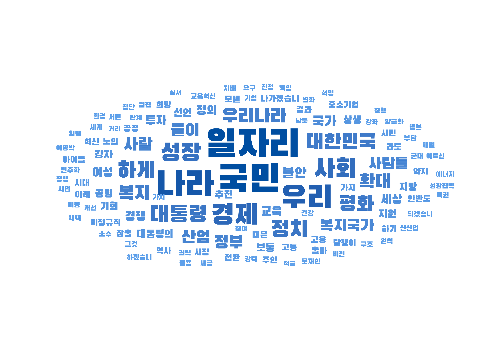

```{r setup, include=FALSE}
options(htmltools.dir.version = FALSE, 
        width = 70, 
        max.print = 80,
        tibble.print_max = 40,
        tibble.width = 70,
        servr.interval = 0.01) # Viewer 수정 반영 속도

knitr::opts_chunk$set(cache = T, warning = F, message = F, 
                      dpi = 300, fig.height = 4, out.width = "100%")

xaringanExtra::use_tile_view()

library(knitr)
library(icon)
library(here)
```


```{r echo=FALSE}
rm(list = ls())

library(showtext)
font_add_google(name = "Nanum Gothic", family = "nanumgothic")
showtext_auto()

# code highlighting
hook_source <- knitr::knit_hooks$get('source')
knitr::knit_hooks$set(source = function(x, options) {
  x <- stringr::str_replace(x, "^[[:blank:]]?([^*].+?)[[:blank:]]*#<<[[:blank:]]*$", "*\\1")
  hook_source(x, options)
})


```

class: title0

Do it! 쉽게 배우는 R 텍스트 마이닝

---

<br>

.pull-left[
&nbsp;&nbsp;&nbsp;&nbsp;&nbsp;&nbsp;&nbsp;&nbsp;
```{r, echo=FALSE, out.width="70%", out.height="70%"}
include_graphics("https://raw.githubusercontent.com/youngwoos/Doit_textmining/main/cover.png")
```
]

.pull-right[

<br>
<br>
<br>

`r fontawesome("github")` [github.com/youngwoos/Doit_textmining](https://github.com/youngwoos/Doit_textmining)

`r fontawesome("facebook-square")` [facebook.com/groups/datacommunity](https://facebook.com/groups/datacommunity)

- [네이버책](https://book.naver.com/bookdb/book_detail.nhn?bid=17891971)
  - [yes24](http://bit.ly/3oUuJOB)
  - [알라딘](http://bit.ly/3oXOSDn)
  - [교보문고](https://bit.ly/2LtNOcB)
]

---

class: title0

02
<br>
형태소 분석기를 이용한
<br>
단어 빈도 분석

---

class: title0-2

We'll make

<br-back-10>

```{r, echo=FALSE, out.width="60%", out.height="60%"}

```

---

class: title0-2

and

<br-back-40>

```{r, echo=F, out.width="60%", out.height="60%"}

```

---

<br>

.large2[.font-jua[목차]]

.large[.font-jua[02-1 형태소 분석]]([link](#02-1))

.large[.font-jua[02-2 명사 빈도 분석하기]]([link](#02-2))

.large[.font-jua[02-3 특정 단어가 사용된 문장 살펴보기]]([link](#02-3))


---


name: 02-1
class: title1

02-1 형태소 분석

---

#### 띄어쓰기 기준 토큰화의 문제
- 의미를 지니지 않는 서술어가 가장 많이 추출됨
    - ex) '합니다', '있습니다'

--

#### 형태소 분석(Morphological Analysis)
- 문장에서 형태소를 추출해 명사, 동사, 형용사 등 품사로 분류하는 작업
- 특히 명사를 보고 문장 내용 파악
- 형태소(Morpheme)
  - 의미를 가진 가장 작은 말의 단위
  - 더 나누면 뜻이 없는 문자가 됨


---

#### `KoNLP` 한글 형태소 분석 패키지 설치하기

##### 1. 자바와 rJava 패키지 설치하기

```{r, eval = F}
install.packages("multilinguer")
library(multilinguer)
install_jdk()
```

##### 2. KoNLP 의존성 패키지 설치하기

```{r, eval = F}
install.packages(c("stringr", "hash", "tau", "Sejong", "RSQLite", "devtools"),
                 type = "binary")
```

##### 3. `KoNLP` 패키지 설치하기
```{r, eval=F}
install.packages("remotes")
remotes::install_github("haven-jeon/KoNLP",
                        upgrade = "never",
                        INSTALL_opts = c("--no-multiarch"))

library(KoNLP)
```

---

#### `KoNLP` 한글 형태소 분석 패키지 설치하기

##### 4. 형태소 사전 설정하기

NIA 사전: 120만여 개 단어로 구성된 형태소 사전

```{r, eval = F}
useNIADic()
```

`r fontawesome("lightbulb")` `KoNLP` 패키지 설치 후 한 번만 실행

---

#### 형태소 분석기를 이용해 토큰화하기 - 명사 추출

##### 샘플 텍스트로 작동 원리 알아보기

```{r}
library(KoNLP)
library(dplyr)

text <- tibble(
  value = c("대한민국은 민주공화국이다.",
            "대한민국의 주권은 국민에게 있고, 모든 권력은 국민으로부터 나온다."))

text
```

---
`extractNoun()`: 문장에서 추출한 명사를 list 구조로 출력

```{r}
extractNoun(text$value)
```

`r fontawesome("lightbulb")` `extractNoun()`은 두 번째 실행부터 빠르게 작동

---

##### `unnest_tokens()`를 이용해 명사 추출하기

- 다루기 쉬운 tibble 구조로 명사 출력

```{r}
library(tidytext)

text %>%
  unnest_tokens(input = value,        # 분석 대상
                output = word,        # 출력 변수명
                token = extractNoun)  # 토큰화 함수  #<<
```

`r icon_style(fontawesome("exclamation-triangle"), fill = "#FF7333")` `token` 파라미터에 입력한 `extractNoun` 앞뒤에 따옴표 X

---

.pull-left[

##### 띄어쓰기 기준 추출
```{r}
text %>%
  unnest_tokens(input = value,    
                output = word,    
                token = "words") #<<
```

]

.pull-right[

##### 명사 추출
```{r}
text %>%
  unnest_tokens(input = value,    
                output = word,    
                token = extractNoun) #<<
```

]

---


#### 연설문에서 명사 추출하기

##### 문재인 대통령 연설문 불러오기

```{r eval=F}
raw_moon <- readLines("speech_moon.txt", encoding = "UTF-8")
```

##### 기본적인 전처리
```{r eval=F}
library(stringr)
library(textclean)

moon <- raw_moon %>%
  str_replace_all("[^가-힣]", " ") %>%  # 한글만 남기기
  str_squish() %>%                      # 중복 공백 제거
  as_tibble()                           # tibble로 변환

moon
```

---

```{r echo=F}
# 문재인 대통령 연설문 불러오기
raw_moon <- readLines("../Data/speech_moon.txt", encoding = "UTF-8")

# 기본적인 전처리
library(stringr)
library(textclean)

moon <- raw_moon %>%
  str_replace_all("[^가-힣]", " ") %>%  # 한글만 남기기
  str_squish() %>%                      # 중복 공백 제거
  as_tibble()                           # tibble로 변환

moon
```

---

##### 명사 기준 토큰화
```{r}
word_noun <- moon %>%
  unnest_tokens(input = value,
                output = word,
                token = extractNoun)

word_noun
```


---


name: 02-2
class: title1

02-2 명사 빈도 분석하기

---

##### 단어 빈도 구하기

- 빈도가 높은 명사를 보면 글쓴이가 무엇을 강조했는지 알 수 있음
- `# A tibble: 704 x 2`: 연설문이 704개의 명사로 구성됨

```{r}
word_noun <- word_noun %>%
  count(word, sort = T) %>%    # 단어 빈도 구해 내림차순 정렬
  filter(str_count(word) > 1)  # 두 글자 이상만 남기기

word_noun
```

---

.pull-left[

##### 띄어쓰기 기준 추출
```{r}
moon %>%
  unnest_tokens(input = value,
                output = word,
                token = "words") %>% #<<
  count(word, sort = T) %>%
  filter(str_count(word) > 1)

```
]

.pull-right[

##### 명사 추출
```{r}
moon %>%
  unnest_tokens(input = value,
                output = word,
                token = extractNoun) %>% #<< 
  count(word, sort = T) %>%
  filter(str_count(word) > 1)

```

]

---

##### 막대 그래프 만들기

```{r}
# 상위 20개 단어 추출
top20 <- word_noun %>%
  head(20)
```

```{r eval=F}
# 막대 그래프 만들기
library(ggplot2)

ggplot(top20, aes(x = reorder(word, n), y = n)) +
  geom_col() +
  coord_flip() +
  geom_text(aes(label = n), hjust = -0.3) +
  labs(x = NULL) +
  theme(text = element_text(family = "nanumgothic"))
```

---

- 명사로 되어있기 때문에 연설문의 내용을 이해하기 쉬움

```{r echo=F, fig.height = 5, out.width = "80%"}
showtext_opts(dpi = 300) # opts_chunk$set(dpi=300)

library(ggplot2)
ggplot(top20, aes(x = reorder(word, n), y = n)) +
  geom_col() +
  coord_flip() +
  geom_text(aes(label = n), hjust = -0.3) +
  labs(x = NULL) +
  theme(text = element_text(family = "nanumgothic"))
```

---

<br>

.pull-left[

##### &nbsp;&nbsp;&nbsp;&nbsp;&nbsp;&nbsp;&nbsp;&nbsp;&nbsp;&nbsp;&nbsp;&nbsp;&nbsp;&nbsp;&nbsp;띄어쓰기 기준 추출

```{r, echo=FALSE}
include_graphics("https://raw.githubusercontent.com/youngwoos/Doit_textmining/main/Image/01/01_3_1.png")
```
]

.pull-right[

##### &nbsp;&nbsp;&nbsp;&nbsp;&nbsp;&nbsp;&nbsp;&nbsp;&nbsp;&nbsp;&nbsp;&nbsp;&nbsp;&nbsp;&nbsp;명사 추출
```{r, echo=FALSE}
include_graphics("https://raw.githubusercontent.com/youngwoos/Doit_textmining/main/Image/02/01_2_1.png")
```
]

---

##### 워드 클라우드 만들기

```{r eval=F}
# 폰트 설정
library(showtext)
font_add_google(name = "Black Han Sans", family = "blackhansans")
showtext_auto()

library(ggwordcloud)
ggplot(word_noun, aes(label = word, size = n, col = n)) +
  geom_text_wordcloud(seed = 1234, family = "blackhansans") +
  scale_radius(limits = c(3, NA),
               range = c(3, 15)) +
  scale_color_gradient(low = "#66aaf2", high = "#004EA1") +
  theme_minimal()
```

---
<br-back-50>

```{r echo=F}
include_graphics("https://raw.githubusercontent.com/youngwoos/Doit_textmining/main/Image/02/01_2_2.png")
```

---

<br>

.pull-left[

##### &nbsp;&nbsp;&nbsp;&nbsp;&nbsp;&nbsp;&nbsp;&nbsp;&nbsp;&nbsp;&nbsp;&nbsp;&nbsp;&nbsp;&nbsp;띄어쓰기 기준 추출

<br-back-10>

```{r, echo=FALSE, out.width="90%", out.height="90%"}
include_graphics("https://raw.githubusercontent.com/youngwoos/Doit_textmining/main/Image/01/01_3_6.png")
```
]

.pull-right[ 

##### &nbsp;&nbsp;&nbsp;&nbsp;&nbsp;&nbsp;&nbsp;&nbsp;&nbsp;&nbsp;&nbsp;&nbsp;&nbsp;&nbsp;&nbsp;&nbsp;&nbsp;&nbsp;&nbsp;&nbsp;&nbsp;&nbsp;&nbsp;&nbsp;&nbsp;&nbsp;&nbsp;&nbsp;&nbsp;명사 추출

<br-back-20>

```{r, echo=FALSE}
include_graphics("https://raw.githubusercontent.com/youngwoos/Doit_textmining/main/Image/02/01_2_2.png")
```
]

---

name: 02-3
class: title1

02-3 특정 단어가 사용된 문장 살펴보기

---

- 고빈도 단어 사용된 문장 직접 읽어보기
- 글쓴이가 어떤 의미로 단어를 사용했는지 이해할 수 있음

--

##### 문장 기준으로 토큰화하기

- 원문 `raw_moon`을 문장 기준으로 토큰화

```{r eval=F}
sentences_moon <- raw_moon %>%
  str_squish() %>%
  as_tibble() %>%
  unnest_tokens(input = value,
                output = sentence,
                token = "sentences") #<<

sentences_moon
```

`r icon_style(fontawesome("exclamation-triangle"), fill = "#FF7333")` 문장으로 토큰화할 때는 마침표가 문장의 기준점이 되므로 특수 문자 제거 X

---

```{r echo=F}
sentences_moon <- raw_moon %>%
  str_squish() %>%
  as_tibble() %>%
  unnest_tokens(input = value,
                output = sentence,
                token = "sentences")

sentences_moon
```

---

#### 특정 단어가 사용된 문장 추출하기

##### 특정 단어가 들어 있는지 확인하기 - `str_detect()`

- 단어가 문장에 있으면 `TRUE`, 그렇지 않으면 `FALSE` 반환

```{r}
str_detect("치킨은 맛있다", "치킨")
str_detect("치킨은 맛있다", "피자")
```

---

##### 특정 단어가 사용된 문장 추출하기

.scroll-box-24[

```{r}
sentences_moon %>%
  filter(str_detect(sentence, "국민"))
```
]

---

##### 특정 단어가 사용된 문장 추출하기

.scroll-box-24[

```{r}
sentences_moon %>%
  filter(str_detect(sentence, "일자리"))
```
]

---

`r fontawesome("lightbulb")` tibble 구조는 텍스트가 길면 Console 창 크기에 맞춰 일부만 출력함

- 모든 내용 출력 하려면: `%>% data.frame()`
- 왼쪽 정렬 출력 하려면: `%>% print.data.frame(right = F)`

---

.box[

.info[`r icon_style(fontawesome("rocket"), fill = "#FF7333")` 형태소 분석기의 한계]

- 분석 결과에 '하게' 처럼 의미를 알 수 없는 단어가 들어 있음
  - 형태소 사전에 '하게'라는 명사가 있음
  - '당당하게', '절실하게' 등의 '하게'를 명사로 분류해 생긴 오류
- 형태소 분석기의 성능에 한계가 있기 때문에 분석하면서 오류를 찾아 수정해야 함

]

---

class: title1

정리하기

---

### 정리하기

##### 1. 명사 추출하기

```{r eval=F}
# 명사 기준 토큰화
word_noun <- moon %>%
  unnest_tokens(input = value,
                output = word,
                token = extractNoun)
```


##### 2. 특정 단어가 사용된 문장 살펴보기
```{r eval=F}
# 문장 기준 토큰화
sentences_moon <- raw_moon %>%
  unnest_tokens(input = value,
                output = sentence,
                token = "sentences")

# 특정 단어가 사용된 문장 추출
sentences_moon %>%
  filter(str_detect(sentence, "국민"))
```

---

class: title1

분석 도전

---

### 분석 도전

박근혜 전 대통령의 대선 출마 선언문이 들어있는 `speech_park.txt`를 이용해 문제를 해결해 보세요.

Q1. `speech_park.txt`를 불러와 분석에 적합하게 전처리한 다음 연설문에서 명사를 추출하세요.

Q2. 가장 자주 사용된 단어 20개를 추출하세요.

Q3. 가장 자주 사용된 단어 20개의 빈도를 나타낸 막대 그래프를 만드세요.

Q4. 전처리하지 않은 연설문에서 연속된 공백을 제거하고 tibble 구조로 변환한 다음 <br> &nbsp;&nbsp;&nbsp;&nbsp;&nbsp;&nbsp;&nbsp;&nbsp;문장 기준으로 토큰화하세요.

Q5. 연설문에서 `"경제"`가 사용된 문장을 출력하세요.

---

Q1. `speech_park.txt`를 불러와 분석에 적합하게 전처리한 다음 연설문에서 명사를 추출하세요.

```{r eval=F}
raw_park <- readLines("speech_park.txt", encoding = "UTF-8")

# 전처리
library(dplyr)
library(stringr)
park <- raw_park %>%
  str_replace_all("[^가-힣]", " ") %>%  # 한글만 남기기
  str_squish() %>%                      # 연속된 공백 제거
  as_tibble()                           # tibble로 변환

park
```

---

Q1. `speech_park.txt`를 불러와 분석에 적합하게 전처리한 다음 연설문에서 명사를 추출하세요.

```{r echo=F}
raw_park <- readLines(here("Data/speech_park.txt"), encoding = "UTF-8")

# 전처리
library(dplyr)
library(stringr)
park <- raw_park %>%
  str_replace_all("[^가-힣]", " ") %>%  # 한글만 남기기
  str_squish() %>%                      # 연속된 공백 제거
  as_tibble()                           # tibble로 변환

park
```


---

Q1. `speech_park.txt`를 불러와 분석에 적합하게 전처리한 다음 연설문에서 명사를 추출하세요.

.scroll-box-26[
```{r}
# 명사 기준 토큰화
library(tidytext)
library(KoNLP)

word_noun <- park %>%
  unnest_tokens(input = value,
                output = word,
                token = extractNoun)

word_noun
```
]

---

Q2. 가장 자주 사용된 단어 20개를 추출하세요.

.scroll-box-26[
```{r}
top20 <- word_noun %>%
  count(word, sort = T) %>%
  filter(str_count(word) > 1) %>%
  head(20)

top20
```
]

---

Q3. 가장 자주 사용된 단어 20개의 빈도를 나타낸 막대 그래프를 만드세요.
```{r eval=F}
library(ggplot2)
ggplot(top20, aes(x = reorder(word, n), y = n)) +
  geom_col() +
  coord_flip () +
  geom_text(aes(label = n), hjust = -0.3) +
  labs(x = NULL)
```

---

```{r echo=F}
library(ggplot2)
ggplot(top20, aes(x = reorder(word, n), y = n)) +
  geom_col() +
  coord_flip () +
  geom_text(aes(label = n), hjust = -0.3) +
  labs(x = NULL)
```

---

Q4. 전처리하지 않은 연설문에서 연속된 공백을 제거하고 tibble 구조로 변환한 다음 <br> &nbsp;&nbsp;&nbsp;&nbsp;&nbsp;&nbsp;&nbsp;&nbsp;문장 기준으로 토큰화하세요.

.scroll-box-26[
```{r}
sentences_park <- raw_park %>%
  str_squish() %>%                    # 연속된 공백 제거
  as_tibble() %>%                     # tibble로 변환
  unnest_tokens(input = value,
                output = sentence,
                token = "sentences")

sentences_park
```
]

---

Q5. 연설문에서 `"경제"`가 사용된 문장을 출력하세요.

.scroll-box-26[
```{r}
sentences_park %>%
  filter(str_detect(sentence, "경제"))
```
]

---

class: title0

끝
