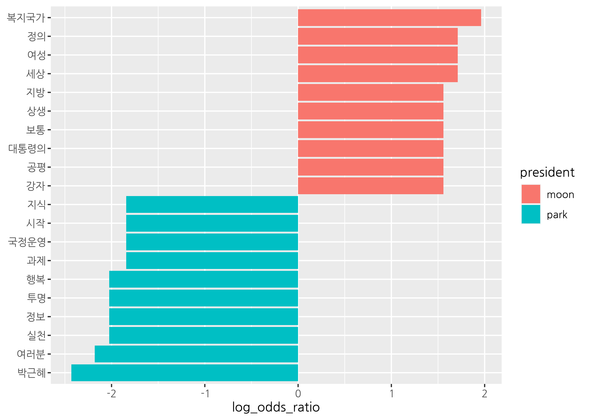
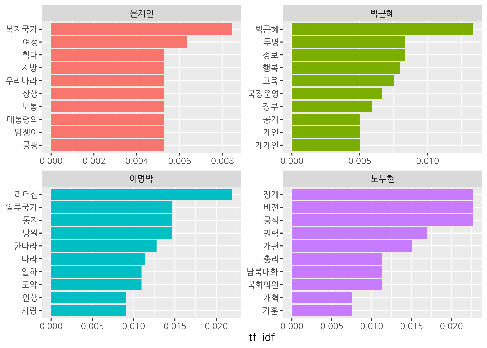
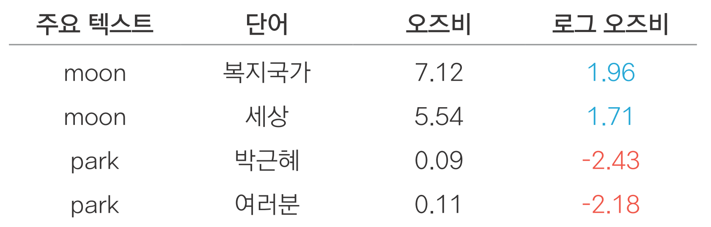
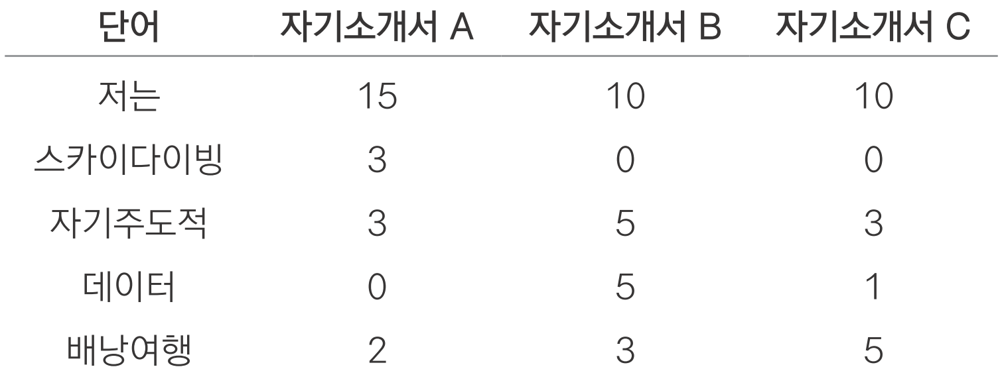

```{r setup, include=FALSE}
options(htmltools.dir.version = FALSE, 
        width = 80,
        # width = 70,
        
        max.print = 80,
        tibble.print_max = 40,
        
        tibble.width = 80,
        # tibble.width = 70,
        
        # pillar.min_chars = Inf, # tibble 문자 출력 제한
        servr.interval = 0.01) # Viewer 수정 반영 속도


knitr::opts_chunk$set(cache = T, warning = F, message = F, 
                      dpi = 300, fig.height = 4, out.width = "100%")

xaringanExtra::use_tile_view()

library(knitr)
library(icon)
library(here)
```


```{r echo=FALSE}
rm(list = ls())

library(showtext)
font_add_google(name = "Nanum Gothic", family = "nanumgothic")
showtext_auto()
showtext_opts(dpi = 300) # opts_chunk$set(dpi=300)

# code highlighting
hook_source <- knitr::knit_hooks$get('source')
knitr::knit_hooks$set(source = function(x, options) {
  x <- stringr::str_replace(x, "^[[:blank:]]?([^*].+?)[[:blank:]]*#<<[[:blank:]]*$", "*\\1")
  hook_source(x, options)
})


```

class: title0

Do it! 쉽게 배우는 R 텍스트 마이닝

---

<br>

.pull-left[
&nbsp;&nbsp;&nbsp;&nbsp;&nbsp;&nbsp;&nbsp;&nbsp;
```{r, echo=FALSE, out.width="70%", out.height="70%"}
include_graphics("https://raw.githubusercontent.com/youngwoos/Doit_textmining/main/cover.png")
```
]

.pull-right[

<br>
<br>
<br>

`r fontawesome("github")` [github.com/youngwoos/Doit_textmining](https://github.com/youngwoos/Doit_textmining)

`r fontawesome("facebook-square")` [facebook.com/groups/datacommunity](https://facebook.com/groups/datacommunity)

- [네이버책](https://book.naver.com/bookdb/book_detail.nhn?bid=17891971)
  - [yes24](http://bit.ly/3oUuJOB)
  - [알라딘](http://bit.ly/3oXOSDn)
  - [교보문고](https://bit.ly/2LtNOcB)
]

---

class: title0

03 비교 분석: 무엇이 다를까?

---

class: title0-2

We'll make

<br-back-20>

```{r, echo=FALSE, out.width="70%", out.height="70%"}

```

---

class: title0-2

and

<br-back-40>

```{r, echo=F, out.width="70%", out.height="70%"}

```

---

<br>

.large2[.font-jua[목차]]

.large[.font-jua[03-1 단어 빈도 비교하기]]([link](#03-1))

.large[.font-jua[03-2 오즈비 - 상대적으로 중요한 단어 비교하기]]([link](#03-2))

.large[.font-jua[03-3 로그 오즈비로 단어 비교하기]]([link](#03-3))

.large[.font-jua[03-4 TF-IDF - 여러 텍스트의 단어 비교하기]]([link](#03-4))

---


name: 03-1
class: title1

03-1 단어 빈도 비교하기

---

### 비교 분석
- 여러 텍스트를 비교해 차이를 알아보는 분석 방법
- 단어 빈도 분석을 응용해 자주 사용된 단어의 차이를 살펴봄

---

### 텍스트 합치기

- 텍스트를 비교하기 위해 여러 개의 텍스트를 하나의 데이터셋으로 합치는 작업

##### 데이터 불러오기

- 문재인 대통령과 박근혜 전 대통령의 대선 출마 선언문 불러오기
- tibble 구조로 변환하고 연설문 구분 위해 대통령 이름 부여

```{r eval=FALSE}
library(dplyr)

# 문재인 대통령 연설문 불러오기
raw_moon <- readLines("speech_moon.txt", encoding = "UTF-8")
moon <- raw_moon %>%
  as_tibble() %>%
  mutate(president = "moon")

# 박근혜 대통령 연설문 불러오기
raw_park <- readLines("speech_park.txt", encoding = "UTF-8")
park <- raw_park %>%
  as_tibble() %>%
  mutate(president = "park")
```

```{r echo=F}
library(dplyr)

# 문재인 대통령 연설문 불러오기
raw_moon <- readLines("../Data/speech_moon.txt", encoding = "UTF-8")

moon <- raw_moon %>%
  as_tibble() %>%
  mutate(president = "moon")

# 박근혜 대통령 연설문 불러오기
raw_park <- readLines("../Data/speech_park.txt", encoding = "UTF-8")

park <- raw_park %>%
  as_tibble() %>%
  mutate(president = "park")
```

---

##### 데이터 합치기

- 두 데이터를 행(세로) 방향으로 결합
- 출력 결과 보기 편하게 `select()`로 변수 순서 바꾸기
- 윗부분은 문재인 대통령, 아랫부분은 박근혜 전 대통령 연설문

```{r}
bind_speeches <- bind_rows(moon, park) %>%
  select(president, value)
```

--

<br-back-30>

.pull-left[

```{r, R.options = list(tibble.width = 25)}
head(bind_speeches)
```
]

.pull-right[

```{r, R.options = list(tibble.width = 25)}
tail(bind_speeches)
```
]


`r fontawesome("lightbulb")` 박근혜 전 대통령의 대선 출마 선언문 출처: [bit.ly/easytext_31](https://bit.ly/easytext_31)


---


#### 집단별 단어 빈도 구하기

##### 1. 기본적인 전처리 및 토큰화

- 한글 이외의 문자, 연속된 공백 제거
- `bind_speeches`는 tibble 구조이므로 `mutate()` 활용


```{r eval=FALSE}
# 기본적인 전처리
library(stringr)
speeches <- bind_speeches %>%
  mutate(value = str_replace_all(value, "[^가-힣]", " "),
         value = str_squish(value))

speeches
```
---

```{r echo=FALSE, R.options=list(tibble.width = 50)}
# 기본적인 전처리
library(stringr)
speeches <- bind_speeches %>%
  mutate(value = str_replace_all(value, "[^가-힣]", " "),
         value = str_squish(value))

speeches
```


---

- 형태소 분석기를 이용해 명사 기준 토큰화


```{r eval=F}
# 토큰화
library(tidytext)
library(KoNLP)

speeches <- speeches %>%
  unnest_tokens(input = value,
                output = word,
                token = extractNoun)

speeches
```


---

```{r echo=F}
# 토큰화
library(tidytext)
library(KoNLP)

speeches <- speeches %>%
  unnest_tokens(input = value,
                output = word,
                token = extractNoun)

speeches
```


---


#### 하위 집단별 단어 빈도 구하기 - `count()`

- `"moon"`과 `"park"`의 단어 빈도 각각 구하기

##### 샘플 텍스트로 작동 원리 알아보기

- `count()`에 집단을 구성하는 두 변수를 순서대로 입력

```{r}
df <- tibble(class = c("a", "a", "a", "b", "b", "b"),
             sex = c("female", "male", "female", "male", "male", "female"))
```

.pull-left[

```{r}
df
```
]


.pull-right[

```{r}
df %>% count(class, sex)
```
]

---


##### 두 연설문의 단어 빈도 구하기

```{r}
frequency <- speeches %>%
  count(president, word) %>%   # 연설문 및 단어별 빈도
  filter(str_count(word) > 1)  # 두 글자 이상 추출

head(frequency)
```

`r fontawesome("lightbulb")`  `count()`는 입력한 변수의 알파벳, 가나다순으로 행을 정렬함

---


#### 자주 사용된 단어 추출하기

- `dplyr::slice_max()`: 값이 큰 상위 n개의 행을 추출해 내림차순 정렬

##### 샘플 데이터로 작동 원리 알아보기


```{r}
df <- tibble(x = c(1:100))
```

<br-back-20>

.pull-left[

```{r}
df
```
]

.pull-right[
```{r}
df %>% slice_max(x, n = 3)
```


]

---

.pull-left[

`r fontawesome("lightbulb")`  `slice_min()`: 값이 작은 하위 n개 추출
```{r}
df %>% slice_min(x, n = 3)
```
]


---

#### 연설문에 가장 많이 사용된 단어 추출하기

- `president`별 고빈도 단어 상위 10개 추출


```{r eval=FALSE}
top10 <- frequency %>%
  group_by(president) %>%  # president별로 분리
  slice_max(n, n = 10)     # 상위 10개 추출

top10
```

---

```{r echo=F}
top10 <- frequency %>%
  group_by(president) %>%  # president별로 분리
  slice_max(n, n = 10)     # 상위 10개 추출

top10
```


---

#### 단어 빈도 동점 처리

- 두 연설문에서 단어 10개씩 추출했는데 20행이 아니라 22행
- 단어 빈도 동점인 행이 전부 추출되었기 때문


```{r highlight.output = 1, R.options=list(tibble.print_max = 10)}
top10
```

---

- 박근혜 전 대통령의 연설문 단어 12개
  - `"교육"`, `"사람"`, `"사회"`, `"일자리"` 빈도 동점, 모두 추출되면서 행 늘어남


```{r, highlight.output = c(13:16)}
top10 %>%
  filter(president == "park")
```


---


#### 빈도 동점 단어 제외하고 추출하기
- `slice_max(with_ties = F)`: 원본 데이터의 정렬 순서에 따라 행 추출

##### 샘플 데이터로 작동 원리 알아보기

```{r}
df <- tibble(x = c("A", "B", "C", "D"), y = c(4, 3, 2, 2))
```

<br-back-20>

.pull-left[

```{r}
df %>%
  slice_max(y, n = 3)
```
]

.pull-right[
```{r}
df %>%
  slice_max(y, n = 3, with_ties = F)
```
]
---

#### 연설문에 적용하기

```{r eval=F}
top10 <- frequency %>%
  group_by(president) %>%
  slice_max(n, n = 10, with_ties = F)

top10

```

---

```{r, echo=FALSE, highlight.output=1}
top10 <- frequency %>%
  group_by(president) %>%
  slice_max(n, n = 10, with_ties = F)

top10

```

---

#### 막대 그래프 만들기

##### 1. 변수의 항목별로 그래프만들기 - `facet_wrap()`
- `~` 뒤에 그래프를 나누는 기준 변수 입력

```{r eval=F}
library(ggplot2)
ggplot(top10, aes(x = reorder(word, n),
                  y = n,
                  fill = president)) +
  geom_col() +
  coord_flip() +
  facet_wrap(~ president)
```

---

```{r echo=F}
library(ggplot2)
ggplot(top10, aes(x = reorder(word, n),
                  y = n,
                  fill = president)) +
  geom_col() +
  coord_flip() +
  facet_wrap(~ president)
```


---


##### 2. 그래프별 y축 설정하기

- 축을 구성하는 단어가 한 범주에만 있으면 축은 있지만 막대는 없는 항목 생김
  - ex) `"행복"`, `"나라"`


```{r echo=F, out.width="90%"}
library(ggplot2)
ggplot(top10, aes(x = reorder(word, n),
                  y = n,
                  fill = president)) +
  geom_col() +
  coord_flip() +
  facet_wrap(~ president)
```


---

##### 2. 그래프별 y축 설정하기

- 축을 구성하는 단어가 한 범주에만 있으면 축은 있지만 막대는 없는 항목 생김
  - ex) `"행복"`, `"나라"`


- `scales`: 그래프의 축 통일 또는 각각 생성 결정
  - `"fixed"`: 축 통일(기본값)
  - `"free_y"`: 범주별로 y축 만듦

```{r eval=F}
ggplot(top10, aes(x = reorder(word, n),
                  y = n,
                  fill = president)) +
  geom_col() +
  coord_flip() +
  facet_wrap(~ president,         # president별 그래프 생성
              scales = "free_y")  # y축 통일하지 않음 #<<
```

---

```{r echo=F}
ggplot(top10, aes(x = reorder(word, n),
                  y = n,
                  fill = president)) +
  geom_col() +
  coord_flip() +
  facet_wrap(~ president,         # president별 그래프 생성
              scales = "free_y")  # y축 통일하지 않음
```


---


#### 3. 특정 단어 제외하고 막대 그래프 만들기

- 박근혜 전 대통령 `"국민"` 빈도 너무 높아 다른 단어들 차이 드러나지 않음

```{r echo=F, out.width="80%"}
ggplot(top10, aes(x = reorder(word, n),
                  y = n,
                  fill = president)) +
  geom_col() +
  coord_flip() +
  facet_wrap(~ president,         # president별 그래프 생성
              scales = "free_y")  # y축 통일하지 않음
```

---


#### 3. 특정 단어 제외하고 막대 그래프 만들기

- 박근혜 전 대통령 `"국민"` 빈도 너무 높아 다른 단어들 차이 드러나지 않음
- 전반적인 단어 빈도가 잘 드러나도록 제거

```{r}
top10 <- frequency %>%
  filter(word != "국민") %>%
  group_by(president) %>%
  slice_max(n, n = 10, with_ties = F)
```

--

```{r eval=F}
ggplot(top10, aes(x = reorder(word, n),
                  y = n,
                  fill = president)) +
  geom_col() +
  coord_flip() +
  facet_wrap(~ president, scales = "free_y")
```

---

```{r echo=F}
ggplot(top10, aes(x = reorder(word, n),
                  y = n,
                  fill = president)) +
  geom_col() +
  coord_flip() +
  facet_wrap(~ president, scales = "free_y")
```


---


#### 4. 축 정렬하기

- x축을 지정할 때 `reorder()`를 사용했는데도 막대가 빈도 기준으로 완벽하게 정렬되지 않음
- 전체 빈도 기준으로 각 범주의 x축 순서를 정했기 때문

```{r echo=F, out.width="80%"}
ggplot(top10, aes(x = reorder(word, n),
                  y = n,
                  fill = president)) +
  geom_col() +
  coord_flip() +
  facet_wrap(~ president, scales = "free_y")
```

---

#### 4. 축 정렬하기

- x축을 지정할 때 `reorder()`를 사용했는데도 막대가 빈도 기준으로 완벽하게 정렬되지 않음
- 전체 빈도 기준으로 각 범주의 x축 순서를 정했기 때문

##### 그래프별로 축 정렬하기

- `tidytext::reorder_within()`: 변수의 항목별로 축 순서 따로 구하기
  - `x` : 축
  - `by` :정렬 기준
  - `within` : 그래프를 나누는 기준

```{r eval=F}
ggplot(top10, aes(x = reorder_within(word, n, president),
                  y = n,
                  fill = president)) +
  geom_col() +
  coord_flip() +
  facet_wrap(~ president, scales = "free_y")
```

---

```{r echo=F}
ggplot(top10, aes(x = reorder_within(word, n, president),
                  y = n,
                  fill = president)) +
  geom_col() +
  coord_flip() +
  facet_wrap(~ president, scales = "free_y")
```

---

#### 5. 변수 항목 제거하기

- `tidytext::scale_x_reordered()`: 각 단어 뒤의 범주 항목 제거

```{r eval=FALSE}
ggplot(top10, aes(x = reorder_within(word, n, president),
                  y = n,
                  fill = president)) +
  geom_col() +
  coord_flip() +
  facet_wrap(~ president, scales = "free_y") +
  scale_x_reordered() +
  labs(x = NULL) +                                    # x축 삭제
  theme(text = element_text(family = "nanumgothic"))  # 폰트
```

---

```{r echo=FALSE}
ggplot(top10, aes(x = reorder_within(word, n, president),
                  y = n,
                  fill = president)) +
  geom_col() +
  coord_flip() +
  facet_wrap(~ president, scales = "free_y") +
  scale_x_reordered() +
  labs(x = NULL) +                                    # x축 삭제
  theme(text = element_text(family = "nanumgothic"))  # 폰트
```

---
name: 03-2
class: title1

03-2 오즈비:
<br>
상대적으로  중요한 단어 비교하기

---

- 빈도 높은 단어를 비교하면
  - 어떤 텍스트든 일반적인 단어 빈도 높아 텍스트 차이 잘 드러나지 않음
     - ex) 연설문: `"우리"`, `"사회"`, `"경제"`, `"일자리"`


--


- 텍스트의 차이를 알아보려면
  - 특정 텍스트에는 많이 사용되었지만 다른 텍스트에는 적게 사용된 단어를 살펴봐야함

---


#### Long form을 Wide form으로 변환하기
- 여러 텍스트 비교하기 편하게 데이터 구조 바꾸기

--

##### Long form 데이터 살펴보기
- `frequency`: `president`가 `"moon"`인 행과 `"park"`인 행이 세로로 길게 나열

```{r eval=FALSE}
df_long <- frequency %>%
  group_by(president) %>%
  slice_max(n, n = 10) %>%
  filter(word %in% c("국민", "우리", "정치", "행복"))

df_long
```

<br-back-10>

```{r echo=FALSE}
df_long <- frequency %>%
  group_by(president) %>%
  slice_max(n, n = 10) %>%
  filter(word %in% c("국민", "우리", "정치", "행복"))

df_long
```


---

##### Long form 데이터

- 같은 단어가 범주별로 다른 행을 구성
- 범주별 빈도 비교 어려움
- 빈도를 활용해 연산하기 불편

```{r echo=F}
df_long
```


---


#### Long form을 Wide form으로 변형하기
- **wide form**: 가로로 넓은 형태의 데이터
  - 범주별로 단어 빈도 비교하기 편함
  - 변수간 연산하기 편함


--


- `tidyr::pivot_wider()`: long form을 wide form으로 변환
  - `names_from`: 변수명으로 만들 값이 들어 있는 변수
  - `values_from`: 변수에 채워넣을 값이 들어 있는 변수

```{r eval=F}
install.packages("tidyr")
library(tidyr)

df_wide <- df_long %>%
  pivot_wider(names_from = president,
              values_from = n)

df_wide
```

```{r echo=F}
# install.packages("tidyr")
library(tidyr)

df_wide <- df_long %>%
  pivot_wider(names_from = president,
              values_from = n)
```

---

##### Wide form
- 한 단어가 한 행으로 구성됨
- 범주별 단어 빈도 비교하기 쉬움

```{r}
df_wide
```


---

.pull-left[
```{r}
df_long
```
]

.pull-right[
```{r}
df_wide
```
]


---


##### `NA`를 `0`으로 바꾸기

- 어떤 단어가 둘 중 한 범주에만 있으면 `NA`
- 오즈비 계산하기 위해 `0`으로 변환해야 함

```{r}
df_wide <- df_long %>%
  pivot_wider(names_from = president,
              values_from = n,
              values_fill = list(n = 0)) #<<

df_wide
```


---

.pull-left[

```{r}
df_long
```
]

.pull-right[

```{r}
df_wide
```
]

---

##### 연설문 단어 빈도를 Wide form으로 변환하기


```{r}
frequency_wide <- frequency %>%
  pivot_wider(names_from = president,
              values_from = n,
              values_fill = list(n = 0))

frequency_wide
```


---


#### 오즈비 구하기

- **오즈비(odds ratio)**
  - 어떤 사건이 A 조건에서 발생할 확률이 B 조건에서 발생할 확률에 비해 얼마나 더 큰지를 나타냄
  - 단어가 두 텍스트 중 어디에 등장할 확률이 높은지, 상대적인 중요도를 알 수 있음

--

<br>

.pull-left[

$${\large\text{odds ratio} = \frac{\left(\frac{n+1}{\text{total}+1}\right)_\text{Text A}}
                           {\left(\frac{n+1}{\text{total}+1}\right)_\text{Text B}}}$$

- $n$: 각 단어의 빈도
- $\text{total}$: 전체 단어 빈도

]

---


##### 1. 단어의 비중을 나타낸 변수 추가하기

- 각 단어가 두 연설문에서 차지하는 비중을 나타낸 변수
- 연설문별로 '각 단어의 빈도'를 '모든 단어 빈도의 합'으로 나눔

```{r}
frequency_wide <- frequency_wide %>%
  mutate(ratio_moon = ((moon)/(sum(moon))),  # moon 에서 단어의 비중
         ratio_park = ((park)/(sum(park))))  # park 에서 단어의 비중

frequency_wide

```

---
##### 1. 단어의 비중을 나타낸 변수 추가하기

- 어떤 단어가 한 연설문에 전혀 사용되지 않으면 빈도 0, 오즈비 0, 단어 비중 비교 불가
  - 빈도가 0보다 큰 값이 되도록 모든 값에 `+1`

```{r}
frequency_wide <- frequency_wide %>%
  mutate(ratio_moon  = ((moon + 1)/(sum(moon + 1))),  # moon에서 단어의 비중
         ratio_park  = ((park + 1)/(sum(park + 1))))  # park에서 단어의 비중

frequency_wide
```

---

#### 2. 오즈비 변수 추가하기

- 한 텍스트의 단어 비중을 다른 텍스트의 단어 비중으로 나눔

```{r}
frequency_wide <- frequency_wide %>%
  mutate(odds_ratio = ratio_moon/ratio_park)

frequency_wide
```

---

- 오즈비를 보면 단어가 어떤 텍스트에서 상대적으로 더 많이 사용됐는지 알 수 있음
  - **`"moon"`에서 상대적인 비중 클수록 1보다 큰 값**
  - `"park"`에서 상대적인 비중 클수록 1보다 작은 값
  - 두 연설문에서 단어 비중 같으면 1

```{r}
frequency_wide %>%
  arrange(-odds_ratio) #<<
```

---

- 오즈비를 보면 단어가 어떤 텍스트에서 상대적으로 더 많이 사용됐는지 알 수 있음
  - `"moon"`에서 상대적인 비중 클수록 1보다 큰 값
  - **`"park"`에서 상대적인 비중 클수록 1보다 작은 값**
  - 두 연설문에서 단어 비중 같으면 1

```{r}
frequency_wide %>%
  arrange(odds_ratio) #<<
```

---

- 오즈비를 보면 단어가 어떤 텍스트에서 상대적으로 더 많이 사용됐는지 알 수 있음
  - `"moon"`에서 상대적인 비중 클수록 1보다 큰 값
  - `"park"`에서 상대적인 비중 클수록 1보다 작은 값
  - **두 연설문에서 단어 비중 같으면 1**

```{r}
frequency_wide %>%
  arrange(abs(1 - odds_ratio)) #<<
```

---

.box[

  .info[`r icon_style(fontawesome("rocket"), fill = "#FF7333")` 오즈비 간단히 구하기]

```{r}
frequency_wide <- frequency_wide %>%
  mutate(odds_ratio = ((moon + 1)/(sum(moon + 1)))/
                      ((park + 1)/(sum(park + 1))))
```
]

---

#### 상대적으로 중요한 단어 추출하기

##### 오즈비가 가장 높거나 가장 낮은 단어 추출하기

```{r}
top10 <- frequency_wide %>%
  filter(rank(odds_ratio) <= 10 | rank(-odds_ratio) <= 10)
```

--

```{r eval=F}
top10 %>%
  arrange(-odds_ratio)
```

---

```{r echo=FALSE}
top10 %>%
  arrange(-odds_ratio)
```


---

- 상위 10개: `"moon"`에서 더 자주 사용되어 `odds_ratio`가 높은 단어

```{r echo=F, highlight.output=c(4:13)}
top10 %>%
  arrange(-odds_ratio)
```

---

- 하위 10개: `"park"`에서 더 자주 사용되어 `odds_ratio`가 낮은 단어

```{r echo=F, highlight.output=c(14:23)}
top10 %>%
  arrange(-odds_ratio)
```

---

#### 막대 그래프 만들기

##### 1. 비중이 큰 연설문을 나타낸 변수 추가하기

```{r R.options=list(tibble.print_max = 10)}
top10 <- top10 %>%
  mutate(president = ifelse(odds_ratio > 1, "moon", "park"),
         n = ifelse(odds_ratio > 1, moon, park))

top10

```

---

##### 2. 막대 그래프 만들기

```{r out.width="60%"}
ggplot(top10, aes(x = reorder_within(word, n, president),
                  y = n,
                  fill = president)) +
  geom_col() +
  coord_flip() +
  facet_wrap(~ president, scales = "free_y") +
  scale_x_reordered()
```


---

- 전반적으로 "park"의 단어 빈도가 높아보임
- `"park"`의 `"행복"` 빈도 기준으로 두 그래프의 x축 크기를 똑같이 고정했기 때문


```{r echo=F, out.width="80%"}
ggplot(top10, aes(x = reorder_within(word, n, president),
                  y = n,
                  fill = president)) +
  geom_col() +
  coord_flip() +
  facet_wrap(~ president, scales = "free_y") +
  scale_x_reordered()
```

---

##### 3. 그래프별로 축 설정하기

- 범주별로 단어 비중 알 수 있도록 x축 크기 각각 정하기

```{r out.width="40%"}
ggplot(top10, aes(x = reorder_within(word, n, president),
                  y = n,
                  fill = president)) +
  geom_col() +
  coord_flip() +
  facet_wrap(~ president, scales = "free") + #<<
  scale_x_reordered() +
  labs(x = NULL) +                                    # x축 삭제
  theme(text = element_text(family = "nanumgothic"))  # 폰트
```

---
`r icon_style(fontawesome("exclamation-triangle"), fill = "#FF7333")`  **x축 크기가 그래프마다 다르므로 해석 조심**
<br-back-10>
- 막대 길이 같아도 단어 빈도 다름
- 두 텍스트 단어 빈도 비교 X
- 각 텍스트에서 상대적으로 중요한 단어가 무엇인지 중심으로 해석

```{r echo=FALSE, out.width="80%"}
ggplot(top10, aes(x = reorder_within(word, n, president),
                  y = n,
                  fill = president)) +
  geom_col() +
  coord_flip() +
  facet_wrap(~ president, scales = "free") + #<<
  scale_x_reordered() +
  labs(x = NULL) +                                    # x축 삭제
  theme(text = element_text(family = "nanumgothic"))  # 폰트
```

---

#### 주요 단어가 사용된 문장 살펴보기

##### 1. 원문을 문장 기준으로 토큰화하기

```{r R.options=list(tibble.width = 40, tibble.print_max = 8, tibble.print_min=8)}
speeches_sentence <- bind_speeches %>%
  as_tibble() %>%
  unnest_tokens(input = value,
                output = sentence,
                token = "sentences")

speeches_sentence
```

---

```{r, R.options = list(tibble.width = 40)}
head(speeches_sentence)
tail(speeches_sentence)
```

---


#### 2. 주요 단어가 사용된 문장 추출하기 - `str_detect()`


```{r R.options=list(tibble.width = 50)}
speeches_sentence %>%
  filter(president == "moon" & str_detect(sentence, "복지국가"))
```

---

#### 2. 주요 단어가 사용된 문장 추출하기 - `str_detect()`


```{r echo=FALSE, R.options=list(tibble.width = 50, tibble.print_max = 10)}
speeches_sentence %>%
  filter(president == "park" & str_detect(sentence, "행복"))
```

---

#### 중요도가 비슷한 단어 살펴보기

- `odds_ratio`가 1에 가까운 단어 추출
- 대부분 보편적인 의미를 지니는 단어

```{r}
frequency_wide %>%
  arrange(abs(1 - odds_ratio)) %>%
  head(10)
```

---

#### 중요도가 비슷한 단어 살펴보기

- 중요도가 비슷하면서 빈도가 높은 단어: 두 텍스트에서 모두 강조한 단어

```{r}
frequency_wide %>%
  filter(moon >= 5 & park >= 5) %>%
  arrange(abs(1 - odds_ratio)) %>%
  head(10)
```

---

name: 03-3
class: title1

03-3 로그 오즈비로 단어 비교하기
---
##### 로그 오즈비(log odds ratio)
- 오즈비에 로그를 취한 값
- 단어의 오즈비가 1보다 크면 `+`, 1보다 작으면 `-`가 됨
- 단어가 두 텍스트 중 어디에서 비중이 큰지에 따라 서로 다른 부호
  - `"moon"`에서 비중이 커서 `odds_ratio`가 1보다 큰 단어 `+`
  - `"park"`에서 비중이 커서 `odds_ratio`가 1보다 작은 단어 `-`

<br>

```{r, echo=F, out.width="60%", out.height="60%"}

```

---

##### 로그 오즈비(log odds ratio)
- 오즈비에 로그를 취한 값
- 단어의 오즈비가 1보다 크면 `+`, 1보다 작으면 `-`가 됨
- 단어가 두 텍스트 중 어디에서 비중이 큰지에 따라 서로 다른 부호
  - `"moon"`에서 비중이 커서 `odds_ratio`가 1보다 큰 단어 `+`
  - `"park"`에서 비중이 커서 `odds_ratio`가 1보다 작은 단어 `-`

<br>


.center[

$${\large\text{odds ratio} = \frac{\left(\frac{n+1}{\text{total}+1}\right)_\text{Text A}}
                           {\left(\frac{n+1}{\text{total}+1}\right)_\text{Text B}}}$$
]

---

##### 로그 오즈비(log odds ratio)
- 오즈비에 로그를 취한 값
- 단어의 오즈비가 1보다 크면 `+`, 1보다 작으면 `-`가 됨
- 단어가 두 텍스트 중 어디에서 비중이 큰지에 따라 서로 다른 부호
  - `"moon"`에서 비중이 커서 `odds_ratio`가 1보다 큰 단어 `+`
  - `"park"`에서 비중이 커서 `odds_ratio`가 1보다 작은 단어 `-`

<br>


.center[
$${\large\text{log odds ratio} = \log{\left(\frac{\left(\frac{n+1}{\text{total}+1}\right)_\text{Text A}}
                              {\left(\frac{n+1}{\text{total}+1}\right)_\text{Text B}}\right)}}$$
]

---

- 텍스트 차이 분명하게 드러나도록 시각화하는데 활용
- 단어가 어느 텍스트에서 중요한지에 따라 막대를 반대 방향으로 표현

```{r, echo=F, out.width="60%", out.height="60%"}

```
---

#### 로그 오즈비 구하기


```{r}
frequency_wide <- frequency_wide %>%
  mutate(log_odds_ratio = log(odds_ratio))

frequency_wide
```

---

- **부호**와 **크기**를 보면 단어가 어느 연설문에서 더 중요한지 알 수 있음
  - 0보다 큰 양수일수록 `"moon`"에서 비중이 큼
  - 0보다 작은 음수일수록 `"park"`에서 비중이 큼
  - 0에 가까우면 두 연설문에서 비중 비슷함

---

- 부호와 크기를 보면 단어가 어느 연설문에서 더 중요한지 알 수 있음
  - **0보다 큰 양수일수록 `"moon`"에서 비중이 큼**
  - 0보다 작은 음수일수록 `"park"`에서 비중이 큼
  - 0에 가까우면 두 연설문에서 비중 비슷함

```{r }
# moon에서 비중이 큰 단어
frequency_wide %>%
  arrange(-log_odds_ratio) #<<
```

---

- 부호와 크기를 보면 단어가 어느 연설문에서 더 중요한지 알 수 있음
  - 0보다 큰 양수일수록 `"moon`"에서 비중이 큼
  - **0보다 작은 음수일수록 `"park"`에서 비중이 큼**
  - 0에 가까우면 두 연설문에서 비중 비슷함

```{r }
# park에서 비중이 큰 단어
frequency_wide %>%
  arrange(log_odds_ratio) #<<
```

---

- 부호와 크기를 보면 단어가 어느 연설문에서 더 중요한지 알 수 있음
  - 0보다 큰 양수일수록 `"moon`"에서 비중이 큼
  - 0보다 작은 음수일수록 `"park"`에서 비중이 큼
  - **0에 가까우면 두 연설문에서 비중 비슷함**

```{r }
# 비중이 비슷한 단어
frequency_wide %>%
  arrange(abs(log_odds_ratio)) #<<
```
---

.box[

  .info[`r icon_style(fontawesome("rocket"), fill = "#FF7333")` 로그 오즈비 간단히 구하기]


```{r, eval = F}
frequency_wide <- frequency_wide %>%
  mutate(log_odds_ratio = log(((moon + 1) / (sum(moon + 1))) /
                              ((park + 1) / (sum(park + 1)))))
```


]

---


#### 로그 오즈비를 이용해 중요한 단어 비교하기

- 두 연설문 각각 `log_odds_ratio` Top 10 추출

```{r eval=F}
top10 <- frequency_wide %>%
  group_by(president = ifelse(log_odds_ratio > 0, "moon", "park")) %>%
  slice_max(abs(log_odds_ratio), n = 10, with_ties = F)

top10

```

---

```{r echo=FALSE, R.options=list(pillar.min_chars = Inf, tibble.width = 100, width = 100)}
top10 <- frequency_wide %>%
  group_by(president = ifelse(log_odds_ratio > 0, "moon", "park")) %>%
  slice_max(abs(log_odds_ratio), n = 10, with_ties = F)

top10

```

---

##### 주요 변수 추출

```{r R.options=list(tibble.print_max = 15)}
top10 %>%
  arrange(-log_odds_ratio) %>%
  select(word, log_odds_ratio, president)
```

---

```{r echo=F, highlight.output=c(5:14)}
top10 %>%
  arrange(-log_odds_ratio) %>%
  select(word, log_odds_ratio, president)
```


---

```{r echo=F, highlight.output=c(15:24)}
top10 %>%
  arrange(-log_odds_ratio) %>%
  select(word, log_odds_ratio, president)
```


---
.box[
**오즈비 기준 상·하위 10개 추출했을 때와 단어 동일**

```{r eval=F}
frequency_wide %>%
  filter(rank(odds_ratio) <= 10 | rank(-odds_ratio) <= 10) %>%
  arrange(-odds_ratio)
```
]

---

.box[

<br-back-20>

```{r echo=FALSE}
frequency_wide %>%
  filter(rank(odds_ratio) <= 10 | rank(-odds_ratio) <= 10) %>%
  arrange(-odds_ratio)
```
]


---

#### 막대 그래프 만들기

- 단어가 어느 연설문에서 중요한지에 따라 서로 다른 축 방향으로 표현됨

```{r fig.width=6, fig.height=4, out.width="45%"}
ggplot(top10, aes(x = reorder(word, log_odds_ratio),
                  y = log_odds_ratio,
                  fill = president)) +
  geom_col() +
  coord_flip() +
  labs(x = NULL) +
  theme(text = element_text(family = "nanumgothic"))
```

---

<br>
```{r echo=FALSE, fig.width=6, fig.height=4, out.width="80%"}
ggplot(top10, aes(x = reorder(word, log_odds_ratio),
                  y = log_odds_ratio,
                  fill = president)) +
  geom_col() +
  coord_flip() +
  labs(x = NULL) +
  theme(text = element_text(family = "nanumgothic"))
```

---

name: 03-4
class: title1

03-4 TF-IDF:
<br>
여러 텍스트의 단어 비교하기

---

##### 오즈비의 한계

- 두 조건의 확률을 이용해 계산
- 여러 텍스트 비교하기 불편
- 두 개 이상의 텍스트 비교할 때는 **TF-IDF** 활용

--

##### 중요한 단어?

- 흔하지 않으면서도 특정 텍스트에서는 자주 사용된 단어
- 텍스트가 다른 텍스트와 구별되는 특징, 개성을 드러내는 단어
    - ex) 자기소개서: "저는" vs "스카이다이빙"


---


#### TF-IDF(Term Frequency - Inverse Document Frequency)
- 어떤 단어가 흔하지 않으면서도 특정 텍스트에서는 자주 사용된 정도를 나타낸 지표
- 텍스트의 개성을 드러내는 주요 단어를 찾는데 활용

--

##### TF(Term Frequency)

- 단어가 특정 텍스트에 사용된 횟수 - 단어 빈도

<br>
<br-back-30>

```{r, echo=F, out.width="50%", out.height="50%"}

```

---

##### DF와 IDF

- **DF(Document Frequency)**
  - 단어가 사용된 텍스트 수 - '문서 빈도'
  - 클수록 여러 문서에 흔하게 사용된 일반적인 단어


--


- **IDF(Inverse Document Frequency)**
  - '역문서 빈도'
     - (1) 전체 문서 수(N)에서 DF가 차지하는 비중을 구함
     - (2) 그 값의 역수를 취함
     - (3) 로그를 취함
  - DF가 클수록 작아지고, 반대로 DF가 작을수록 커짐
  - 클수록 드물게 사용되는 특이한 단어, 작을수록 흔하게 사용되는 일반적인 단어

<br>
<br-back-30>

$${\large\text{IDF} = \log{\frac{{\text{N}}}{{\text{DF}}}}}$$

---

##### DF와 IDF

<br>
<br-back-20>

```{r, echo=F, out.width="50%", out.height="50%"}
include_graphics("Image/etc/03_4_table2.png", dpi = 300)
```

`r fontawesome("lightbulb")` 소수점 둘째 자리에서 반올림하여 표기


---


##### TF-IDF


- TF(단어 빈도)와 IDF(역 문서 빈도)를 곱한 값
  - TF: 단어가 분석 대상이 되는 텍스트 내에서 많이 사용될수록 커짐
  - IDF: 단어가 사용된 텍스트가 드물수록 커짐


--


<br>
<br-back-20>

$${\large\text{TF-IDF} = TF{\times}\log\frac{{\text{N}}}{{\text{DF}}}}$$

<br>


---

##### TF-IDF

- **흔하지 않은 단어**인데 **특정 텍스트에서 자주 사용**될수록 큰 값
  - TF-IDF가 큰 단어를 보면 다른 텍스트와 구별되는 특징을 알 수 있음

<br>
<br-back-30>

```{r, echo=F, out.width="60%", out.height="60%", fig.align='center'}
include_graphics("Image/etc/03_4_table3.png", dpi = 300)
```

.center[
`r fontawesome("lightbulb")` 소수점 둘째 자리에서 반올림하여 표기
]
---


#### TF-IDF 구하기


##### 1. 단어 빈도 구하기

- `speeches_presidents.csv` : 역대 대통령의 대선 출마 선언문
- `readr::read_csv()` 데이터를 다루기 편한 tibble 구조로 만들어 줌, read.csv()보다 빠름

```{r eval=F}
# 데이터 불러오기
install.packages("readr")
library(readr)

raw_speeches <- read_csv("speeches_presidents.csv")
raw_speeches
```

```{r echo=FALSE, R.options=list(tibble.width = 50)}
# install.packages("readr")
library(readr)
raw_speeches <- read_csv("../Data//speeches_presidents.csv")
raw_speeches
```

---

```{r eval=FALSE}
# 기본적인 전처리
speeches <- raw_speeches %>%
  mutate(value = str_replace_all(value, "[^가-힣]", " "),
         value = str_squish(value))

# 토큰화
speeches <- speeches %>%
  unnest_tokens(input = value,
                output = word,
                token = extractNoun)

# 단어 빈도 구하기
frequecy <- speeches %>%
  count(president, word) %>%
  filter(str_count(word) > 1)

frequecy
```


```{r echo=FALSE}
# 기본적인 전처리
speeches <- raw_speeches %>%
  mutate(value = str_replace_all(value, "[^가-힣]", " "),
         value = str_squish(value))

# 토큰화
speeches <- speeches %>%
  unnest_tokens(input = value,
                output = word,
                token = extractNoun)

# 단어 빈도 구하기
frequecy <- speeches %>%
  count(president, word) %>%
  filter(str_count(word) > 1)
```

---

```{r echo=FALSE}
frequecy
```

---

#### 3.4.2 TF-IDF 구하기

- `tidytext::bind_tf_idf()`
  - `term`     : 단어
  - `document` : 텍스트 구분 기준
  - `n`        : 단어 빈도


```{r eval=F}
frequecy <- frequecy %>%
  bind_tf_idf(term = word,           # 단어
              document = president,  # 텍스트 구분 기준
              n = n) %>%             # 단어 빈도
  arrange(-tf_idf)

frequecy
```


---

```{r echo=FALSE}
frequecy <- frequecy %>%
  bind_tf_idf(term = word,           # 단어
              document = president,  # 텍스트 구분 기준
              n = n) %>%             # 단어 빈도
  arrange(-tf_idf)

frequecy
```

`r fontawesome("lightbulb")` `tf`: 대상 텍스트의 전체 단어 수에서 해당 단어의 수가 차지하는 '비중'. 텍스트에 사용된 전체 단어 수가 &nbsp;&nbsp;&nbsp;&nbsp;많을수록 작아짐

---

##### TF-IDF가 높은 단어 살펴보기

- 텍스트의 특징을 드러내는 중요한 단어
- 각 대통령이 다른 대통령들과 달리 무엇을 강조했는지 알 수 있음

```{r}
frequecy %>% filter(president == "문재인")
```

---

##### TF-IDF가 높은 단어 살펴보기

- 텍스트의 특징을 드러내는 중요한 단어
- 각 대통령이 다른 대통령들과 달리 무엇을 강조했는지 알 수 있음

```{r}
frequecy %>% filter(president == "박근혜")
```

---

##### TF-IDF가 높은 단어 살펴보기

- 텍스트의 특징을 드러내는 중요한 단어
- 각 대통령이 다른 대통령들과 달리 무엇을 강조했는지 알 수 있음

```{r}
frequecy %>% filter(president == "이명박")
```

---

##### TF-IDF가 높은 단어 살펴보기

- 텍스트의 특징을 드러내는 중요한 단어
- 각 대통령이 다른 대통령들과 달리 무엇을 강조했는지 알 수 있음

```{r}
frequecy %>% filter(president == "노무현")
```


---


##### TF-IDF가 낮은 단어 살펴보기

- 역대 대통령들이 공통적으로 사용한 흔한 단어, 범용 단어

```{r}
frequecy %>%
  filter(president == "문재인") %>%
  arrange(tf_idf)
```

---

##### TF-IDF가 낮은 단어 살펴보기

- 역대 대통령들이 공통적으로 사용한 흔한 단어, 범용 단어

```{r}
frequecy %>%
  filter(president == "박근혜") %>%
  arrange(tf_idf)
```

---

#### 막대 그래프 만들기

```{r eval=F}
# 주요 단어 추출
top10 <- frequecy %>%
  group_by(president) %>%
  slice_max(tf_idf, n = 10, with_ties = F)

# 그래프 순서 정하기
top10$president <- factor(top10$president,
                          levels = c("문재인", "박근혜", "이명박", "노무현"))

# 막대 그래프 만들기
ggplot(top10, aes(x = reorder_within(word, tf_idf, president),
                  y = tf_idf,
                  fill = president)) +
  geom_col(show.legend = F) +
  coord_flip() +
  facet_wrap(~ president, scales = "free", ncol = 2) +
  scale_x_reordered() +
  labs(x = NULL) +
  theme(text = element_text(family = "nanumgothic"))
```

---

```{r echo=F, fig.width=6, fig.height=5, out.width="75%"}
# 주요 단어 추출
top10 <- frequecy %>%
  group_by(president) %>%
  slice_max(tf_idf, n = 10, with_ties = F)

# 그래프 순서 정하기
top10$president <- factor(top10$president,
                          levels = c("문재인", "박근혜", "이명박", "노무현"))

# 막대 그래프 만들기
ggplot(top10, aes(x = reorder_within(word, tf_idf, president),
                  y = tf_idf,
                  fill = president)) +
  geom_col(show.legend = F) +
  coord_flip() +
  facet_wrap(~ president, scales = "free", ncol = 2) +
  scale_x_reordered() +
  labs(x = NULL) +
  theme(text = element_text(family = "nanumgothic"))
```

---

class: title1

정리하기

---

### 정리하기

##### 1. 단어 빈도 비교하기

```{r eval=F}
# 토큰화
speeches <- speeches %>%
  unnest_tokens(input = value,
                output = word,
                token = extractNoun)

# 하위 집단별 단어 빈도 구하기
frequency <- speeches %>%
  count(president, word) %>%
  filter(str_count(word) > 1)

# 가장 많이 사용된 단어 추출
top10 <- frequency %>%
  group_by(president) %>%
  slice_max(n, n = 10, with_ties = F)
```

---

### 정리하기

##### 2. 로그 오즈비로 단어 비교하기

```{r}
# long form을 wide form으로 변환
frequency_wide <- frequency %>%
  pivot_wider(names_from = president,
              values_from = n,
              values_fill = list(n = 0))

# 로그 오즈비 구하기
frequency_wide <- frequency_wide %>%
  mutate(log_odds_ratio = log(((moon + 1) / (sum(moon + 1))) /
                              ((park + 1) / (sum(park + 1)))))

# 상대적으로 중요한 단어 추출
top10 <- frequency_wide %>%
  group_by(president = ifelse(log_odds_ratio > 0, "moon", "park")) %>%
  slice_max(abs(log_odds_ratio), n = 10, with_ties = F)
```

---

### 정리하기

##### 3. TF-IDF로 단어 비교하기

```{r eval=F}
# TF-IDF 구하기
frequecy <- frequecy %>%
  bind_tf_idf(term = word,
              document = president,
              n = n) %>%
  arrange(-tf_idf)

# 상대적으로 중요한 단어 추출
top10 <- frequecy %>%
  arrange(tf_idf) %>%
  group_by(president) %>%
  slice_max(tf_idf, n = 10, with_ties = F)
```

---

class: title1

분석 도전

---

### 분석 도전(1/2)

**Q1. 역대 대통령의 대선 출마 선언문을 담은 `speeches_presidents.csv`를 이용해 문제를 해결해 보세요.**

Q1.1 `speeches_presidents.csv`를 불러와 이명박 전 대통령과 노무현 전 대통령의 연설문을 추출하고 &nbsp;&nbsp;&nbsp;&nbsp;&nbsp;&nbsp;&nbsp;&nbsp;&nbsp; 분석에 적합하게 전처리하세요.

Q1.2 연설문에서 명사를 추출한 다음 연설문별 단어 빈도를 구하세요.

Q1.3 로그 오즈비를 이용해 두 연설문에서 상대적으로 중요한 단어를 10개씩 추출하세요.

Q1.4 두 연설문에서 상대적으로 중요한 단어를 나타낸 막대 그래프를 만드세요.


---

Q1.1 `speeches_presidents.csv`를 불러와 이명박 전 대통령과 노무현 전 대통령의 연설문을 추출하고 &nbsp;&nbsp;&nbsp;&nbsp;&nbsp;&nbsp;&nbsp;&nbsp; 분석에 적합하게 전처리하세요.

```{r eval=FALSE}
# 데이터 불러오기
library(readr)
raw_speeches <- read_csv("speeches_presidents.csv")

# 전처리
library(dplyr)
library(stringr)
speeches <- raw_speeches %>%
  filter(president %in% c("이명박", "노무현")) %>%
  mutate(value = str_replace_all(value, "[^가-힣]", " "),
         value = str_squish(value))

speeches
```

```{r echo=F, R.options=list(tibble.width = 50)}
library(readr)
raw_speeches <- read_csv("../Data/speeches_presidents.csv")

# 전처리
library(dplyr)
library(stringr)
speeches <- raw_speeches %>%
  filter(president %in% c("이명박", "노무현")) %>%
  mutate(value = str_replace_all(value, "[^가-힣]", " "),
         value = str_squish(value))

speeches
```

---

Q1.2 연설문에서 명사를 추출한 다음 연설문별 단어 빈도를 구하세요.

<br-back-10>

```{r eval=FALSE}
# 명사 추출
library(tidytext)
library(KoNLP)
speeches <- speeches %>%
  unnest_tokens(input = value,
                output = word,
                token = extractNoun)

speeches
```

<br-back-10>

```{r echo=FALSE}
# 명사 추출
library(tidytext)
library(KoNLP)
speeches <- speeches %>%
  unnest_tokens(input = value,
                output = word,
                token = extractNoun)

speeches
```


---

Q1.2 연설문에서 명사를 추출한 다음 연설문별 단어 빈도를 구하세요.

```{r}
# 연설문별 단어 빈도 구하기
frequency <- speeches %>%
  count(president, word) %>%
  filter(str_count(word) > 1)

frequency
```

---

Q1.3 로그 오즈비를 이용해 두 연설문에서 상대적으로 중요한 단어를 10개씩 추출하세요.

```{r}
# long form을 wide form으로 변환
library(tidyr)
frequency_wide <- frequency %>%
  pivot_wider(names_from = president,     # 변수명으로 만들 값
              values_from = n,            # 변수에 채워 넣을 값
              values_fill = list(n = 0))  # 결측치 0으로 변환

frequency_wide
```

---

Q1.3 로그 오즈비를 이용해 두 연설문에서 상대적으로 중요한 단어를 10개씩 추출하세요.

```{r}
# 로그 오즈비 구하기
frequency_wide <- frequency_wide %>%
  mutate(log_odds_ratio = log(((이명박 + 1) / (sum(이명박 + 1))) /
                              ((노무현 + 1) / (sum(노무현 + 1)))))

frequency_wide
```

---

Q1.3 로그 오즈비를 이용해 두 연설문에서 상대적으로 중요한 단어를 10개씩 추출하세요.

```{r eval=F}
# 상대적으로 중요한 단어 추출
top10 <- frequency_wide %>%
  group_by(president = ifelse(log_odds_ratio > 0, "lee", "roh")) %>%
  slice_max(abs(log_odds_ratio), n = 10, with_ties = F)

top10
```

---
```{r echo=FALSE}
# 상대적으로 중요한 단어 추출
top10 <- frequency_wide %>%
  group_by(president = ifelse(log_odds_ratio > 0, "lee", "roh")) %>%
  slice_max(abs(log_odds_ratio), n = 10, with_ties = F)

top10
```


---

Q1.4 두 연설문에서 상대적으로 중요한 단어를 나타낸 막대 그래프를 만드세요.
```{r fig.width=6, fig.height=4, out.width="50%"}
library(ggplot2)
ggplot(top10, aes(x = reorder(word, log_odds_ratio),
                  y = log_odds_ratio,
                  fill = president)) +
  geom_col() +
  coord_flip () +
  labs(x = NULL)
```

---
```{r echo=F, fig.width=6, fig.height=4, out.width="90%"}
ggplot(top10, aes(x = reorder(word, log_odds_ratio),
                  y = log_odds_ratio,
                  fill = president)) +
  geom_col() +
  coord_flip () +
  labs(x = NULL)
```

---


### 분석 도전(2/2)

**Q2. 역대 대통령의 취임사를 담은 `inaugural_address.csv`를 이용해 문제를 해결해 보세요.**

Q2.1 `inaugural_address.csv`를 불러와 분석에 적합하게 전처리하고 연설문에서 명사를 추출하세요.

Q2.2 TF-IDF를 이용해 각 연설문에서 상대적으로 중요한 단어를 10개씩 추출하세요.

Q2.3 각 연설문에서 상대적으로 중요한 단어를 나타낸 막대 그래프를 만드세요.

---

Q2.1 `inaugural_address.csv`를 불러와 분석에 적합하게 전처리하고 연설문에서 명사를 추출하세요.

```{r eval=FALSE}
# 데이터 불러오기
library(readr)
raw_speeches <- read_csv("inaugural_address.csv")

# 전처리
library(dplyr)
library(stringr)
speeches <- raw_speeches %>%
  mutate(value = str_replace_all(value, "[^가-힣]", " "),
         value = str_squish(value))

speeches
```

```{r echo=FALSE, R.options=list(tibble.width = 50)}
# 데이터 불러오기
library(readr)
raw_speeches <- read_csv("../Data/inaugural_address.csv")

# 전처리
library(dplyr)
library(stringr)
speeches <- raw_speeches %>%
  mutate(value = str_replace_all(value, "[^가-힣]", " "),
         value = str_squish(value))

speeches
```

---

Q2.1 `inaugural_address.csv`를 불러와 분석에 적합하게 전처리하고 연설문에서 명사를 추출하세요.


```{r eval=F}
# 명사 기준 토큰화
library(tidytext)
library(KoNLP)
speeches <- speeches %>%
  unnest_tokens(input = value,
                output = word,
                token = extractNoun)

speeches
```

---
```{r echo=F}
# 명사 기준 토큰화
library(tidytext)
library(KoNLP)
speeches <- speeches %>%
  unnest_tokens(input = value,
                output = word,
                token = extractNoun)

speeches
```

---

Q2.2 TF-IDF를 이용해 각 연설문에서 상대적으로 중요한 단어를 10개씩 추출하세요.

```{r}
# 단어 빈도 구하기
frequecy <- speeches %>%
  count(president, word) %>%
  filter(str_count(word) > 1)

frequecy
```

---

Q2.2 TF-IDF를 이용해 각 연설문에서 상대적으로 중요한 단어를 10개씩 추출하세요.

```{r}
# TF-IDF 구하기
frequecy <- frequecy %>%
  bind_tf_idf(term = word,           # 단어
              document = president,  # 텍스트 구분 변수
              n = n) %>%             # 단어 빈도
  arrange(-tf_idf)

frequecy
```

---

Q2.2 TF-IDF를 이용해 각 연설문에서 상대적으로 중요한 단어를 10개씩 추출하세요.

```{r}
# 상대적으로 중요한 단어 추출
top10 <- frequecy %>%
  group_by(president) %>%
  slice_max(tf_idf, n = 10, with_ties = F)

head(top10)
```


---


Q2.3 각 연설문에서 상대적으로 중요한 단어를 나타낸 막대 그래프를 만드세요.

```{r fig.width=6, fig.height=5, out.width="35%"}
library(ggplot2)
ggplot(top10, aes(x = reorder_within(word, tf_idf, president),
                  y = tf_idf,
                  fill = president)) +
  geom_col(show.legend = F) +
  coord_flip () +
  facet_wrap(~ president, scales = "free", ncol = 2) +
  scale_x_reordered() +
  labs(x = NULL)
```

---


```{r echo=F, fig.width=6, fig.height=5, out.width="75%"}
ggplot(top10, aes(x = reorder_within(word, tf_idf, president),
                  y = tf_idf,
                  fill = president)) +
  geom_col(show.legend = F) +
  coord_flip () +
  facet_wrap(~ president, scales = "free", ncol = 2) +
  scale_x_reordered() +
  labs(x = NULL)
```

---


class: title0

끝
