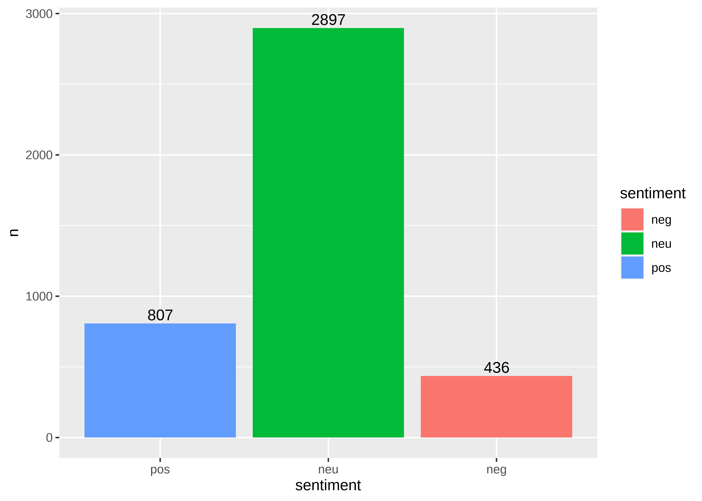
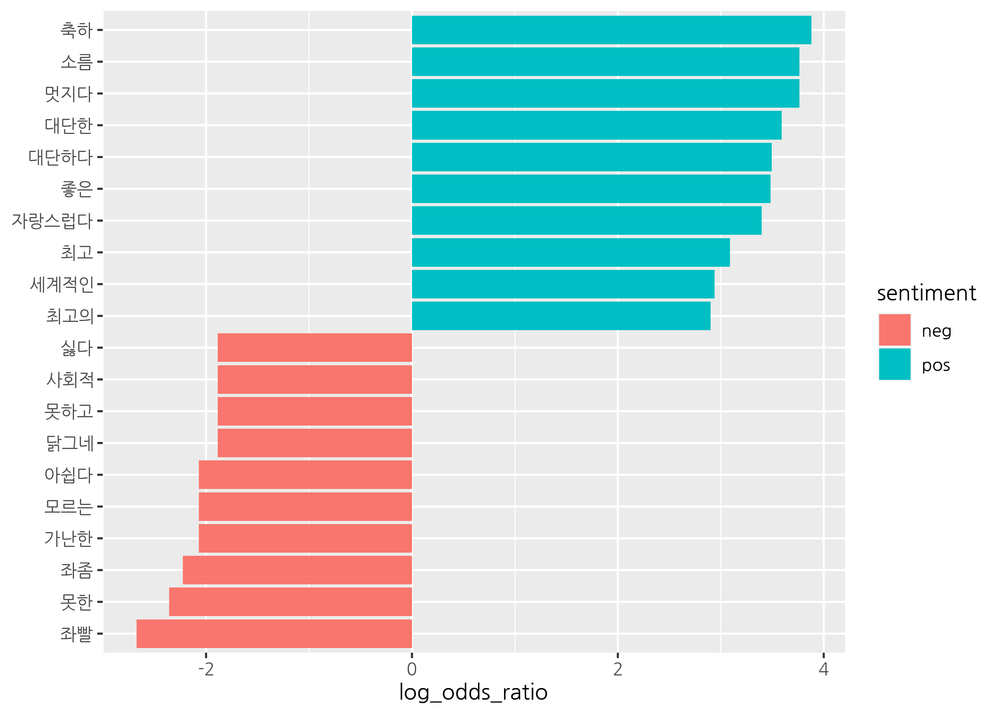
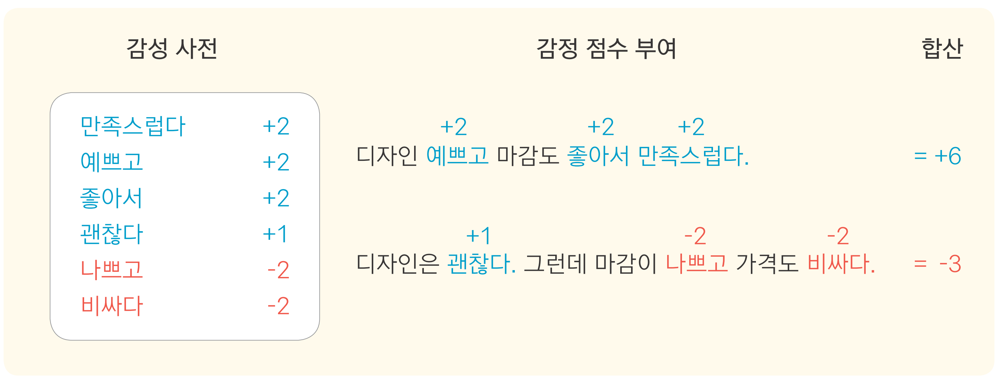

```{r setup, include=FALSE}
options(htmltools.dir.version = FALSE, 
        width = 80,
        # width = 70,
        
        max.print = 80,
        tibble.print_max = 40,
        
        tibble.width = 80,
        # tibble.width = 70,
        
        # pillar.min_chars = Inf, # tibble 문자 출력 제한
        servr.interval = 0.01) # Viewer 수정 반영 속도


knitr::opts_chunk$set(cache = T, warning = F, message = F, 
                      dpi = 300, fig.height = 4, out.width = "100%")

#xaringanExtra::use_tile_view()

library(knitr)
library(icon)
library(here)
```


```{r echo=FALSE}
rm(list = ls())

library(showtext)
font_add_google(name = "Nanum Gothic", family = "nanumgothic")
showtext_auto()
showtext_opts(dpi = 300) # opts_chunk$set(dpi=300)

# code highlighting
hook_source <- knitr::knit_hooks$get('source')
knitr::knit_hooks$set(source = function(x, options) {
  x <- stringr::str_replace(x, "^[[:blank:]]?([^*].+?)[[:blank:]]*#<<[[:blank:]]*$", "*\\1")
  hook_source(x, options)
})


```

class: title0

Do it! 쉽게 배우는 R 텍스트 마이닝

---

<br>

.pull-left[
&nbsp;&nbsp;&nbsp;&nbsp;&nbsp;&nbsp;&nbsp;&nbsp;
```{r, echo=FALSE, out.width="70%", out.height="70%"}
include_graphics("https://raw.githubusercontent.com/youngwoos/Doit_textmining/main/cover.png")
```
]

.pull-right[

<br>
<br>
<br>

`r fontawesome("github")` [github.com/youngwoos/Doit_textmining](https://github.com/youngwoos/Doit_textmining)

`r fontawesome("facebook-square")` [facebook.com/groups/datacommunity](https://facebook.com/groups/datacommunity)

- [네이버책](https://book.naver.com/bookdb/book_detail.nhn?bid=17891971)
  - [yes24](http://bit.ly/3oUuJOB)
  - [알라딘](http://bit.ly/3oXOSDn)
  - [교보문고](https://bit.ly/2LtNOcB)
]

---

class: title0

04 감정 분석: <br> 어떤 마음으로 글을 썼을까?

---

class: title0-2

We'll make

<br-back-20>

```{r, echo=FALSE, out.width="70%", out.height="70%"}

```

---

class: title0-2

and

<br-back-40>

```{r, echo=F, out.width="70%", out.height="70%"}

```

---

<br>

.large2[.font-jua[목차]]

.large[.font-jua[04-1 감정 사전 활용하기]]([link](#04-1))

.large[.font-jua[04-2 댓글 감정 분석하기]]([link](#04-2))

.large[.font-jua[04-3 감정 범주별 주요 단어 살펴보기]]([link](#04-3))

.large[.font-jua[04-4 감정 사전 수정하기]]([link](#04-4))


---


name: 04-1
class: title1

04-1 감정 사전 활용하기

---

##### 감정 분석(sentiment analysis)
- 텍스트에 어떤 감정이 담겨있는지 분석하는 방법
  - 글쓴이가 어떤 감정을 담아 글을 썼는가?
  - 사람들이 어떤 주제를 긍정적/부정적으로 느끼는가?

```{r, out.width="80%", eval=F}

```

---

##### 감정 사전
- '감정 단어'와 '감정의 강도를 표현한 숫자'로 구성된 사전
- 사전을 이용해 문장의 단어에 감정 점수를 부여한 다음 합산

--
#### 감정 사전 살펴보기

- KNU 한국어 감성사전
  - 군산대학교 소프트웨어융합공학과에서 개발
  - `word`: 감정 단어 
  - `polarity`: 감정의 강도

`r fontawesome("lightbulb")` KNU 한국어 감성사전 출처: github.com/park1200656/KnuSentiLex


```{r, eval=FALSE}
# 감정 사전 불러오기
library(dplyr)
library(readr)
dic <- read_csv("knu_sentiment_lexicon.csv")
```

```{r, echo=FALSE}
# 감정 사전 불러오기
library(dplyr)
library(readr)
dic <- read_csv("../Data/knu_sentiment_lexicon.csv")
```

---

.pull-left[
```{r}
# 긍정 단어
dic %>%
  filter(polarity == 2) %>%
  arrange(word)
```
]

.pull-right[

```{r}
# 부정 단어
dic %>%
  filter(polarity == -2) %>%
  arrange(word)
```
]


---

##### 감정 단어의 종류 살펴보기

<br10>

- `word`
  - 한 단어로 된 단일어,  둘 이상 단어 결합된 복합어
  - 이모티콘: `^^`, `ㅠㅠ` 


- `polarity`
  -  5가지 정수(+2, +1, 0, -1, -2)
  - `+`: 긍정 단어, `-`: 부정 단어, `0`: 중성 단어

--

.pull-left[
```{r}
dic %>%
  filter(word %in% c("좋은", "나쁜"))
```
]

.pull-right[
```{r}
dic %>%
  filter(word %in% c("기쁜", "슬픈"))
```
]

---

```{r}
# 이모티콘
library(stringr)
dic %>%
  filter(!str_detect(word, "[가-힣]")) %>%
  arrange(word)

```

---
- 총 14,854개 단어

```{r}
dic %>%
  mutate(sentiment = ifelse(polarity >=  1, "pos",
                     ifelse(polarity <= -1, "neg", "neu"))) %>%
  count(sentiment)
```

---


#### 문장의 감정 점수 구하기

##### 1. 단어 기준으로 토큰화하기
```{r}
df <- tibble(sentence = c("디자인 예쁘고 마감도 좋아서 만족스럽다.",
                          "디자인은 괜찮다. 그런데 마감이 나쁘고 가격도 비싸다."))
df
```

---
- 텍스트를 단어 기준으로 토큰화: 감정 사전과 동일하게
- `unnest_tokens(drop = F)`
  - 원문 제거하지 않기
  - 단어가 어느 문장에서 추출됐는지 알수 있도록

```{r df, eval=F}
library(tidytext)
df <- df %>%
  unnest_tokens(input = sentence,
                output = word,
                token = "words",
                drop = F)

df
```

---

```{r, ref.label = "df" , echo=FALSE}
```


---


#### 단어에 감정 점수 부여하기

- `dplyr::left_join()`: `word` 기준 감정 사전 결합
- 감정 사전에 없는 단어 `polarity` `NA` → `0` 부여

```{r join, eval=F}

df <- df %>%
  left_join(dic, by = "word") %>%
  mutate(polarity = ifelse(is.na(polarity), 0, polarity))

df
```


---

```{r ref.label="join", echo=F}

```

---

<!-- #### 3. 문장별로 감정 점수 합산하기 -->

<!-- 이제 `sencence`별로 감정 점수를 합산하겠습니다. 출력 결과를 보면 첫 번째 문장은 세 단어가 `+2`이므로 합산해 `6`이 되었습니다. 두 번째 문장은 한 단어는 `+1`, 두 단어는 `-2`이므로 합산해 `-3`이 되었습니다. -->

<!-- ```{r} -->
<!-- score_df <- df %>%  -->
<!--   group_by(sentence) %>%  -->
<!--   summarise(score  = sum(polarity)) -->

<!-- score_df -->
<!-- ``` -->

<!-- ## 4.2 기사 댓글 감정 분석하기 -->

<!-- 이제 실제 텍스트를 이용해 감정 분석을 해보겠습니다. `"news_comment_parasite.csv"`에는 2020년 2월 10일 영화 '기생충'의 아카데미상 수상 소식을 다룬 기사에 달린 댓글이 들어 있습니다. 댓글을 분석해 긍정적인 댓글과 부정적인 댓글 중 무엇이 더 많은지, 어떤 내용의 댓글이 달렸는지 알아보겠습니다. -->


<!-- ### 4.2.1 기본적인 전처리 -->

<!-- 우선 기사 댓글 데이터를 불러와 기본적인 전처리를 하겠습니다.  -->

<!-- **고유 번호 변수 만들기** : 댓글의 내용이 같아도 구별할 수 있도록 `mutate()`와 `row_number()`를 이용해 고유 번호 `id`를 추가하겠습니다.  -->

<!-- **html 특수 문자 제거하기** : 웹에서 만들어진 텍스트는 `&nbsp;`과 같은 html 특수 문자가 포함되어 있어서 출력하면 내용을 알아보기 불편합니다. `textclean` 패키지의 `replace_html()`을 이용해 html 태그를 공백으로 바꾼 다음 `stringr` 패키지의 `str_squish()`를 이용해 중복 공백을 제거하겠습니다. -->

<!-- **두 글자 미만 단어 포함하기** : 다음 코드를 보면 앞 장과 달리 특수문자를 제거하고 두 글자 이상의 단어만 남기는 작업을 하지 않았습니다. 감정 사전에 특수문자, 모음, 자음으로 된 이모티콘도 포함되어 있는데, 이런 단어들도 텍스트의 감정을 분석하는데 활용해야 하기 때문입니다. -->


<!-- ```{r eval=F} -->
<!-- # 데이터 불러오기 -->
<!-- raw_news_comment <- read_csv("news_comment_parasite.csv") -->
<!-- ``` -->

<!-- ```{r echo=F} -->
<!-- # 데이터 불러오기 -->
<!-- raw_news_comment <- read_csv("../Data/news_comment_parasite.csv") -->

<!-- ``` -->


<!-- ```{r eval=F} -->
<!-- # 기본적인 전처리 -->
<!-- install.packages("textclean") -->
<!-- library(textclean) -->

<!-- news_comment <- raw_news_comment %>% -->
<!--   mutate(id = row_number(), -->
<!--          reply = str_squish(replace_html(reply))) -->

<!-- # 데이터 구조 확인 -->
<!-- glimpse(news_comment) -->
<!-- ``` -->

<!-- ```{r echo=F} -->
<!-- # 기본적인 전처리 -->
<!-- # install.packages("textclean") -->
<!-- library(textclean) -->

<!-- news_comment <- raw_news_comment %>% -->
<!--   mutate(id = row_number(), -->
<!--          reply = str_squish(replace_html(reply))) -->

<!-- glimpse(news_comment, width = 60) -->
<!-- ``` -->

<!-- > [참고] `glimpse()`는 데이터 구조를 요약해 보여주는 `dplyr` 패키지의 함수입니다. 요약 결과를 줄을 맞춰 출력하기 때문에 `str()`보다 데이터 구조를 파악하기 좋습니다. -->


<!-- ### 4.2.2 단어 기준으로 토큰화하고 감정 점수 부여하기 -->

<!-- `news_comment`를 단어 기준으로 토큰화하고 각 단어에 감정 점수를 부여하겠습니다. -->

<!-- ```{r} -->
<!-- # 토큰화 -->
<!-- word_comment <- news_comment %>% -->
<!--   unnest_tokens(input = reply, -->
<!--                 output = word, -->
<!--                 token = "words", -->
<!--                 drop = F) -->

<!-- word_comment %>% -->
<!--   select(word, reply) -->

<!-- # 감정 점수 부여 -->
<!-- word_comment <- word_comment %>% -->
<!--   left_join(dic, by = "word") %>% -->
<!--   mutate(polarity = ifelse(is.na(polarity), 0, polarity)) -->

<!-- word_comment %>% -->
<!--   select(word, polarity) -->
<!-- ``` -->

<!-- ### 4.2.3 자주 사용된 감정 단어 살펴보기 -->

<!-- 댓글별로 감정 점수를 합산하기 전에, 우선 어떤 감정 단어가 많이 사용되었는지 알아보겠습니다. -->

<!-- #### 1. 감정 분류하기 -->

<!-- 감정이 분명하게 드러난 단어를 중심으로 살펴보기 위해 `polarity`가 `2`면 긍정(pos), `-2`면 부정(neg), 그 외에는 중립(neu)을 부여한 변수 `sentiment`를 만들겠습니다. `sentiment`로 빈도를 구하면 어떤 감정의 단어가 많은지 알 수 있습니다. -->

<!-- ```{r} -->
<!-- word_comment <- word_comment %>% -->
<!--   mutate(sentiment = ifelse(polarity ==  2, "pos", -->
<!--                      ifelse(polarity == -2, "neg", "neu"))) -->

<!-- word_comment %>% -->
<!--   count(sentiment) -->
<!-- ``` -->

<!-- #### 2. 막대 그래프 만들기 -->

<!-- 중립 단어는 제외하고, 긍정 단어와 부정 단어 중 가장 많이 사용 된 단어를 10개씩 추출해 막대 그래프를 만들겠습니다. -->

<!-- ```{r} -->
<!-- top10_sentiment <- word_comment %>% -->
<!--   filter(sentiment != "neu") %>% -->
<!--   count(sentiment, word) %>% -->
<!--   group_by(sentiment) %>% -->
<!--   slice_max(n, n = 10) -->

<!-- top10_sentiment -->
<!-- ``` -->

<!-- ```{r} -->
<!-- # 막대 그래프 만들기 -->
<!-- library(ggplot2) -->
<!-- ggplot(top10_sentiment, aes(x = reorder(word, n),  -->
<!--                             y = n,  -->
<!--                             fill = sentiment)) + -->
<!--   geom_col() + -->
<!--   coord_flip() + -->
<!--   geom_text(aes(label = n), hjust = -0.3) + -->
<!--   facet_wrap(~ sentiment, scales = "free") + -->
<!--   scale_y_continuous(expand = expansion(mult = c(0.05, 0.15))) +   -->
<!--   labs(x = NULL) + -->
<!--   theme(text = element_text(family = "nanumgothic")) -->
<!-- ``` -->

<!-- > [참고] `scale_y_continuous()`에 적용한 `expansion()`은 막대와 그래프 경계의 간격을 넓히는 기능을 합니다. 막대 밖에 표현한 빈도 값이 그래프 경계 밖으로 벗어나지 않도록 하려고 사용했습니다. -->

<!-- 그래프를 보면 긍정 단어는 `"대단하다"`, `"자랑스럽다"`, `"축하"` 등의 빈도가 높습니다. 아카데미상을 수상한 제작진을 칭찬하는 댓글에 사용된 단어라고 예상할 수 있습니다. 부정 단어는 `"소름"`, `"아니다"`, `"우울한"` 등의 빈도가 높습니다. 영화 내용과 관련된 부정적인 감정을 표현한 댓글들에 사용된 단어라고 예상할 수 있습니다. -->

<!-- 앞에서 살펴본 단어들은 댓글에 사용된 단어 중 감정 사전과 매칭된 일부 입니다. 본격적으로 분석을 하기 전에 어떤 감정 단어가 많이 사용되었는지 알아보려고 감정이 분명하게 들어난 단어만 추출해본 것입니다. 텍스트의 전반적인 내용을 파악하려면 감정 점수가 부여되지 않은 중립 단어까지 포함해서 분석해야 합니다. 이 방법은 뒤에서 다루겠습니다. -->

<!-- > [참고] `"소름"`, `"미친"` 등은 부정적인 단어가 아니라 긍정적인 감정을 극적으로 표현하는 단어일 수 있기 때문에 감정 사전을 수정해서 점수를 부여해야 합니다. 이에 대해서는 **4.4**에서 자세히 다룹니다. -->

