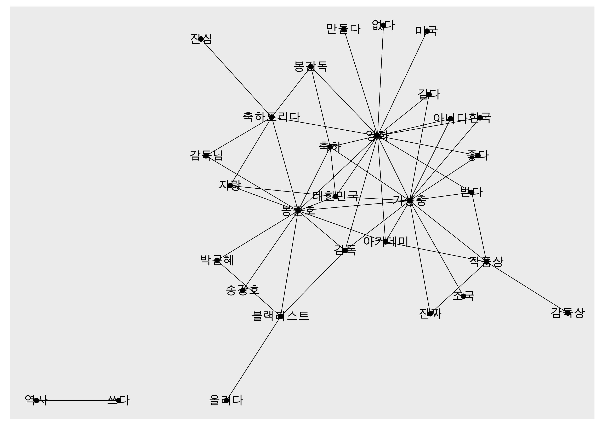
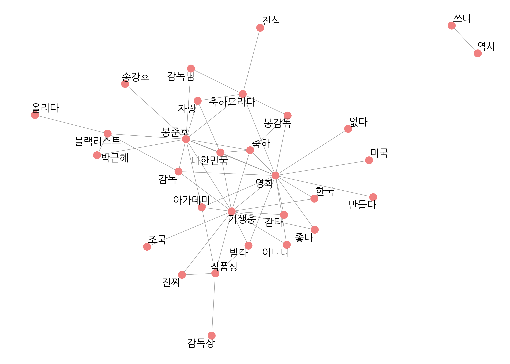
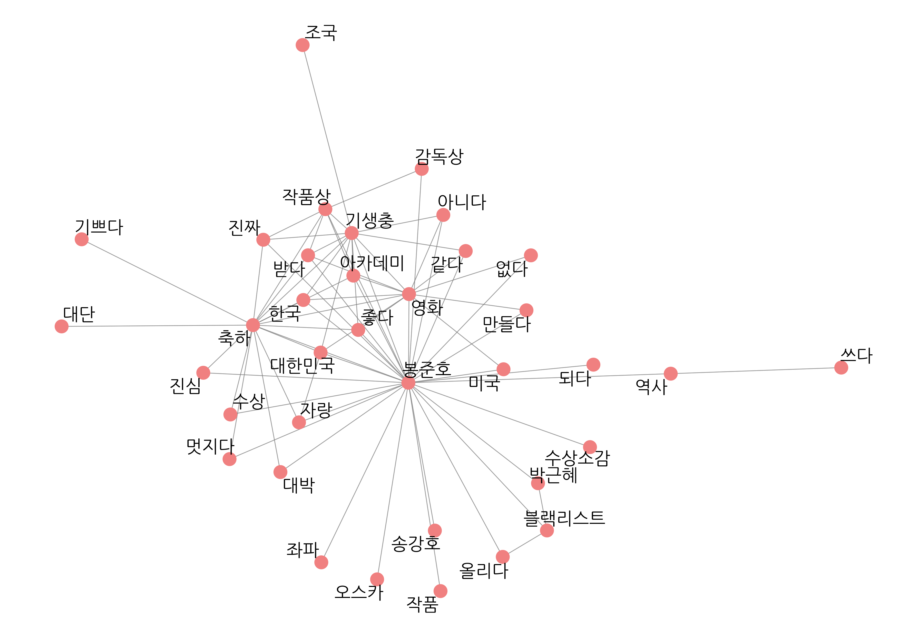
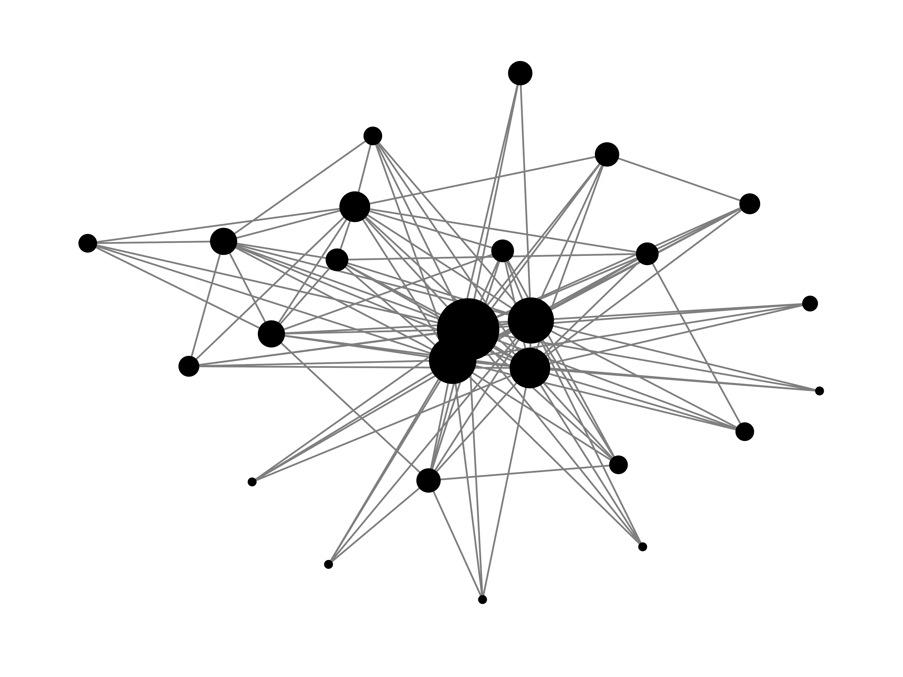
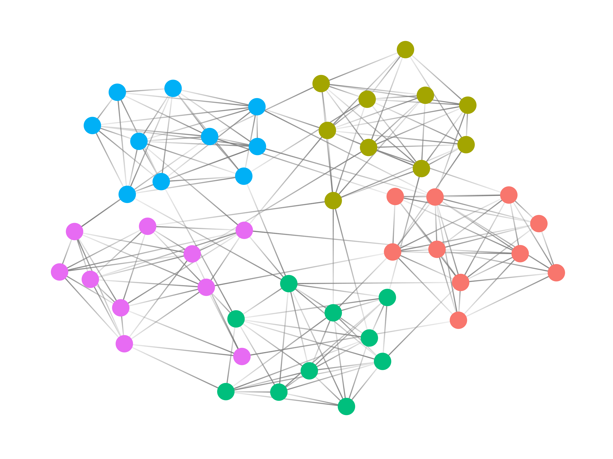

```{r include=FALSE}
options(htmltools.dir.version = FALSE, 
        width = 80,
        # width = 70,
        
        max.print = 80,
        tibble.print_max = 40,
        
        tibble.width = 80,
        # tibble.width = 70,
        
        # pillar.min_chars = Inf, # tibble 문자 출력 제한
        servr.interval = 0.01) # Viewer 수정 반영 속도


knitr::opts_chunk$set(cache = T, warning = F, message = F, 
                      dpi = 300, fig.height = 4)
                      # out.width = "100%"

#xaringanExtra::use_tile_view()

library(knitr)
library(icon)
library(here)
```


```{r echo=FALSE}
rm(list = ls())

library(showtext)
font_add_google(name = "Nanum Gothic", family = "nanumgothic")
showtext_auto()
showtext_opts(dpi = 300) # opts_chunk$set(dpi=300)

# code highlighting
hook_source <- knitr::knit_hooks$get('source')
knitr::knit_hooks$set(source = function(x, options) {
  x <- stringr::str_replace(x, "^[[:blank:]]?([^*].+?)[[:blank:]]*#<<[[:blank:]]*$", "*\\1")
  hook_source(x, options)
})


```

```{r echo=F}
# get data from prior rmd
load("05-1.rdata")

library(ggplot2)
library(dplyr)
library(tidytext)
library(stringr)
library(widyr)
library(ggraph)
```


class: title1

05-2 동시 출현 네트워크:  
Co-occurrence network

---

##### 동시 출현 네트워크(co-occurrence network)
- 동시 출현 빈도를 이용해 단어의 관계를 네트워크 형태로 표현
- 단어들이 어떤 맥락에서 함께 사용되었는지 이해할 수 있다


--

#### 네트워크 그래프 데이터 만들기 

- `tidygraph::as_tbl_graph()`
- 동시 출현 빈도 데이터를 '네트워크 그래프 데이터'로 변환하기
  - 단어를 나타내는 노드(node, 꼭짓점)
  - 단어를 연결하는 엣지(edge, 선)

`r fontawesome("lightbulb")` 네트워크가 너무 복잡하지 않도록 25회 이상 사용된 단어 추출해 생성


```{r eval=F}
install.packages("tidygraph")
library(tidygraph)

graph_comment <- pair %>%
  filter(n >= 25) %>%
  as_tbl_graph()

graph_comment
```

```{r echo=F}
# install.packages("tidygraph")
library(tidygraph)

graph_comment <- pair %>%
  filter(n >= 25) %>%
  as_tbl_graph()

graph_comment
```


---


#### 네트워크 그래프 만들기

- `ggraph::ggraph()`

```{r eval=F}
install.packages("ggraph")
library(ggraph)

ggraph(graph_comment) +
  geom_edge_link() +                 # 엣지
  geom_node_point() +                # 노드
  geom_node_text(aes(label = name))  # 텍스트
```

```{r, echo=FALSE, out.width="40%", out.height="40%"}

```

---

```{r, echo=FALSE, out.width="80%", out.height="80%"}

```

---

.box[
  .info[`r icon_style(fontawesome("rocket"), fill = "#FF7333")` 그래프를 큰 화면에 출력하는 방법]

  - Plots 창의 Zoom 아이콘 클릭
  이미지 출력 창을 별도로 열어 큰 화면에서 보기
    - 윈도우: `windows()`
    - macOS: `x11()`
]

---


##### 그래프 다듬기

```{r eval=F}
# 한글 폰트 설정
library(showtext)
font_add_google(name = "Nanum Gothic", family = "nanumgothic")
showtext_auto()
```


---

##### 엣지와 노드의 색깔, 크기, 텍스트 위치 수정

- `ggraph(layout = "fr")`: 네트워크 형태 결정
  - 난수를 이용해 매번 형태 달라짐 → `set.seed()`로 난수 고정

```{r eval=FALSE}
set.seed(1234)                              # 난수 고정
ggraph(graph_comment, layout = "fr") +      # 레이아웃

  geom_edge_link(color = "gray50",          # 엣지 색깔
                 alpha = 0.5) +             # 엣지 명암

  geom_node_point(color = "lightcoral",     # 노드 색깔
                  size = 5) +               # 노드 크기

  geom_node_text(aes(label = name),         # 텍스트 표시
                 repel = T,                 # 노드밖 표시
                 size = 5,                  # 텍스트 크기
                 family = "nanumgothic") +  # 폰트

  theme_graph()                             # 배경 삭제
```

`r icon_style(fontawesome("exclamation-triangle"), fill = "#FF7333")`  노드 텍스트 폰트 `geom_node_text()`의 `family`로 별도 설정. `theme()`으로 적용 안됨.

---

```{r, echo=FALSE, out.width="80%", out.height="80%"}

```

---


##### 네트워크 그래프 함수 만들기

```{r}
word_network <- function(x) {
  ggraph(x, layout = "fr") +
    geom_edge_link(color = "gray50",
                   alpha = 0.5) +
    geom_node_point(color = "lightcoral",
                    size = 5) +
    geom_node_text(aes(label = name),
                   repel = T,
                   size = 5,
                   family = "nanumgothic") +
    theme_graph()
}
```


```{r eval=F}
set.seed(1234)
word_network(graph_comment)
```

---

####  유의어 처리하기

- 유의어(synonyms): 표현은 다르지만 의미가 비슷한 단어
  - ex) `"감독"`, `"봉감독"`, `"봉준호감독"`
- 유의어 통일하기: 네트워크 구조가 간결해지고 단어의 관계가 좀 더 분명하게 드러남

---

```{r, results='hide'}
# 유의어 처리하기
comment <- comment %>%
  mutate(word = ifelse(str_detect(word, "감독") &
                      !str_detect(word, "감독상"), "봉준호", word),
         word = ifelse(word == "오르다", "올리다", word),
         word = ifelse(str_detect(word, "축하"), "축하", word))

# 단어 동시 출현 빈도 구하기
pair <- comment %>%
  pairwise_count(item = word,
                 feature = id,
                 sort = T)

# 네트워크 그래프 데이터 만들기
graph_comment <- pair %>%
  filter(n >= 25) %>%
  as_tbl_graph()

# 네트워크 그래프 만들기
set.seed(1234)
word_network(graph_comment)
```

---

```{r, echo=FALSE, out.width="80%"}

```

---

#### 연결 중심성과 커뮤니티 표현하기

- 네트워크 그래프는 단어 노드가 많아 어떤 단어 노드 중심으로 해석할지 판단 어려움
- 연결 중심성과 커뮤니티를 표현하면 단어의 관계를 더 분명하게 파악할 수 있다

--


##### 연결 중심성(degree centrality)
- 노드가 다른 노드들과 얼마나 밀접하게 연결되는지 나타낸 값
- 연결 중심성으로 노드 크기를 조정하면 어떤 단어를 눈여겨봐야 할지 판단하기 쉬워진다

```{r, echo=FALSE, out.width="50%"}

```

---

#### 연결 중심성과 커뮤니티 표현하기

- 네트워크 그래프는 단어 노드가 많아 어떤 단어 노드 중심으로 해석할지 판단 어려움
- 연결 중심성과 커뮤니티를 표현하면 단어의 관계를 더 분명하게 파악할 수 있다


##### 커뮤니티(community)

- 단어 간의 관계가 가까워 빈번하게 연결된 노드 집단
- 노드를 커뮤니티별로 구분 지어 서로 다른 색으로 표현하면 네트워크 구조를 이해하기 쉬워진다

```{r, echo=FALSE, out.width="50%"}

```


---

##### 1. 네트워크 그래프 데이터에 연결 중심성, 커뮤니티 변수 추가하기

<br10>
  - 네트워크 그래프 데이터 만들기: `as_tbl_graph()`
      - `directed = F`: 방향성 없도록 설정
      - `group_infomap()`은 방향성 없는 네트워크 그래프 데이터에서만 커뮤니티를 찾아줌


--


  - 연결 중심성 변수 추가하기: `centrality_degree()`
  - 커뮤니티 변수 추가하기: `group_infomap()`
      - 커뮤니티가 정수형 숫자이므로 노드가 그라데이션으로 표현됨
      - `as.factor()`: factor 타입으로 변환해 노드 그룹별로 다른 색으로 표현

```{r graph_comment, eval=F}
set.seed(1234)
graph_comment <- pair %>%
  filter(n >= 25) %>%
  as_tbl_graph(directed = F) %>%
  mutate(centrality = centrality_degree(),    # 연결 중심성
         group = as.factor(group_infomap()))  # 커뮤니티

graph_comment
```


---
```{r ref.label="graph_comment", echo=F, highlight.output = c(6:14)}

```

---

#### 2. 네트워크 그래프에 연결 중심성, 커뮤니티 표현하기

- `geom_node_point(aes())`
  - `size = centrality`: 연결 중심성에 따라 노드 크기 설정
  - `color = group`: 커뮤니티 별로 노드 색깔 다르게
  - `geom_node_point(show.legend = F)`: 범례 제거
  - `scale_size(range = c(5, 15))`: 노드 크기 5~15 범위 유지
  - 너무 크거나 작으면 알아보기 불편


---


```{r eval=F}
set.seed(1234)
ggraph(graph_comment, layout = "fr") +      # 레이아웃

  geom_edge_link(color = "gray50",          # 엣지 색깔
                 alpha = 0.5) +             # 엣지 명암

  geom_node_point(aes(size = centrality,    # 노드 크기
                      color = group),       # 노드 색깔
                  show.legend = F) +        # 범례 삭제
  scale_size(range = c(5, 15)) +            # 노드 크기 범위

  geom_node_text(aes(label = name),         # 텍스트 표시
                 repel = T,                 # 노드밖 표시
                 size = 5,                  # 텍스트 크기
                 family = "nanumgothic") +  # 폰트

  theme_graph()                             # 배경 삭제
```


---

```{r, echo=FALSE, out.width="80%"}
include_graphics("../Image/05/05_2_6.png")
```


---


#### 3. 네트워크의 주요 단어 살펴보기


##### 주요 단어의 커뮤니티 살펴보기

```{r}
graph_comment %>%
  filter(name == "봉준호")
```

---

#### 같은 커뮤니티로 분류된 단어 살펴보기

```{r}
graph_comment %>%
  filter(group == 4) %>%
  arrange(-centrality) %>%
  data.frame()
```


---

#### 연결 중심성이 높은 주요 단어 살펴보기

.pull-left[

```{r eval=FALSE}
graph_comment %>%
  arrange(-centrality)
```
]

.pull-right[
```{r echo=FALSE}
graph_comment %>%
  arrange(-centrality)
```

]


---

#### 연결 중심성이 높은 주요 단어 살펴보기

- 2번 커뮤니티로 분류된 단어

```{r}
graph_comment %>%
  filter(group == 2) %>%
  arrange(-centrality) %>%
  data.frame()
```


---

#### 4. 주요 단어가 사용된 원문 살펴보기

```{r R.options=list(tibble.print_max = 10, tibble.print_min = 10, tibble.width = 50)}
news_comment %>%
  filter(str_detect(reply, "봉준호") & str_detect(reply, "대박")) %>%
  select(reply)
```


---

```{r R.options=list(tibble.print_max = 10, tibble.print_min = 10, tibble.width = 50)}
news_comment %>%
  filter(str_detect(reply, "박근혜") & str_detect(reply, "블랙리스트")) %>%
  select(reply)
```

---

```{r R.options=list(tibble.print_max = 10, tibble.print_min = 10, tibble.width = 50)}
news_comment %>%
  filter(str_detect(reply, "기생충") & str_detect(reply, "조국")) %>%
  select(reply)
```

<br>

`r fontawesome("lightbulb")` `tidygraph` 패키지의 연결 중심성 지표, 커뮤니티 탐지 알고리즘: [tidygraph.data-imaginist.com](https://tidygraph.data-imaginist.com)


```{r, echo=F}
save(comment, pair, word_network, file = "05-2.rdata")
```
