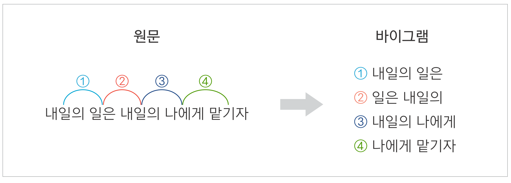
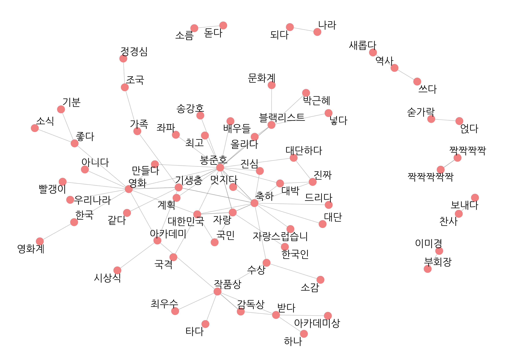
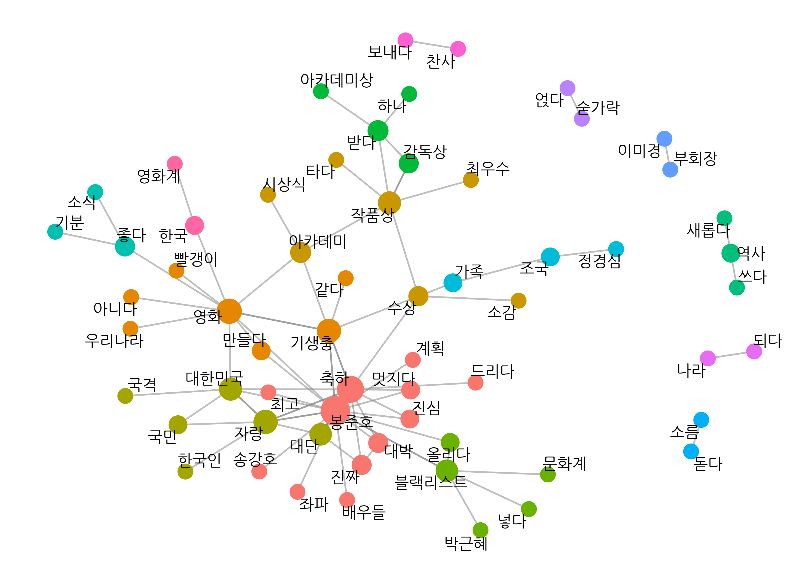
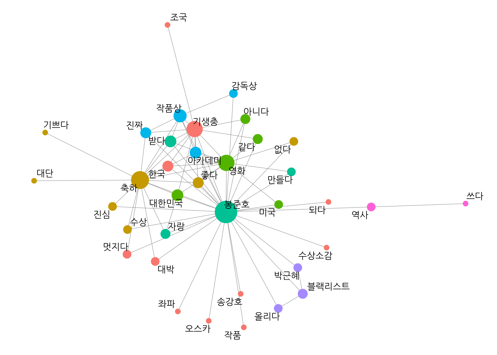
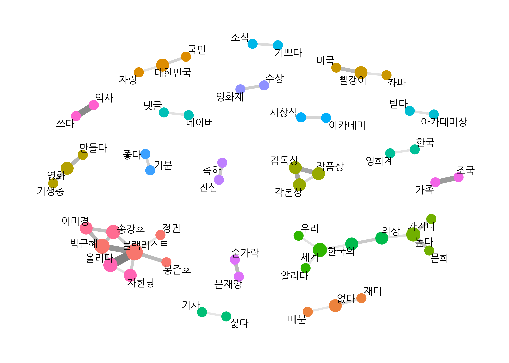

```{r include=FALSE}
options(htmltools.dir.version = FALSE, 
        width = 80,
        # width = 70,
        
        max.print = 80,
        tibble.print_max = 40,
        
        tibble.width = 80,
        # tibble.width = 70,
        
        # pillar.min_chars = Inf, # tibble 문자 출력 제한
        servr.interval = 0.01) # Viewer 수정 반영 속도


knitr::opts_chunk$set(cache = T, warning = F, message = F, 
                      dpi = 300, fig.height = 4)
                      # out.width = "100%"

#xaringanExtra::use_tile_view()

library(knitr)
library(icon)
library(here)
```


```{r echo=FALSE}
rm(list = ls())

library(showtext)
font_add_google(name = "Nanum Gothic", family = "nanumgothic")
showtext_auto()
showtext_opts(dpi = 300) # opts_chunk$set(dpi=300)

# code highlighting
hook_source <- knitr::knit_hooks$get('source')
knitr::knit_hooks$set(source = function(x, options) {
  x <- stringr::str_replace(x, "^[[:blank:]]?([^*].+?)[[:blank:]]*#<<[[:blank:]]*$", "*\\1")
  hook_source(x, options)
})


```

```{r echo=F}
# get data from prior rmd
load("05-1.rdata")
load("05-2.rdata")
rm(list=setdiff(ls(), c("comment_pos", "pair", "word_network")))

library(ggplot2)
library(dplyr)
library(tidytext)
library(stringr)
library(widyr)
library(ggraph)
```


class: title1

05-4  
연이어 사용된 단어쌍 분석: n-gram

---


- 같은 단어도 함께 사용된 단어에 따라 의미가 달라짐
- 어떤 단어는 다른 단어와 연결되어 새로운 의미를 만들어냄
  - ex)
      - '사과를 먹다', '사과를 하다'
      - '감을 잡다', '귀가 얇다'

--


- 동시 출현 빈도와 파이 계수의 한계: 단어가 함께 사용된 횟수만 고려
  - 단어가 연결될 때 생기는 의미 무시
  - 이해하기 어려운 단어쌍 등장

--


<br>

- 단어가 연결될 때 생기는 의미를 고려하려면 **'자주 연이어 사용된 단어'**를 살펴봐야 한다


---

#### 엔그램(n-gram)
- 연이어 사용된 n개의 단어
  - 두 단어 연속: 바이그램(bigram) 또는 2-gram
  - 세 단어 연속: 트라이그램(trigram) 또는 3-gram

.center[
```{r, echo=F, out.width="70%"}

```
]


--


- **텍스트를 엔그램으로 토큰화하면**
  - 단어 앞뒤에 연이어 사용된 단어를 함께 살펴봄: 얼마나 자주 '연이어' 사용된 단어쌍인가?
  - 단어가 연결될 때 생기는 의미와 맥락을 이해할 수 있음
  - 대다수의 텍스트에 사용된 평범한 단어쌍이 아니라 분명한 의미를 드러내는 단어쌍 발견

---


#### 엔그램으로 토큰화하기

**샘플 텍스트로 엔그램 토큰화해보기**
<br-back-10>
- `tidytext::unnest_tokens()`
  - `token = "ngrams"`
  - `n`: 기준 단어 수

```{r R.options=list(pillar.min_chars = Inf, tibble.width = 100, width = 100)}
text <- tibble(value = "대한민국은 민주공화국이다. 대한민국의 주권은 국민에게 있고, 모든 권력은 국민으로부터 나온다.")

text
```

---

.pull-left[


```{r}
# 바이그램 토큰화
text %>%
  unnest_tokens(input = value,
                output = word,
                token = "ngrams",
                n = 2)  #<<
```
]

.pull-right[


```{r}
# 트라이그램 토큰화
text %>%
  unnest_tokens(input = value,
                output = word,
                token = "ngrams",
                n = 3) #<<
```
]


---

- 단어 기준 토큰화 = 유니그램(unigram) 토큰화

.pull-left[


```{r}
# 단어 기준 토큰화
text %>%
  unnest_tokens(input = value,
                output = word,
                token = "words") #<<
```
]

.pull-right[
```{r}
# 유니그램 토큰화
text %>%
  unnest_tokens(input = value,
                output = word,
                token = "ngrams", #<<
                n = 1)            #<<
```
]

---

#### 기사 댓글로 바이그램 만들기

##### (1) 명사, 동사, 형용사 추출하기

- `comment_pos` 이용: 댓글을 형태소로 토큰화 후 품사별로 행 분리
- 명사, 동사, 형용사를 추출해 결합한 후 두 글자 이상만 남김

```{r}
comment_new <- comment_pos %>%
  separate_rows(word, sep = "[+]") %>%
  filter(str_detect(word, "/n|/pv|/pa")) %>%
  mutate(word = ifelse(str_detect(word, "/pv|/pa"),
                       str_replace(word, "/.*$", "다"),
                       str_remove(word, "/.*$"))) %>%
  filter(str_count(word) >= 2) %>%
  arrange(id)
```

---

`r icon_style(fontawesome("exclamation-triangle"), fill = "#FF7333")` **바이그램으로 토큰화할 때는 형태소 추출 먼저**

- 텍스트 원문을 바이그램으로 토큰화하면 원형은 같지만 표현만 다른 단어들이 개별 단어로 취급됨
  - ex) '하다', '했다', '하며', '하므로'
- 표현이 아니라 의미 중심으로 분석해야 하므로 형태소를 먼저 추출한 다음 바이그램으로 토큰화해야 함

---


##### (2) 유의어 처리하기


```{r}
comment_new <- comment_new %>%
  mutate(word = ifelse(str_detect(word, "감독") &
                      !str_detect(word, "감독상"), "봉준호", word),
         word = ifelse(word  == "오르다", "올리다", word),
         word = ifelse(str_detect(word, "축하"), "축하", word))
```

---


##### (3) 한 댓글이 하나의 행이 되도록 결합하기


```{r}
comment_new %>%
  select(word)
```

---

##### (3) 한 댓글이 하나의 행이 되도록 결합하기

```{r}
line_comment <- comment_new %>%
  group_by(id) %>%
  summarise(sentence = paste(word, collapse = " "))

line_comment
```


---

##### (4) 바이그램으로 토큰화하기


```{r}
bigram_comment <- line_comment %>%
  unnest_tokens(input = sentence,
                output = bigram,
                token = "ngrams",
                n = 2)

bigram_comment
```

---


#### 연이어 사용된 단어쌍 빈도 구하기


##### 1. 바이그램 분리하기

```{r}
# 바이그램 분리하기
bigram_seprated <- bigram_comment %>%
  separate(bigram, c("word1", "word2"), sep = " ")

bigram_seprated
```

---

##### 2. 단어쌍 빈도 구하기

.pull-left[

```{r pair_bigram, results='hide'}
# 단어쌍 빈도 구하기
pair_bigram <- bigram_seprated %>%
  count(word1, word2, sort = T) %>%
  na.omit()

pair_bigram
```

]
.pull-right[

```{r ref.label="pair_bigram", echo=F}
```
]

<br>
`r fontawesome("lightbulb")` `na.omit()`: 결측치 행 제거: 한 단어로 된 문장은 바이그램으로 토큰화하면 `NA`가 됨 <br>&nbsp;&nbsp;&nbsp;&nbsp;ex) '축하합니다', '멋집니다'

---

##### 3. 단어쌍 살펴보기

<br10>

.pull-left[
```{r}
# 동시 출현 단어쌍
pair %>% #<<
  filter(item1 == "대한민국")
```
]
.pull-right[
```{r}
# 바이그램 단어쌍
pair_bigram %>% #<<
  filter(word1 == "대한민국")
```
]

---


#### 엔그램으로 네트워크 그래프 만들기


```{r eval=F}
# 네트워크 그래프 데이터 만들기
graph_bigram <- pair_bigram %>%
  filter(n >= 8) %>%
  as_tbl_graph()

# 네트워크 그래프 만들기
set.seed(1234)
word_network(graph_bigram)
```

```{r, echo=F, out.width="40%"}

```

---

```{r, echo=F, out.width="80%"}

```


---


##### 유의어 통일하고 네트워크 그래프 다시 만들기

- `bigram_seprated`의 유의어 통일, 같은 단어 연속 단어쌍 제거
- 단어쌍 빈도 구하고 결측치 제거

```{r}
# 유의어 처리
bigram_seprated <- bigram_seprated %>%
  mutate(word1 = ifelse(str_detect(word1, "대단"), "대단", word1),
         word2 = ifelse(str_detect(word2, "대단"), "대단", word2),

         word1 = ifelse(str_detect(word1, "자랑"), "자랑", word1),
         word2 = ifelse(str_detect(word2, "자랑"), "자랑", word2),

         word1 = ifelse(str_detect(word1, "짝짝짝"), "짝짝짝", word1),
         word2 = ifelse(str_detect(word2, "짝짝짝"), "짝짝짝", word2)) %>%

  # 같은 단어 연속 제거
  filter(word1 != word2)

# 단어쌍 빈도 구하기
pair_bigram <- bigram_seprated %>%
  count(word1, word2, sort = T) %>%
  na.omit()
```


---

```{r eval=F}
# 네트워크 그래프 데이터 만들기
set.seed(1234)
graph_bigram <- pair_bigram %>%
  filter(n >= 8) %>%
  as_tbl_graph(directed = F) %>%
  mutate(centrality = centrality_degree(),    # 중심성
         group = as.factor(group_infomap()))  # 커뮤니티
```

---

```{r eval=F}
# 네트워크 그래프 만들기
set.seed(1234)
ggraph(graph_bigram, layout = "fr") +         # 레이아웃

  geom_edge_link(color = "gray50",            # 엣지 색깔
                 alpha = 0.5) +               # 엣지 명암

  geom_node_point(aes(size = centrality,      # 노드 크기
                      color = group),         # 노드 색깔
                  show.legend = F) +          # 범례 삭제
  scale_size(range = c(4, 8)) +               # 노드 크기 범위

  geom_node_text(aes(label = name),           # 텍스트 표시
                 repel = T,                   # 노드밖 표시
                 size = 5,                    # 텍스트 크기
                 family = "nanumgothic") +    # 폰트

  theme_graph()                               # 배경 삭제
```

---

```{r, echo=F, out.width="80%"}

```

---
- 자주 연이어 사용된 단어쌍 중심으로 네트워크 형성
- 단어의 맥락과 의미를 구체적으로 이해할 수 있음
- 개별 단어의 빈도는 낮지만 자주 연이어 사용되고 함께 사용할 때 분명한 의미 지니는 단어쌍 발견
  - ex) '이미경-부회장', '조국-가족'

```{r, echo=F, out.width="60%"}

```

---

##### 파이 계수, 바이그램 네트워크 그래프의 차이점

<br10>

- **파이 계수**를 이용한 네트워크 그래프
  - 관련성이 큰 단어쌍 중심으로 네트워크 형성
  - 빈도가 낮아도 관련성이 큰 단어 주로 표현
  - 관련성이 작은 노드들이 연결되지 않음
      - 단어 군집이 명확하게 드러남 but 단어들의 전반적인 관계를 파악하기 어려움


--

<br10>

- **바이그램**을 이용한 네트워크 그래프
  - 연이어 자주 사용된 단어쌍 중심으로 표현
  - 관련성이 큰 동시에 자주 사용된 단어 주로 표현
  - 노드가 대부분 연결됨
    - 단어 군집이 덜 명확 but 단어들의 전반적인 관계 파악할 수 있음

---

##### 파이 계수, 바이그램 네트워크 그래프의 차이점

<br10>

- **파이 계수**를 이용한 네트워크 그래프
  - .orange[**관련성이 큰 단어쌍**] 중심으로 네트워크 형성
  - 빈도가 낮아도 관련성이 큰 단어 주로 표현
  - 관련성이 작은 노드들이 연결되지 않음
      - 단어 군집이 명확하게 드러남 but 단어들의 전반적인 관계를 파악하기 어려움

<br10>

- **바이그램**을 이용한 네트워크 그래프
  - .orange[**연이어 자주 사용된 단어쌍**] 중심으로 표현
  - 관련성이 큰 동시에 자주 사용된 단어 주로 표현
  - 노드가 대부분 연결됨
    - 단어 군집이 덜 명확 but 단어들의 전반적인 관계 파악할 수 있음

---

##### 어떤 방법으로 네트워크 그래프를 만드는 게 좋을까
<br10>
- 각 방법의 특징 다르므로 분석 목적에 맞게 선택
- 세 가지 방법 모두 사용해 분석 결과 비교하면 텍스트를 다각도로 이해할 수 있음

<br>





---

- **동시 출현 빈도**: 자주 사용된 단어 중심으로 단어들의 관계 표현
<br10>

```{r, echo=F, out.width="75%"}

```

---

- **파이 계수**
  - 관련성이 큰 단어쌍 중심으로 표현
  - 단어 군집을 잘 드러내고 싶을 때

```{r, echo=F, out.width="70%"}

```

---

- **엔그램**
  - 연이어 사용될 때 의미를 지니는 단어쌍 중심으로 표현
  - 단어들이 전반적으로 어떤 관계를 형성하고 있는지 표현할 때

```{r, echo=F, out.width="70%"}

```

---

class: title1

정리하기

---

### 정리하기

##### 1. 동시 출현 단어 분석 - Co-occurrence analysis

```{r eval=FALSE}
# 품사 기준 토큰화
comment_pos <- news_comment %>%
  unnest_tokens(input = reply,
                output = word,
                token = SimplePos22,
                drop = F)

# 명사, 동사, 형용사 추출
comment <- comment_pos %>%
  separate_rows(word, sep = "[+]") %>%
  filter(str_detect(word, "/n|/pv|/pa")) %>%
  mutate(word = ifelse(str_detect(word, "/pv|/pa"),
                       str_replace(word, "/.*$", "다"),
                       str_remove(word, "/.*$"))) %>%
  filter(str_count(word) >= 2) %>%
  arrange(id)
```

---

### 정리하기

##### 1. 동시 출현 단어 분석 - Co-occurrence analysis


```{r eval=FALSE}
# 단어 동시 출현 빈도 구하기
pair <- comment %>%
  pairwise_count(item = word,
                 feature = id,
                 sort = T)
```


---

### 정리하기

##### 2. 단어 간 상관 분석 - Phi coefficient

```{r eval=FALSE}
# 파이 계수 구하기
word_cors <- comment %>%
  add_count(word) %>%
  filter(n >= 20) %>%
  pairwise_cor(item = word,
               feature = id,
               sort = T)
```


---

### 정리하기


##### 3. 연이어 사용된 단어쌍 분석 - n-gram

```{r eval=FALSE}
# 텍스트를 한 행으로 구성
line_comment <- comment %>%
  group_by(id) %>%
  summarise(sentence = paste(word, collapse = " "))

# 바이그램 토큰화
bigram_comment <- line_comment %>%
  unnest_tokens(input = sentence,
                output = bigram,
                token = "ngrams",
                n = 2)

# 바이그램 분리
bigram_seprated <- bigram_comment %>%
  separate(bigram, c("word1", "word2"), sep = " ")
```

---

### 정리하기


##### 3. 연이어 사용된 단어쌍 분석 - n-gram


```{r eval=FALSE}
# 단어쌍 빈도 구하기
pair_bigram <- bigram_seprated %>%
  count(word1, word2, sort = T) %>%
  na.omit()
```

---

### 정리하기

##### 4. 네트워크 그래프 만들기

```{r eval=FALSE}
# 네트워크 그래프 데이터 만들기
set.seed(1234)
graph_comment <- pair_bigram %>%
  filter(n >= 8) %>%
  as_tbl_graph(directed = F) %>%
  mutate(centrality = centrality_degree(),
         group = as.factor(group_infomap()))

# 네트워크 그래프 만들기
set.seed(1234)
ggraph(graph_comment) +
  geom_edge_link() +
  geom_node_point(aes(size = centrality,
                      color = group)) +
  geom_node_text(aes(label = name))
```

---

### 분석 도전

**`"news_comment_BTS.csv"`에는 2020년 9월 21일 방탄소년단이 '빌보드 핫 100 차트' 1위에 오른 소식을 다룬 기사에 달린 댓글이 들어있습니다. `"news_comment_BTS.csv"`를 이용해 문제를 해결해 보세요.**

- Q1. `"news_comment_BTS.csv"`를 불러온 다음 행 번호를 나타낸 변수를 추가하고 분석에 적합하게<br>&nbsp;&nbsp;&nbsp;&nbsp;&nbsp;&nbsp; 전처리하세요.

- Q2. 댓글에서 명사, 동사, 형용사를 추출하고 '/로 시작하는 모든 문자'를 '다'로 바꾸세요.

- Q3. 다음 코드를 이용해 유의어를 통일한 다음 한 댓글이 하나의 행이 되도록 단어를 결합하세요.

```{r eval=F}
# 유의어 통일하기
comment <- comment %>%
  mutate(word = case_when(str_detect(word, "축하") ~ "축하",
                          str_detect(word, "방탄") ~ "자랑",
                          str_detect(word, "대단") ~ "대단",
                          str_detect(word, "자랑") ~ "자랑",
                          T ~ word))
```


---

### 분석 도전

**`"news_comment_BTS.csv"`에는 2020년 9월 21일 방탄소년단이 '빌보드 핫 100 차트' 1위에 오른 소식을 다룬 기사에 달린 댓글이 들어있습니다. `"news_comment_BTS.csv"`를 이용해 문제를 해결해 보세요.**


- Q4. 댓글을 바이그램으로 토큰화한 다음 바이그램 단어쌍을 분리하세요.

<br10>

- Q5. 단어쌍 빈도를 구한 다음 네트워크 그래프 데이터를 만드세요.
  - 난수를 고정한 다음 네트워크 그래프 데이터를 만드세요.
  - 빈도가 3 이상인 단어쌍만 사용하세요.
  - 연결 중심성과 커뮤니티를 나타낸 변수를 추가하세요.

<br10>

- Q6. 바이그램을 이용해 네트워크 그래프를 만드세요.
  - 난수를 고정한 다음 네트워크 그래프를 만드세요.
  - 레이아웃을 `"fr"`로 설정하세요.
  - 연결 중심성에 따라 노드 크기를 정하고, 커뮤니티별로 노드 색깔이 다르게 설정하세요.
  - 노드의 범례를 삭제하세요.
  - 텍스트가 노드 밖에 표시되게 설정하고, 텍스트의 크기를 5로 설정하세요.

---

Q1. `"news_comment_BTS.csv"`를 불러온 다음 행 번호를 나타낸 변수를 추가하고 분석에 적합하게<br>&nbsp;&nbsp;&nbsp;&nbsp;&nbsp;&nbsp; 전처리하세요.

```{r eval=F}
library(readr)
library(dplyr)
raw_news_comment <- read_csv("news_comment_BTS.csv")
glimpse(raw_news_comment)
```


```{r echo=F, R.options=list(tibble.width = 60)}
library(readr)
library(dplyr)
raw_news_comment <- read_csv("../../Data/news_comment_BTS.csv")
glimpse(raw_news_comment)
```


---

<br-back-20>
```{r eval=F}
library(stringr)
library(textclean)
news_comment <- raw_news_comment %>%
  select(reply) %>%
  mutate(id = row_number(),
         reply = str_replace_all(reply, "[^가-힣]", " "),
         reply = str_squish(reply))

news_comment %>%
  select(id, reply)
```

```{r echo=F, R.options=list(tibble.width = 50)}
#전처리
library(stringr)
library(textclean)
news_comment <- raw_news_comment %>%
  select(reply) %>%
  mutate(id = row_number(),
         reply = str_replace_all(reply, "[^가-힣]", " "),
         reply = str_squish(reply))

news_comment %>%
  select(id, reply)


```

---

Q2. 댓글에서 명사, 동사, 형용사를 추출하고 '/로 시작하는 모든 문자'를 '다'로 바꾸세요.


```{r}
# 품사 기준 토큰화
library(tidytext)
library(KoNLP)
comment_pos <- news_comment %>%
  unnest_tokens(input = reply,
                output = word,
                token = SimplePos22,
                drop = F)
```

---


```{r  R.options=list(tibble.width = 50)}

# 한 행이 한 품사를 구성하도록 분리
library(tidyr)
comment_pos <- comment_pos %>%
  separate_rows(word, sep = "[+]")

comment_pos %>%
  select(word, reply)
```


---


```{r}
# 명사, 동사, 형용사 추출
comment <- comment_pos %>%
  separate_rows(word, sep = "[+]") %>%
  filter(str_detect(word, "/n|/pv|/pa")) %>%
  mutate(word = ifelse(str_detect(word, "/pv|/pa"),
                       str_replace(word, "/.*$", "다"),
                       str_remove(word, "/.*$"))) %>%
  filter(str_count(word) >= 2) %>%
  arrange(id)
```

---

```{r, R.options=list(tibble.width = 50)}
comment %>%
  select(word, reply)
```


---

Q3. 다음 코드를 이용해 유의어를 통일한 다음 한 댓글이 하나의 행이 되도록 단어를 결합하세요.

```{r}
# 유의어 통일하기
comment <- comment %>%
  mutate(word = case_when(str_detect(word, "축하") ~ "축하",
                          str_detect(word, "방탄") ~ "자랑",
                          str_detect(word, "대단") ~ "대단",
                          str_detect(word, "자랑") ~ "자랑",
                          T ~ word))
```

---


```{r, R.options=list(tibble.width = 50)}
# 단어를 댓글별 한 행으로 결합
line_comment <- comment %>%
  group_by(id) %>%
  summarise(sentence = paste(word, collapse = " "))

line_comment
```

---

Q4. 댓글을 바이그램으로 토큰화한 다음 바이그램 단어쌍을 분리하세요.


```{r}
# 바이그램 토큰화
bigram_comment <- line_comment %>%
  unnest_tokens(input = sentence,
                output = bigram,
                token = "ngrams",
                n = 2)

bigram_comment
```

---

```{r}
# 바이그램 단어쌍 분리
bigram_seprated <- bigram_comment %>%
  separate(bigram, c("word1", "word2"), sep = " ")

bigram_seprated
```


---

- Q5. 단어쌍 빈도를 구한 다음 네트워크 그래프 데이터를 만드세요.
  - 난수를 고정한 다음 네트워크 그래프 데이터를 만드세요.
  - 빈도가 3 이상인 단어쌍만 사용하세요.
  - 연결 중심성과 커뮤니티를 나타낸 변수를 추가하세요.

<br10>

.pull-left[
```{r quiz_pair_bigram, eval=FALSE}
# 단어쌍 빈도 구하기
pair_bigram <- bigram_seprated %>%
  count(word1, word2, sort = T) %>%
  na.omit()

pair_bigram
```
]

.pull-right[
```{r ref.label="quiz_pair_bigram", echo=F}
```
]

---

```{r}
# 네트워크 그래프 데이터 만들기
library(tidygraph)
set.seed(1234)
graph_bigram <- pair_bigram %>%
  filter(n >= 3) %>%
  as_tbl_graph(directed = F) %>%
  mutate(centrality = centrality_degree(),
         group = as.factor(group_infomap()))

graph_bigram
```


---

- Q6. 바이그램을 이용해 네트워크 그래프를 만드세요.
  - 난수를 고정한 다음 네트워크 그래프를 만드세요.
  - 레이아웃을 `"fr"`로 설정하세요.
  - 연결 중심성에 따라 노드 크기를 정하고, 커뮤니티별로 노드 색깔이 다르게 설정하세요.
  - 노드의 범례를 삭제하세요.
  - 텍스트가 노드 밖에 표시되게 설정하고, 텍스트의 크기를 5로 설정하세요.


```{r eval=F}
library(ggraph)
set.seed(1234)
ggraph(graph_bigram, layout = "fr") +

  geom_edge_link() +

  geom_node_point(aes(size = centrality,
                      color = group),
                  show.legend = F) +

  geom_node_text(aes(label = name),
                 repel = T,
                 size = 5) +

  theme_graph()
  
```

---

```{r, echo=F, out.width="90%"}
include_graphics("https://raw.githubusercontent.com/youngwoos/Doit_textmining/main/Quiz/Quiz_Part05_files/figure-markdown_github/unnamed-chunk-15-1.png")
```

---


```{r eval=FALSE}
# 그래프 꾸미기
library(showtext)
font_add_google(name = "Nanum Gothic", family = "nanumgothic")

set.seed(1234)
ggraph(graph_bigram, layout = "fr") +         # 레이아웃

  geom_edge_link(color = "gray50",            # 엣지 색깔
                 alpha = 0.5) +               # 엣지 명암

  geom_node_point(aes(size = centrality,      # 노드 크기
                      color = group),         # 노드 색깔
                  show.legend = F) +          # 범례 삭제
  scale_size(range = c(4, 8)) +               # 노드 크기 범위

  geom_node_text(aes(label = name),           # 텍스트 표시
                 repel = T,                   # 노드밖 표시
                 size = 5,                    # 텍스트 크기
                 family = "nanumgothic") +    # 폰트

  theme_graph()                               # 배경 삭제
```

---

```{r, echo=F, out.width="90%"}
include_graphics("https://raw.githubusercontent.com/youngwoos/Doit_textmining/main/Quiz/Quiz_Part05_files/figure-markdown_github/unnamed-chunk-17-1.png")
```
---

class: title0

끝
