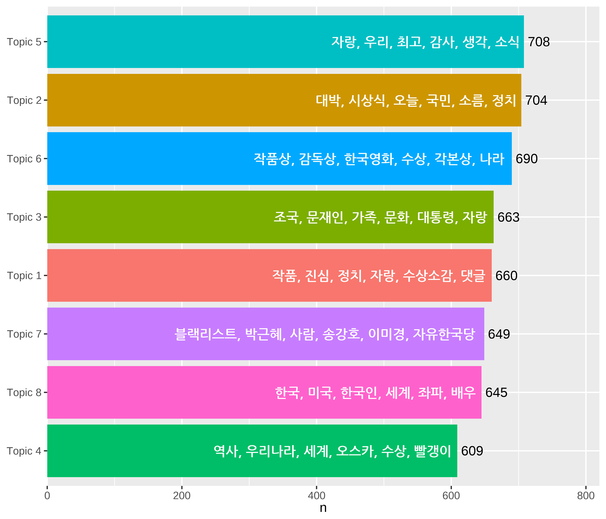
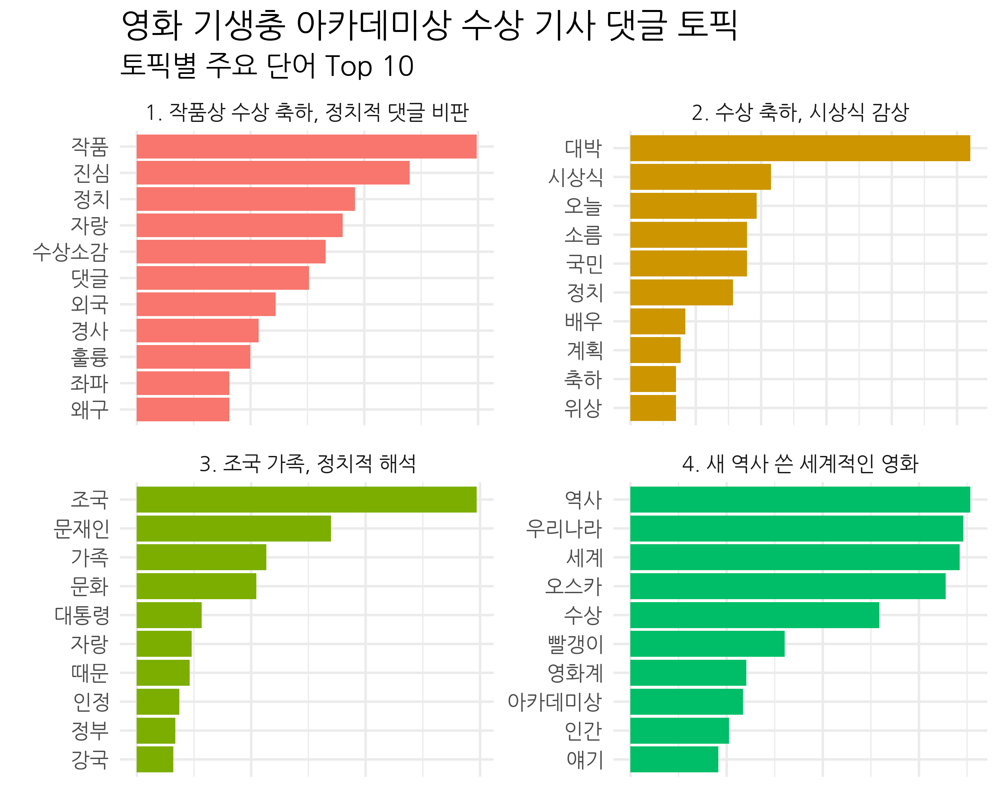
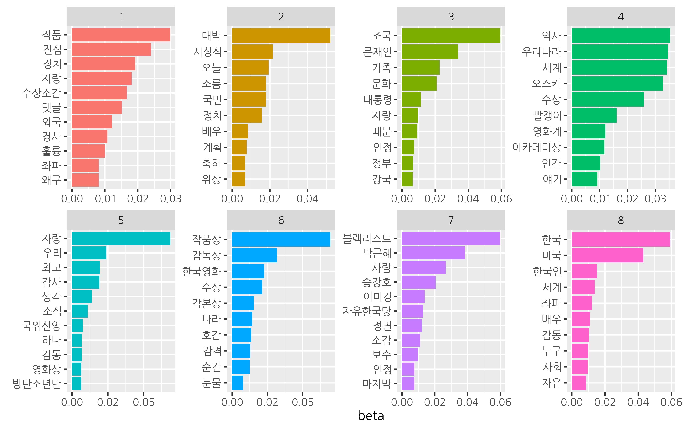
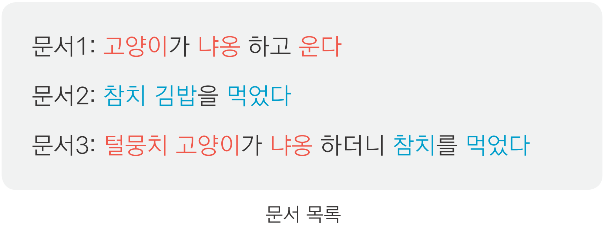
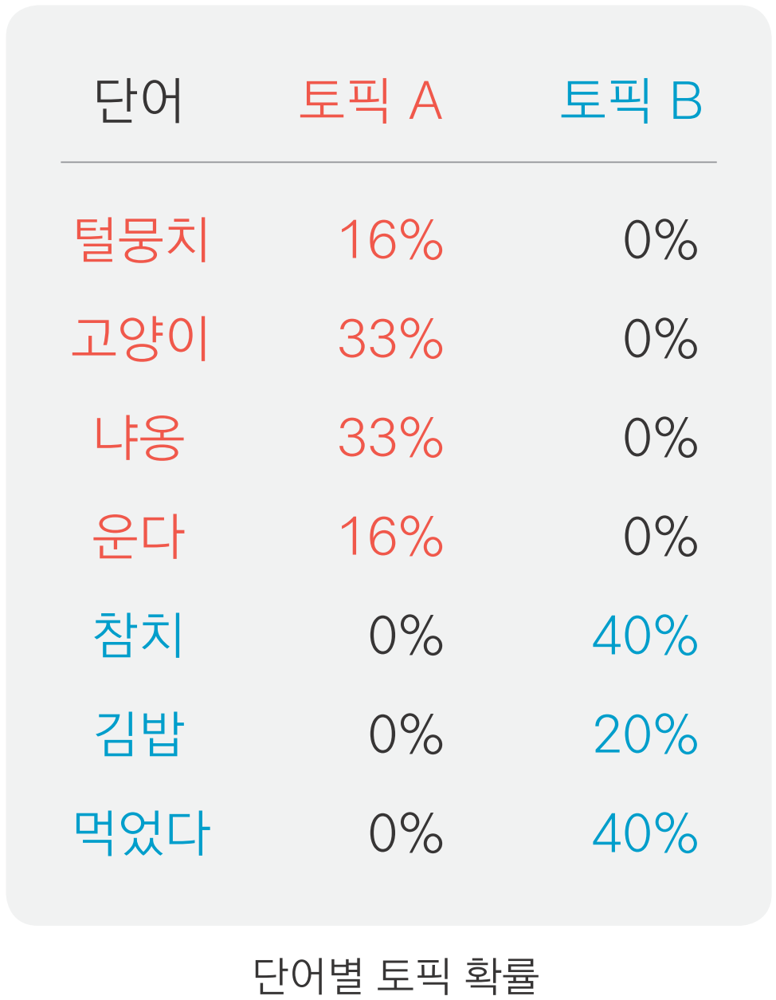
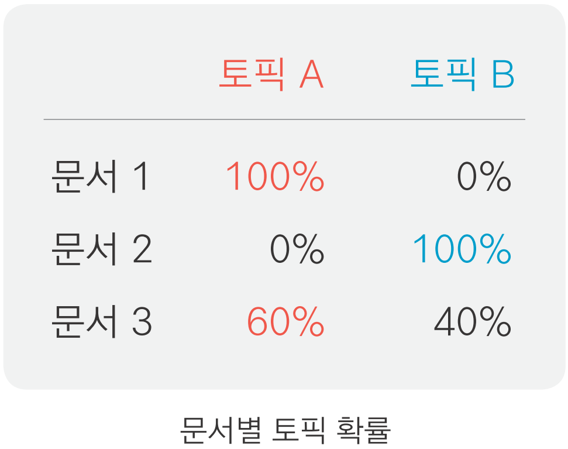
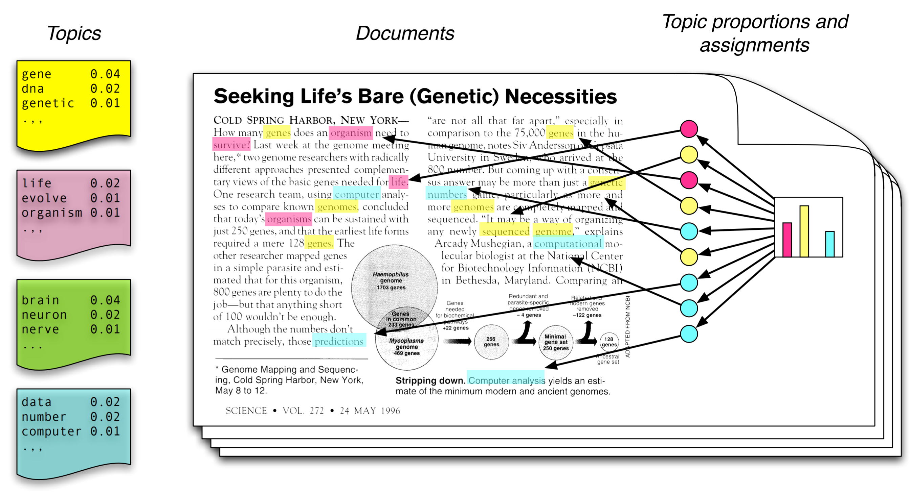

```{r setup, include=FALSE}
options(htmltools.dir.version = FALSE, 
        width = 80,
        # width = 70,
        
        max.print = 80,
        tibble.print_max = 40,
        
        tibble.width = 80,
        # tibble.width = 70,
        
        # pillar.min_chars = Inf, # tibble 문자 출력 제한
        servr.interval = 0.01) # Viewer 수정 반영 속도


knitr::opts_chunk$set(cache = T, warning = F, message = F, 
                      dpi = 300, fig.height = 4)
                      # out.width = "100%"

# xaringanExtra::use_tile_view()

library(knitr)
library(icon)
library(here)
```


```{r echo=FALSE}
rm(list = ls())

library(showtext)
font_add_google(name = "Nanum Gothic", family = "nanumgothic")
showtext_auto()
showtext_opts(dpi = 96)
# showtext_opts(dpi = 300) # opts_chunk$set(dpi=300)

# code highlighting
hook_source <- knitr::knit_hooks$get('source')
knitr::knit_hooks$set(source = function(x, options) {
  x <- stringr::str_replace(x, "^[[:blank:]]?([^*].+?)[[:blank:]]*#<<[[:blank:]]*$", "*\\1")
  hook_source(x, options)
})

# 출력 결과 제한 함수
hook_output <- knit_hooks$get("output")
knit_hooks$set(output = function(x, options) {
  lines <- options$output.lines
  if (is.null(lines)) {
    return(hook_output(x, options))  # pass to default hook
  }
  x <- unlist(strsplit(x, "\n"))
  more <- "..."
  if (length(lines)==1) {        # first n lines
    if (length(x) > lines) {
      # truncate the output, but add ....
      x <- c(head(x, lines), more)
    }
  } else {
    x <- c(more, x[lines], more)
  }
  # paste these lines together
  x <- paste(c(x, ""), collapse = "\n")
  hook_output(x, options)
})
```


class: title0

Do it! 쉽게 배우는 R 텍스트 마이닝

---

class: no-page-num

<br>

.pull-left[
&nbsp;&nbsp;&nbsp;&nbsp;&nbsp;&nbsp;&nbsp;&nbsp;
```{r, echo=FALSE, out.width="70%", out.height="70%"}
include_graphics("https://raw.githubusercontent.com/youngwoos/Doit_textmining/main/cover.png")
```
]

.pull-right[

<br>
<br>
<br>

`r fontawesome("github")` [github.com/youngwoos/Doit_textmining](https://github.com/youngwoos/Doit_textmining)

`r fontawesome("facebook-square")` [facebook.com/groups/datacommunity](https://facebook.com/groups/datacommunity)

- [네이버책](https://book.naver.com/bookdb/book_detail.nhn?bid=17891971)
  - [yes24](http://bit.ly/3oUuJOB)
  - [알라딘](http://bit.ly/3oXOSDn)
  - [교보문고](https://bit.ly/2LtNOcB)
]

---

class: title0

06 토픽 모델링:  
어떤 주제로 글을 썼을까?

---

class: title0-2

<br-back-20>

We'll make

<br-back-40>

```{r, echo=FALSE, out.width="60%", out.height="60%"}

```

---

class: title0-2

<br-back-40>

and

<br-back-40>

```{r, echo=F, out.width="65%", out.height="65%"}

```

---

<br>

.large2[.font-jua[목차]]

.large[.font-jua[06-1 토픽 모델링 개념 알아보기]]([link](#06-1))

.large[.font-jua[06-2 LDA 모델 만들기]]([link](#06-2))

.large[.font-jua[06-3 토픽별 주요 단어 살펴보기]]([link](#06-3))

.large[.font-jua[06-4 문서를 토픽별로 분류하기]]([link](#06-4))

.large[.font-jua[06-5 토픽 이름 짓기]]([link](#06-5))

.large[.font-jua[06-6 최적의 토픽 수 정하기]]([link](#06-6))


---

name: 06-1
class: title1

06-1 토픽 모델링 개념 알아보기

---

#### 토픽 모델링(topic modeling)
  - 텍스트의 핵심 주제를 찾아 비슷한 내용끼리 분류하는 분석 방법
  - 분석할 텍스트가 많을 때 유용
  
```{r echo=FALSE, out.width = '70%'}

```


---

##### 토픽 모델 예시: 문서 3개로 만든 모델

.pull-left-60[

<br10>

- 문서의 토픽
  - 문서 1: 고양이 관련 내용
  - 문서 2: 음식 관련 내용
  - 문서 3: 고양이, 음식 모두 관련 내용
]


<br10>

.pull-right-40[

```{r echo=FALSE, fig.align='center'}

```
]


--


.pull-left-60[
<br>
<br>
<br>

- 토픽 모델을 이용하면
  - 단어가 어떤 토픽에 등장할 확률이 더 높은지 알 수 있다
  - 단어 등장 확률을 보고 토픽의 핵심 단어를 알 수 있다
]

.pull-right-40[
<br>

```{r echo=FALSE, out.width='60%', fig.align='center'}

```
]


---

- 토픽 모델을 이용하면
  - 문서가 어떤 토픽에 등장할 확률이 높은지 알 수 있다
  - 확률을 이용해 문서를 토픽별로 분류할 수 있다 → 다량의 문서 분석할 때 특히 유용
  - 문서가 어떤 주제로 구성되는지 파악할 수 있다

<br10>

```{r echo=FALSE, out.width = '25%', fig.align='center'}

```


---


#### LDA 모델
- LDA(Latent Dirichlet Allocation, 잠재 디리클레 할당): 가장 널리 사용되는 토픽 모델링 알고리즘


##### LDA 모델의 가정 1. 토픽은 여러 단어의 혼합으로 구성된다

- 한 토픽에 여러 단어가 서로 다른 확률로 포함된다
- 같은 단어가 여러 토픽에 서로 다른 확률로 포함된다

<br10>

```{r echo=FALSE, out.width = '25%', fig.align='center'}
knitr::include_graphics("../Image/etc/06_1_table_4.png")
```

---

##### LDA 모델의 가정 2. 문서는 토픽들의 혼합으로 구성된다

- 문서에는 여러 토픽의 단어가 서로 다른 비율로 들어 있음
- 단어 확률이 더 높은 쪽으로 문서 분류

<br10>

```{r echo=FALSE, out.width='50%', fig.cap="Latent Dirichlet allocation(LDA): bit.ly/easytext_62", fig.align='center'}

```

<br>

`r fontawesome("lightbulb")` LDA 모델이 만들어지는 과정을 자세히 알고 싶다면 - Topic Modeling, LDA: [bit.ly/easytext_61](https://bit.ly/easytext_61)


---

name: 06-2
class: title1

6.2 LDA 모델 만들기


---

#### 전처리하기

##### 1. 기본적인 전처리

- **중복 문서 제거하기**: `dplyr::distinct()`
  - 중복 문서가 있으면 계산량 늘어나 모델 만드는 시간 오래 걸림
  - 한 토픽에 내용이 똑같은 문서가 여러 개 들어 있는 문제 생김


- **짧은 문서 제거하기**:
  - 토픽 모델은 여러 문서에 공통으로 사용된 단어를 이용해 만듦
  - 짧은 문서는 다른 문서와 공통으로 사용된 단어가 적어 모델 만드는 데 적합하지 않음

---

```{r eval = F}
# 기생충 기사 댓글 불러오기
library(readr)
library(dplyr)

raw_news_comment <- read_csv("news_comment_parasite.csv") %>%
  mutate(id = row_number())

library(stringr)
library(textclean)

# 기본적인 전처리
news_comment <- raw_news_comment %>%
  mutate(reply = str_replace_all(reply, "[^가-힣]", " "),
         reply = str_squish(reply)) %>%

  # 중복 댓글 제거
  distinct(reply, .keep_all = T) %>%

  # 짧은 문서 제거 - 3 단어 이상 추출
  filter(str_count(reply, boundary("word") >= 3))
```

```{r echo = F}
# 기생충 기사 댓글 불러오기
library(readr)
library(dplyr)

raw_news_comment <- read_csv("../../Data/news_comment_parasite.csv") %>%
  mutate(id = row_number())

library(stringr)
library(textclean)

# 기본적인 전처리
news_comment <- raw_news_comment %>%
  mutate(reply = str_replace_all(reply, "[^가-힣]", " "),
         reply = str_squish(reply)) %>%

  # 중복 댓글 제거
  distinct(reply, .keep_all = T) %>%

  # 짧은 문서 제거 - 3 단어 이상 추출
  filter(str_count(reply, boundary("word")) >= 3)
```

`r fontawesome("lightbulb")` `row_number()`: 문서를 토픽별로 분류하는 작업을 할 때 문서 구분 기준이 필요하므로 댓글 고유 번호 부여

---

##### 2. 명사 추출하기

- 문서의 주제는 명사로 결정되므로 명사 추출해 모델 만드는 경우가 많음
- 댓글에 중복 사용된 단어 제거: 문서에 같은 단어 여러 번 사용되면 내용 관계없이 사용 빈도 때문에 특정 토픽으로 분류될 가능성 높음

```{r}
library(tidytext)
library(KoNLP)

# 명사 추출
comment <- news_comment %>%
  unnest_tokens(input = reply,
                output = word,
                token = extractNoun,
                drop = F) %>%
  filter(str_count(word) > 1) %>%

  # 댓글 내 중복 단어 제거
  group_by(id) %>%
  distinct(word, .keep_all = T) %>%
  ungroup() %>%
  select(id, word)
```

---

```{r}
comment
```

---

##### 3. 빈도 높은 단어 제거하기

- '영화', '기생충' 등은 거의 모든 댓글에 들어 있음
- 빈도가 매우 높은 단어가 포함된 상태로 토픽 모델을 만들면 대부분의 토픽에 똑같은 단어가 주요 단어로 등장해 토픽의 특징을 파악하기 어려우므로 제거

```{r}
count_word <- comment %>%
  add_count(word) %>%
  filter(n <= 200) %>%
  select(-n)
```

---

##### 4. 불용어 제거하기, 유의어 처리하기

<br10>

##### 4.1 불용어, 유의어 확인하기
- 불용어(Stop word): 분석에서 제외할 단어
  - `"들이"`, `"하다"`, `"하게"`처럼 의미를 알 수 없는 단어
  - 텍스트 해석에 도움이 되지 않으므로 제거해야 함
  

<br>

- 빈도 높은 단어 추출해 불용어 확인, 표현은 다르지만 의미가 비슷한 유의어가 있는지 확인

```{r eval=F}
# 불용어, 유의어 확인하기
count_word %>%
  count(word, sort = T) %>%
  print(n = 200)
```

---

```{r echo=F, R.options=list(tibble.print_max = 20, tibble.print_min = 20)}
count_word %>%
  count(word, sort = T)
```


---

##### 4.2 불용어 목록 만들기

```{r}
# 불용어 목록 만들기
stopword <- c("들이", "하다", "하게", "하면", "해서", "이번", "하네",
              "해요", "이것", "니들", "하기", "하지", "한거", "해주",
              "그것", "어디", "여기", "까지", "이거", "하신", "만큼")
```

---


##### 4.3 불용어 제거하고 유의어 수정하기

```{r}
# 불용어, 유의어 처리하기
count_word <- count_word %>%
  filter(!word %in% stopword) %>%
  mutate(word = recode(word,
                       "자랑스럽습니" = "자랑",
                       "자랑스럽" = "자랑",
                       "자한" = "자유한국당",
                       "문재" = "문재인",
                       "한국의" = "한국",
                       "그네" = "박근혜",
                       "추카" = "축하",
                       "정경" = "정경심",
                       "방탄" = "방탄소년단"))
```

`r fontawesome("lightbulb")` `dplyr::recode()`: 특정 값을 다른 값으로 수정

---


.box[
<br-back-20>
.info[`r icon_style(fontawesome("rocket"), fill = "#FF7333")` 불용어 목록을 파일로 만들어 활용하기]

<br10>

```{r eval=F}
# tibble 구조로 불용어 목록 만들기
stopword <- tibble(word = c("들이", "하다", "하게", "하면", "해서", "이번", "하네",
                            "해요", "이것", "니들", "하기", "하지", "한거", "해주",
                            "그것", "어디", "여기", "까지", "이거", "하신", "만큼")

# 불용어 목록 저장하기
library(readr)
write_csv(stopword, "stopword.csv")

# 불용어 목록 불러오기
stopword <- read_csv("stopword.csv")
```


```{r eval=F}
# 불용어 제거하기 - filter()
count_word <- count_word %>%
  filter(!word %in% stopword$word)

# 불용어 제거하기 - dplyr::anti_join()
count_word <- count_word %>%
  anti_join(stopword, by = "word")
```
<br-back-20>
]


---


#### LDA 모델 만들기

##### 1. DTM 만들기
- DTM(Document-Term Matrix, 문서 단어 행렬): 행은 문서, 열은 단어로 구성해 빈도를 나타낸 행렬

##### 1.1 문서별 단어 빈도 구하기

```{r eval = F}
# 문서별 단어 빈도 구하기
count_word_doc <- count_word %>%
  count(id, word, sort = T)

count_word_doc
```

---


```{r echo=F}
count_word_doc
```


---


##### 1.2 DTM 만들기

- `tidytext::cast_dtm()`
  - `document` : 문서 구분 기준
  - `term` : 단어
  - `value` : 단어 빈도

```{r eval=F}
install.packages("tm")

# DTM 만들기
dtm_comment <- count_word_doc %>%
  cast_dtm(document = id, term = word, value = n)

dtm_comment
```

```{r echo=F}
# install.packages("tm")

# DTM 만들기
dtm_comment <- count_word_doc %>%
  cast_dtm(document = id, term = word, value = n)

dtm_comment
```
`r fontawesome("lightbulb")`  `tm` 패키지 설치 필요


---

#### 2. LDA 모델 만들기 - `LDA()`


- `topicmodels::LDA()`
  - `k` : 토픽 수
  - `method` : 샘플링 방법. 일반적으로 깁스 샘플링(`"Gibbs"`) 가장 많이 사용
  - `control = list(seed = 1234))` : 난수 고정

```{r}
install.packages("topicmodels")
library(topicmodels)

# 토픽 모델 만들기
lda_model <- LDA(dtm_comment,
                 k = 8,
                 method = "Gibbs",
                 control = list(seed = 1234))
```

`r fontawesome("lightbulb")`  토픽 수에는 정해진 정답이 없기 때문에 `k`값을 바꿔가며 여러 모델을 만든 다음 결과를 비교해 결정

---

```{r highlight.output=c(11,12)}
# 모델 내용 확인
glimpse(lda_model)
```

---
- `@ beta : num [1:8, 1:5995]`
  - 단어가 각 토픽에 등장할 확률
  - 5,995개 단어로 모델


- `@ gamma : num [1:3203, 1:8]`
  - 문서가 각 토픽에 등장할 확률
  - 3,203개 문서로 모델 생성

`r fontawesome("lightbulb")` 깁스 샘플링에 관해 자세히 알고 싶다면: Topic Modeling, LDA([bit.ly/easytext_61](https://bit.ly/easytext_61))


---

name: 06-3
class: title1

6.3 토픽별 주요 단어 살펴보기


---


##### 6.3.1 토픽별 단어 확률, beta 추출하기

- 베타(beta, β): 단어가 각 토픽에 등장할 확률
  - 베타를 보면 각 토픽에 등장할 가능성이 높은 주요 단어를 알 수 있다


##### beta 추출하기

- `tidytext::tidy()`

.pull-left-50[

```{r results='hide'}
term_topic <- tidy(lda_model, matrix = "beta")
term_topic
```
]
.pull-right-40[

```{r echo=F}
term_topic
```
]

---

##### beta 살펴보기

- 모델을 5,995개 단어로 만들었으므로 토픽별 5,995 행

```{r}
# 토픽별 단어 수
term_topic %>%
  count(topic)
```

---
##### beta 살펴보기

- 확률 값이므로 한 토픽의 `beta`를 모두 다하면 `1`

```{r}
# 토픽 1의 beta 합계
term_topic %>%
  filter(topic == 1) %>%
  summarise(sum_beta = sum(beta))
```

---

##### 특정 단어의 토픽별 확률 살펴보기

- 특정 단어를 추출하면 단어가 어떤 토픽에 등장할 확률이 높은지 알 수 있다

.pull-left[

```{r, highlight.output=9}
term_topic %>%
  filter(term == "작품상")
```
]
---


#### 토픽별 주요 단어 살펴보기

##### 특정 토픽에서 beta가 높은 단어 살펴보기
```{r}
term_topic %>%
  filter(topic == 6) %>%
  arrange(-beta)
```

---

##### 모든 토픽의 주요 단어 살펴보기

- `topicmodels::terms()`

```{r eval=F}
terms(lda_model, 20) %>%
  data.frame()
```

```{r echo=F}
terms(lda_model, 20) %>%
  data.frame() %>%
  head(5) %>%
  select(1:4)
```

```{r echo=F}
terms(lda_model, 20) %>%
  data.frame() %>%
  head(5) %>%
  select(5:8)
```

---


#### 토픽별 주요 단어 시각화하기

##### 1. 토픽별로 beta가 가장 높은 단어 추출하기

```{r}
# 토픽별 beta 상위 10개 단어 추출
top_term_topic <- term_topic %>%
  group_by(topic) %>%
  slice_max(beta, n = 10)

```

`r fontawesome("lightbulb")` 토픽별 단어 확률에 동점이 있으면 추출한 단어가 10개 보다 많을 수 있다. <br> &nbsp;&nbsp;&nbsp;&nbsp;동점 제외하려면 `slice_max(with_ties = F)`

---

#### 2. 막대 그래프 만들기

```{r eval=FALSE}
install.packages("scales")
library(scales)
library(ggplot2)

ggplot(top_term_topic,
       aes(x = reorder_within(term, beta, topic),
           y = beta,
           fill = factor(topic))) +
  geom_col(show.legend = F) +
  facet_wrap(~ topic, scales = "free", ncol = 4) +
  coord_flip() +
  scale_x_reordered() +
  scale_y_continuous(n.breaks = 4,
                     labels = number_format(accuracy = .01)) +
  labs(x = NULL) +
  theme(text = element_text(family = "nanumgothic"))
```

```{r p_top_term_topic, echo=FALSE, fig.show='hide'}
# install.packages("scales")
library(scales)
library(ggplot2)

ggplot(top_term_topic,
       aes(x = reorder_within(term, beta, topic),
           y = beta,
           fill = factor(topic))) +
  geom_col(show.legend = F) +
  facet_wrap(~ topic, scales = "free", ncol = 4) +
  coord_flip() +
  scale_x_reordered() +
  scale_y_continuous(n.breaks = 4,
                     labels = number_format(accuracy = .01)) +
  labs(x = NULL) +
  theme(text = element_text(family = "nanumgothic"))
```

`r fontawesome("lightbulb")` `scale_y_continuous(n.breaks  =  4)`: 축 눈금을 4개 내외로 정하기<br-back-10>
`r fontawesome("lightbulb")` `labels  =  number_format(accuracy = .01)`: 눈금 소수점 첫째 자리에서 반올림. `scales`  로드 필요.

---

```{r ref.label="p_top_term_topic", echo=F, out.width='95%'}

```


---


---

name: 06-4
class: title1

06-4 문서를 토픽별로 분류하기

---

#### 문서별 토픽 확률 gamma 추출하기

- 감마(gamma, γ): 문서가 각 토픽에 등장할 확률
  - 감마를 이용하면 토픽별로 분류할 수 있다
  - 문서를 토픽별로 분류하고 주요 단어와 원문을 함께 살펴보면 토픽의 특징을 이해할 수 있다


##### gamma 추출하기

.pull-left-50[

```{r eval=F}
doc_topic <- tidy(lda_model, matrix = "gamma")
doc_topic
```
]

.pull-right-40[
```{r echo=F}
doc_topic <- tidy(lda_model, matrix = "gamma")
doc_topic
```
]


---

#### gamma 살펴보기

- 모델을 3,203개 문서로 만들었으므로 토픽별 3,203 행
```{r}
doc_topic %>%
  count(topic)
```

---

#### gamma 살펴보기

- 확률 값이므로 한 문서의 `gamma`를 모두 더하면 1
```{r}
# 문서 1의 gamma 합계
doc_topic %>%
  filter(document == 1) %>%
  summarise(sum_gamma = sum(gamma))
```

---

#### 문서를 확률이 가장 높은 토픽으로 분류하기

##### 1. 문서별로 확률이 가장 높은 토픽 추출하기

<br-10>

.pull-left[

```{r eval=F}
# 문서별로 확률이 가장 높은 토픽 추출
doc_class <- doc_topic %>%
  group_by(document) %>%
  slice_max(gamma, n = 1)

doc_class
```
]
.pull-right[
```{r echo=F}
# 문서별로 확률이 가장 높은 토픽 추출
doc_class <- doc_topic %>%
  group_by(document) %>%
  slice_max(gamma, n = 1)

doc_class
```


]

---

##### 2. 원문에 확률이 가장 높은 토픽 번호 부여하기

```{r}
# integer로 변환
doc_class$document <- as.integer(doc_class$document)

# 원문에 토픽 번호 부여
news_comment_topic <- raw_news_comment %>%
  left_join(doc_class, by = c("id" = "document"))
```
`r fontawesome("lightbulb")` `as.integer(doc_class$document)` 데이터셋 결합하기 위해 기준 변수 타입을 integer로 통일

---

##### 2. 원문에 확률이 가장 높은 토픽 번호 부여하기


```{r}
# 결합 확인
news_comment_topic %>%
  select(id, topic)
```

---

##### 3. 토픽별 문서 수 살펴보기

```{r}
news_comment_topic %>%
  count(topic)
```

---

##### 3. 토픽별 문서 수 살펴보기


- `topic`이 `NA`인 문서 제거: <br>빈도가 높은 단어를 제거하는 전처리 작업을 거치지 않은 `raw_news_comment`에 `doc_class`를 <br>결합했으므로 `topic`이 `NA`인 문서 있음


  

```{r}
news_comment_topic <- news_comment_topic %>%
  na.omit()

news_comment_topic %>%
  count(topic)
```

---

#### 토픽별 문서 수와 단어 시각화하기

##### 1. 토픽별 주요 단어 목록 만들기

```{r}
top_terms <- term_topic %>%
  group_by(topic) %>%
  slice_max(beta, n = 6, with_ties = F) %>%
  summarise(term = paste(term, collapse = ", "))

top_terms
```

---

##### 2. 토픽별 문서 빈도 구하기

```{r}
count_topic <- news_comment_topic %>%
  count(topic)

count_topic
```

---

##### 3. 문서 빈도에 주요 단어 결합하기

```{r}
count_topic_word <- count_topic %>%
  left_join(top_terms, by = "topic") %>%
  mutate(topic_name = paste("Topic", topic))

count_topic_word
```

---

##### 4. 토픽별 문서 수와 주요 단어로 막대 그래프 만들기

```{r p_count_topic_word, fig.show='hide'}
ggplot(count_topic_word,
       aes(x = reorder(topic_name, n),
           y = n,
           fill = topic_name)) +
  geom_col(show.legend = F) +
  coord_flip() +

  geom_text(aes(label = n) ,                # 문서 빈도 표시
            hjust = -0.2) +                 # 막대 밖에 표시

  geom_text(aes(label = term),              # 주요 단어 표시
            hjust = 1.03,                   # 막대 안에 표시
            col = "white",                  # 색깔
            fontface = "bold",              # 두껍게
            family = "nanumgothic") +       # 폰트

  scale_y_continuous(expand = c(0, 0),      # y축-막대 간격 줄이기
                     limits = c(0, 820)) +  # y축 범위
  labs(x = NULL)

```


---

```{r ref.label="p_count_topic_word", echo=F, fig.width=6, fig.height=5, out.width='70%'}

```

---

name: 06-5
class: title1

06-5 토픽 이름 짓기

---

#### 토픽별 주요 문서 살펴보고 토픽 이름 짓기

##### 1. 원문을 읽기 편하게 전처리하기, gamma가 높은 순으로 정렬하기

- html 특수 문자 제거
- `gamma`가 높은 주요 문서가 먼저 출력되도록 정렬
```{r, eval = F, R.options=list(tibble.width=50)}
comment_topic <- news_comment_topic %>%
  mutate(reply = str_squish(replace_html(reply))) %>%
  arrange(-gamma)

comment_topic %>%
  select(gamma, reply)

```

---

```{r, echo = F, R.options=list(tibble.width=50)}
comment_topic <- news_comment_topic %>%
  mutate(reply = str_squish(replace_html(reply))) %>%
  arrange(-gamma)

comment_topic %>%
  select(gamma, reply)

```


---


##### 2. 주요 단어가 사용된 문서 살펴보기

```{r eval=F}
# 토픽 1 내용 살펴보기
comment_topic %>%
  filter(topic == 1 & str_detect(reply, "작품")) %>%
  head(50) %>%
  pull(reply)
```

`r fontawesome("lightbulb")` `comment_topic`은 `tibble` 자료형이므로 Console 창 크기에 맞추어 일부만 출력됨.<br>&nbsp;&nbsp;&nbsp; `pull()`을 이용하면 변수를 vector 타입으로 추출해 전체 내용 출력

```{r echo=F}
# 토픽 1 내용 살펴보기
comment_topic %>%
  filter(topic == 1 & str_detect(reply, "작품")) %>%
  head(5) %>%
  pull(reply)
```

---

```{r eval=F}
comment_topic %>%
  filter(topic == 1 & str_detect(reply, "진심")) %>%
  head(50) %>%
  pull(reply)
```

```{r echo=F}
comment_topic %>%
  filter(topic == 1 & str_detect(reply, "진심")) %>%
  head(5) %>%
  pull(reply)
```

---

```{r eval=FALSE}
comment_topic %>%
  filter(topic == 1 & str_detect(reply, "정치")) %>%
  head(5) %>%
  pull(reply)

```

```{r echo=F}
comment_topic %>%
  filter(topic == 1 & str_detect(reply, "정치")) %>%
  head(5) %>%
  pull(reply)

```

---

#### 3. 토픽 이름 목록 만들기

- 댓글 내용을 토대로 토픽 번호와 이름으로 구성된 '토픽 이름 목록' 만들기

```{r}
# 토픽 이름 목록 만들기
name_topic <- tibble(topic = 1:8,
                     name = c("1. 작품상 수상 축하, 정치적 댓글 비판",
                              "2. 수상 축하, 시상식 감상",
                              "3. 조국 가족, 정치적 해석",
                              "4. 새 역사 쓴 세계적인 영화",
                              "5. 자랑스럽고 감사한 마음",
                              "6. 놀라운 4관왕 수상",
                              "7. 문화계 블랙리스트, 보수 정당 비판",
                              "8. 한국의 세계적 위상"))
```

---

#### 토픽 이름과 주요 단어 시각화하기

```{r}
# 토픽 이름 결합하기
top_term_topic_name <- top_term_topic %>%
  left_join(name_topic, name_topic, by = "topic")

top_term_topic_name
```

---

```{r p_top_term_topic_name, fig.show='hide'}
# 막대 그래프 만들기
ggplot(top_term_topic_name,
       aes(x = reorder_within(term, beta, name),
           y = beta,
           fill = factor(topic))) +
  geom_col(show.legend = F) +
  facet_wrap(~ name, scales = "free", ncol = 2) +
  coord_flip() +
  scale_x_reordered() +

  labs(title = "영화 기생충 아카데미상 수상 기사 댓글 토픽",
       subtitle = "토픽별 주요 단어 Top 10",
       x = NULL, y = NULL) +

  theme_minimal() +
  theme(text = element_text(family = "nanumgothic"),
        title = element_text(size = 12),
        axis.text.x = element_blank(),
        axis.ticks.x = element_blank())
```

---
<br-back-10>
```{r ref.label="p_top_term_topic_name", fig.height=9, fig.width=6, out.width = '43%', echo=F}

```

---

name: 06-6
class: title1

06-6 최적의 토픽 수 정하기

---

#### 토픽 수를 정하는 방법 알아보기

- 토픽 모델의 구조는 토픽 수에 따라 달라지므로 적절한 토픽 수를 정해야 한다
  - 토픽 수 너무 적으면 대부분의 단어가 한 토픽의 주요 단어가 되어 의미가 불분명해짐
  - 토픽 수 너무 많으면 여러 토픽에 주요 단어가 중복되어 토픽의 개성이 드러나지 않음

---

##### 방법 1. 모델의 내용을 보고 해석 가능성을 고려해 토픽 수 정하기
- 토픽 수 정하는 가장 일반적인 방법
- 분석가가 적당한 개수를 정해 모델을 만든 다음 내용을 보고 판단
  - (1) 주요 단어가 토픽을 잘 대표하는가?
  - (2) 문서가 비슷한 내용끼리 잘 분류되었는가?
  - (3) 모델이 텍스트를 해석하는 데 도움이 되는가?
  


  - (-) 일일이 모델의 내용을 확인해야 하므로 시간이 많이 소요됨
  - (-) 텍스트의 내용에 관한 전문 지식이 없으면 모델이 타당한지 판단하기 어려움


--


##### 방법 2. 여러 모델의 성능 지표를 비교해 토픽 수 정하기

- 토픽 수 바꾸어 가며 여러 모델 만들어 성능 지표 비교: 하이퍼파라미터 튜닝(hyperparameter tuning)
  - (+) 전문적인 지식 없어도 적당한 토픽 수를 정할 수 있음
  - (-) 여러 모델 만들어야 하므로 시간이 많이 소요됨
  - (-) 성능 지표 높다고 반드시 좋은 모델 X

  
---

##### 방법 3. 두 가지 방법을 함께 사용하기

- (1) 하이퍼파라미터 튜닝으로 몇 개의 후보 모델 선정
- (2) 후보 중 해석 가능성이 큰 모델 최종 선택

---

#### 하이퍼파라미터 튜닝으로 토픽 수 정하기

#### 1. 토픽 수 바꿔가며 LDA 모델 여러 개 만들기

- `ldatuning::FindTopicsNumber()`
  - `dtm` : Document Term Matrix
  - `topics` : 비교할 최소-최대 토픽 수
  - `return_models` : 모델 저장 여부(기본값 `FALSE`)
  - `control = list(seed = 1234))` : 난수 고정

```{r eval=F}
install.packages("ldatuning")
library(ldatuning)

models <- FindTopicsNumber(dtm = dtm_comment,
                           topics = 2:20,
                           return_models = T,
                           control = list(seed = 1234))
```

```{r echo=F}
# install.packages("ldatuning")
library(ldatuning)

models <- FindTopicsNumber(dtm = dtm_comment,
                           topics = 2:20,
                           return_models = T,
                           control = list(seed = 1234))
```

`r icon_style(fontawesome("exclamation-triangle"), fill = "#FF7333")` 19개의 LDA 모델을 만들기 때문에 컴퓨터 성능에 따라 오래 걸릴 수 있음

---

.pull-left[

```{r}
models %>%
  select(topics, Griffiths2004)
```
]

<br><br><br>
.pull-right[

- `Griffiths2004`: 복잡도(perplexity)
  - 모델의 성능 지표, 텍스트를 설명하는 정도
  - 텍스트의 구조를 잘 설명할수록 큰값
]

---


##### 2. 최적 토픽 수 정하기

```{r fig.height=3, fig.width=6, out.width = '60%'}
FindTopicsNumber_plot(models)
```
- x축: 토픽 수
- y축: 성능 지표를 0~1로 최대-최소 정규화(min-max normalization)한 값
   - 성능 좋을수록 큰 값. 후보 중 성능 가장 좋으면 1, 가장 나쁘면 0
- 토픽 수 늘려도 성능이 크게 향상되지 않고 등락 반복하기 시작하는 지점에서 토픽 수 결정

---

##### 3. 모델 추출하기

```{r}
# 토픽 수가 8개인 모델 추출하기
optimal_model <- models %>%
  filter(topics == 8) %>%
  pull(LDA_model) %>%              # 모델 추출
  .[[1]]                           # list 추출
```

---

- 토픽 수를 8개로 지정해 만든 모델과 동일

<br-back-30>

.pull-left[

```{r}
# optimal_model
tidy(optimal_model, matrix = "beta")
```
]
.pull-right[

```{r}
# lda_model
tidy(lda_model, matrix = "beta")
```
]

`r fontawesome("lightbulb")` `Griffiths2004`외에 `FindTopicsNumber()`로 구할 수 있는 복잡도 지표: <br> &nbsp;&nbsp;&nbsp;&nbsp;&nbsp;Select number of topics for LDA model([bit.ly/easytext_64](bit.ly/easytext_64))
<br-back-10>
`r fontawesome("lightbulb")` `Griffiths2004` 자세히 알아보기: Thomas L. Griffiths and Mark Steyvers. 2004. Finding scientific <br> &nbsp;&nbsp;&nbsp;&nbsp;topics. PNAS April 6, 
2004 101(suppl 1) 5228-5235([bit.ly/easytext_65](bit.ly/easytext_65))

---


class: title1

정리하기

---

### 정리하기

##### 1. LDA 모델 만들기
```{r eval=FALSE}
# 문서별 단어 빈도 구하기
count_word_doc <- count_word %>%
  count(id, word, sort = T)

# DTM 만들기
dtm_comment <- count_word_doc %>%
  cast_dtm(document = id, term = word, value = n)

# LDA 모델 만들기
lda_model <- LDA(dtm_comment,
                 k = 8,
                 method = "Gibbs",
                 control = list(seed = 1234))
```

---

### 정리하기

##### 2. 토픽별 주요 단어 살펴보기

```{r eval=FALSE}
# beta 추출
term_topic <- tidy(lda_model, matrix = "beta")

# 토픽별 beta 상위 단어 추출
top_term_topic <- term_topic %>%
  group_by(topic) %>%
  slice_max(beta, n = 10)
```

---

### 정리하기

##### 3. 문서를 토픽별로 분류하기

```{r eval=FALSE}
# gamma 추출
doc_topic <- tidy(lda_model, matrix = "gamma")

# 문서별로 확률이 가장 높은 토픽 추출
doc_class <- doc_topic %>%
  group_by(document) %>%
  slice_max(gamma, n = 1)

# 변수 타입 통일
doc_class$document <- as.integer(doc_class$document)

# 문서에 확률이 가장 높은 토픽 번호 부여
news_comment_topic <- raw_news_comment %>%
  left_join(doc_class, by = c("id" = "document"))
```

---

### 정리하기

##### 4. 토픽별 주요 문서 살펴보기

```{r eval=FALSE}
# 특정 토픽에서 gamma가 높은 문서 추출
news_comment_topic %>%
  filter(topic == 1) %>%
  arrange(-gamma) %>%
  select(reply)
```


---


### 분석 도전

**`speeches_roh.csv`에는 노무현 전 대통령의 연설문 780개가 들어있습니다. `speeches_roh.csv`를 이용해 문제를 해결해 보세요.**

Q1. `speeches_roh.csv`를 불러온 다음 연설문이 들어있는 `content`를 문장 기준으로 토큰화하세요.

Q2. 문장을 분석에 적합하게 전처리한 다음 명사를 추출하세요.

Q3. 연설문 내 중복 단어를 제거하고 빈도가 100회 이하인 단어를 추출하세요.

Q4. 추출한 단어에서 다음의 불용어를 제거하세요.

Q5. 연설문별 단어 빈도를 구한 다음 DTM을 만드세요.

Q6. 토픽 수를 2~20개로 바꿔가며 LDA 모델을 만든 다음 최적 토픽 수를 구하세요.

---

### 분석 도전

**`speeches_roh.csv`에는 노무현 전 대통령의 연설문 780개가 들어있습니다. `speeches_roh.csv`를 이용해 문제를 해결해 보세요.**


Q7. 토픽 수가 9개인 LDA 모델을 추출하세요.

Q8. LDA 모델의 beta를 이용해 각 토픽에 등장할 확률이 높은 상위 10개 단어를 추출한 다음 <br>&nbsp;&nbsp;&nbsp;&nbsp;&nbsp;&nbsp;&nbsp;&nbsp;토픽별 주요 단어를 나타낸 막대 그래프를 만드세요.

Q9. LDA 모델의 gamma를 이용해 연설문 원문을 확률이 가장 높은 토픽으로 분류하세요.

Q10. 토픽별 문서 수를 출력하세요.

Q11. 문서가 가장 많은 토픽의 연설문을 gamma가 높은 순으로 출력하고 내용이 비슷한지 살펴보세요.


---

Q1. `speeches_roh.csv`를 불러온 다음 연설문이 들어있는 `content`를 문장 기준으로 토큰화하세요.


```{r eval=F}
# 연설문 불러오기
library(readr)
speeches_raw <- read_csv("speeches_roh.csv")

# 문장 기준 토큰화
library(dplyr)
library(tidytext)
speeches <- speeches_raw %>%
  unnest_tokens(input = content,
                output = sentence,
                token = "sentences",
                drop = F)
```

```{r echo=F}
library(readr)
speeches_raw <- read_csv("../../Data/speeches_roh.csv")

# 문장 기준 토큰화
library(dplyr)
library(tidytext)
speeches <- speeches_raw %>%
  unnest_tokens(input = content,
                output = sentence,
                token = "sentences",
                drop = F)
```

`r fontawesome("lightbulb")` `KoNLP` 패키지의 함수는 토큰화할 텍스트가 너무 길면 오류 발생함. <br>&nbsp;&nbsp;&nbsp;&nbsp;텍스트를 문장 기준으로 토큰화하고 나서 다시 명사 기준으로 토큰화하면 이런 문제를 피할 수 있음.

---
<!-- Q2. 문장을 분석에 적합하게 전처리한 다음 명사를 추출하세요. -->

<!-- ```{r} -->
<!-- # 전처리 -->
<!-- library(stringr) -->
<!-- speeches <- speeches %>% -->
<!--   mutate(sentence = str_replace_all(sentence, "[^가-힣]", " "), -->
<!--          sentence = str_squish(sentence)) -->
<!-- ``` -->


<!-- ```{r} -->
<!-- # 명사 추출 -->
<!-- library(tidytext) -->
<!-- library(KoNLP) -->
<!-- library(stringr) -->
<!-- nouns_speeches <- speeches %>% -->
<!--   unnest_tokens(input = sentence, -->
<!--                 output = word, -->
<!--                 token = extractNoun, -->
<!--                 drop = F) %>% -->
<!--   filter(str_count(word) > 1) -->
<!-- ``` -->

<!-- `r icon_style(fontawesome("exclamation-triangle"), fill = "#FF7333")` 컴퓨터 성능에 따라 명사 추출하는 데 시간이 오래 걸릴 수 있음 -->


<!-- ```{r echo=F} -->
<!-- # library(tidytext) -->
<!-- # library(KoNLP) -->
<!-- # library(stringr) -->
<!-- # # saveRDS(nouns_speeches, here("files_etc/nouns_speeches_roh.rds"), compress = F) -->
<!-- #  -->
<!-- # # set path -->
<!-- # source(here("Quiz/path.r")) -->
<!-- #  -->
<!-- # nouns_speeches <- readRDS(paste0(path, "nouns_speeches_roh.rds")) -->
<!-- ``` -->

<!-- --- -->

<!-- Q3. 연설문 내 중복 단어를 제거하고 빈도가 100회 이하인 단어를 추출하세요. -->

<!-- ```{r} -->
<!-- # 연설문 내 중복 단어 제거 -->
<!-- nouns_speeches <- nouns_speeches %>% -->
<!--   group_by(id) %>% -->
<!--   distinct(word, .keep_all = T) %>% -->
<!--   ungroup() -->

<!-- # 단어 빈도 100회 이하 단어 추출 -->
<!-- nouns_speeches <- nouns_speeches %>% -->
<!--   add_count(word) %>% -->
<!--   filter(n <= 100) %>% -->
<!--   select(-n) -->
<!-- ``` -->


<!-- --- -->

<!-- Q4. 추출한 단어에서 다음의 불용어를 제거하세요. -->

<!-- ```{r} -->
<!-- stopword <- c("들이", "하다", "하게", "하면", "해서", "이번", "하네", -->
<!--               "해요", "이것", "니들", "하기", "하지", "한거", "해주", -->
<!--               "그것", "어디", "여기", "까지", "이거", "하신", "만큼") -->

<!-- # 불용어 제거 -->
<!-- nouns_speeches <- nouns_speeches %>% -->
<!--   filter(!word %in% stopword) -->
<!-- ``` -->


<!-- --- -->

<!-- Q5. 연설문별 단어 빈도를 구한 다음 DTM을 만드세요. -->


<!-- ```{r } -->
<!-- # 연설문별 단어 빈도 구하기 -->
<!-- count_word_doc <- nouns_speeches %>% -->
<!--   count(id, word, sort = T) -->

<!-- # DTM 만들기 -->
<!-- dtm_comment <- count_word_doc %>% -->
<!--   cast_dtm(document = id, term = word, value = n) -->
<!-- ``` -->


<!-- --- -->

<!-- Q6. 토픽 수를 2~20개로 바꿔가며 LDA 모델을 만든 다음 최적 토픽 수를 구하세요. -->


<!-- ```{r} -->
<!-- # 토픽 수 바꿔가며 LDA 모델 만들기 -->
<!-- library(ldatuning) -->
<!-- models <- FindTopicsNumber(dtm = dtm_comment, -->
<!--                            topics = 2:20, -->
<!--                            return_models = T, -->
<!--                            control = list(seed = 1234)) -->
<!-- ``` -->


<!-- ```{r echo=F} -->
<!-- # library(ldatuning) -->
<!-- # # saveRDS(models, here("files_etc/models_roh.rds"), compress = F) -->
<!-- #  -->
<!-- # # set path -->
<!-- # source("path.r") -->
<!-- #  -->
<!-- # models <- readRDS(paste0(path, "models_roh.rds")) -->
<!-- ``` -->

<!-- ```{r} -->
<!-- # 최적 토픽 수 구하기 -->
<!-- FindTopicsNumber_plot(models) -->
<!-- ``` -->

<!-- --- -->

<!-- Q7. 토픽 수가 9개인 LDA 모델을 추출하세요. -->
<!-- ```{r} -->
<!-- lda_model <- models %>% -->
<!--   filter (topics == 9) %>% -->
<!--   pull(LDA_model) %>% -->
<!--  .[[1]] -->
<!-- ``` -->


<!-- --- -->


<!-- Q8. LDA 모델의 beta를 이용해 각 토픽에 등장할 확률이 높은 상위 10개 단어를 추출한 다음 <br>&nbsp;&nbsp;&nbsp;&nbsp;&nbsp;&nbsp;&nbsp;&nbsp;토픽별 주요 단어를 나타낸 막대 그래프를 만드세요. -->
<!-- ```{r} -->
<!-- # beta 추출 -->
<!-- term_topic <- tidy(lda_model, matrix = "beta") -->
<!-- ``` -->


<!-- --- -->

<!-- ```{r} -->
<!-- # 토픽별 beta 상위 단어 추출 -->
<!-- top_term_topic <- term_topic %>% -->
<!--   group_by(topic) %>% -->
<!--   slice_max(beta, n = 10) -->
<!-- ``` -->

<!-- --- -->


<!-- ```{r} -->
<!-- # 막대 그래프 만들기 -->
<!-- library(ggplot2) -->
<!-- ggplot(top_term_topic, -->
<!--        aes(x = reorder_within(term, beta, topic), -->
<!--            y = beta, -->
<!--            fill = factor(topic))) + -->
<!--   geom_col(show.legend = F) + -->
<!--   facet_wrap(~ topic, scales = "free", ncol = 3) + -->
<!--   coord_flip () + -->
<!--   scale_x_reordered() + -->
<!--   labs(x = NULL) -->
<!-- ``` -->

<!-- ```{r echo=F} -->
<!-- # library(ggplot2) -->
<!-- # library(showtext) -->
<!-- # font_add_google(name = "Nanum Gothic", family = "nanumgothic") -->
<!-- # showtext_opts(dpi = 100) -->
<!-- #  -->
<!-- # p <- ggplot(top_term_topic, -->
<!-- #        aes(x = reorder_within(term, beta, topic), -->
<!-- #            y = beta, -->
<!-- #            fill = factor(topic))) + -->
<!-- #   geom_col(show.legend = F) + -->
<!-- #   facet_wrap(~ topic, scales = "free", ncol = 3) + -->
<!-- #   coord_flip () + -->
<!-- #   scale_x_reordered() + -->
<!-- #   labs(x = NULL) + -->
<!-- #   theme(text = element_text(family = "nanumgothic")) -->
<!-- #  -->
<!-- # p %>%  -->
<!-- #   ggsave( -->
<!-- #     path = "quiz/img", -->
<!-- #     file = "Q6_8.png", -->
<!-- #      -->
<!-- #     width = 8, -->
<!-- #     height = 8, -->
<!-- #     dpi = 100, type = "cairo-png", units = "in") -->
<!-- ``` -->

<!-- <!--  --> -->

<!-- --- -->

<!-- Q9. LDA 모델의 gamma를 이용해 연설문 원문을 확률이 가장 높은 토픽으로 분류하세요. -->

<!-- ```{r} -->
<!-- # gamma 추출 -->
<!-- doc_topic <- tidy(lda_model, matrix = "gamma") -->

<!-- # 문서별로 확률이 가장 높은 토픽 추출 -->
<!-- doc_class <- doc_topic %>% -->
<!--   group_by(document) %>% -->
<!--   slice_max(gamma, n = 1) -->

<!-- # 변수 타입 통일 -->
<!-- doc_class$document <- as.integer(doc_class$document) -->

<!-- # 연설문 원문에 확률이 가장 높은 토픽 번호 부여 -->
<!-- speeches_topic <- speeches_raw %>% -->
<!--   left_join(doc_class, by = c("id" = "document")) -->
<!-- ``` -->

<!-- --- -->

<!-- Q10. 토픽별 문서 수를 출력하세요. -->
<!-- ```{r} -->
<!-- speeches_topic %>% -->
<!--   count(topic) -->
<!-- ``` -->


<!-- --- -->

<!-- Q11. 문서가 가장 많은 토픽의 연설문을 gamma가 높은 순으로 출력하고 내용이 비슷한지 살펴보세요. -->

<!-- ```{r} -->
<!-- speeches_topic %>% -->
<!--   filter(topic == 9) %>% -->
<!--   arrange(-gamma) %>% -->
<!--   select(content) -->
<!-- ``` -->

