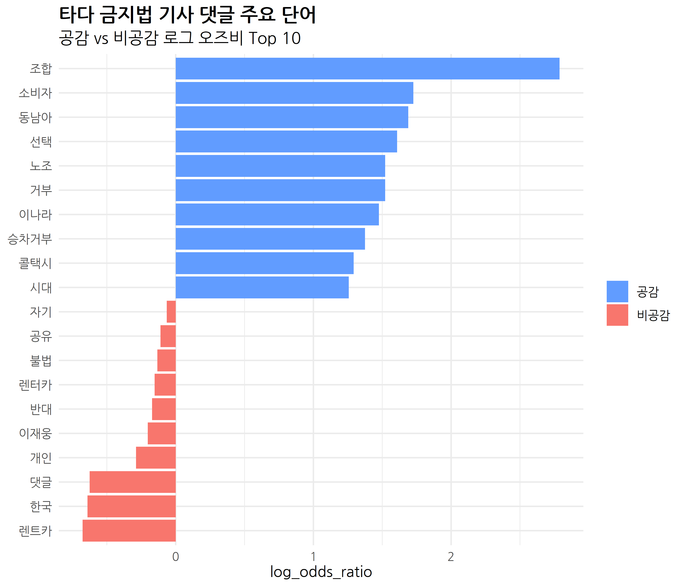
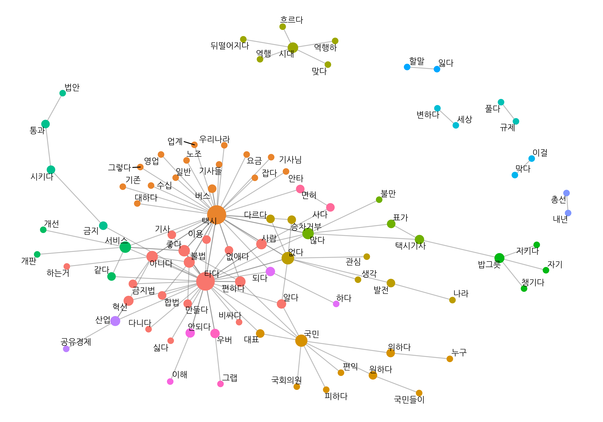
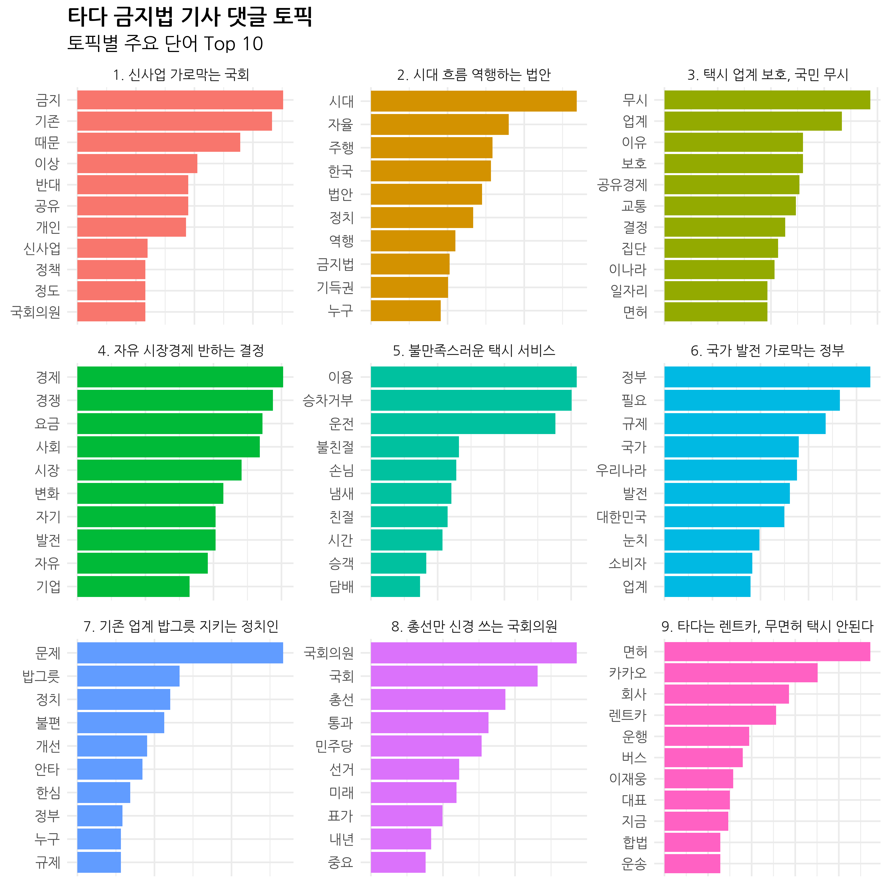
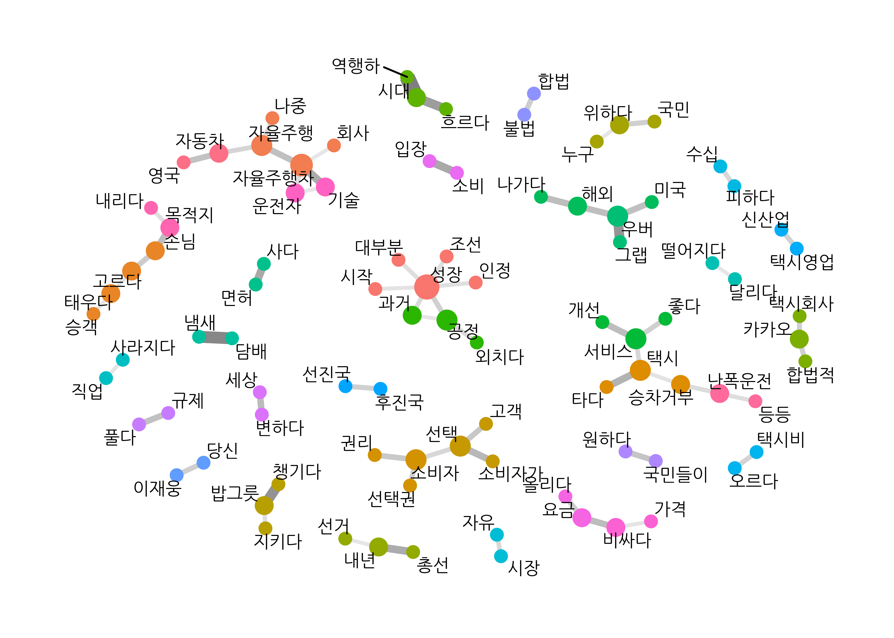

```{r setup, include=FALSE}
options(htmltools.dir.version = FALSE, 
        width = 80,
        # width = 70,
        
        max.print = 80,
        tibble.print_max = 40,
        
        tibble.width = 80,
        # tibble.width = 70,
        
        # pillar.min_chars = Inf, # tibble 문자 출력 제한
        servr.interval = 0.01) # Viewer 수정 반영 속도


knitr::opts_chunk$set(cache = T, 
                      warning = F, 
                      message = F,
                      dpi = 300, 
                      fig.height = 4)

xaringanExtra::use_tile_view()

library(knitr)
library(icon)
library(here)
```


```{r echo=FALSE}
rm(list = ls())

library(showtext)
font_add_google(name = "Nanum Gothic", family = "nanumgothic")
showtext_auto()
showtext_opts(dpi = 300) # opts_chunk$set(dpi=300)

# code highlighting
hook_source <- knitr::knit_hooks$get('source')
knitr::knit_hooks$set(source = function(x, options) {
  x <- stringr::str_replace(x, "^[[:blank:]]?([^*].+?)[[:blank:]]*#<<[[:blank:]]*$", "*\\1")
  hook_source(x, options)
})


# rmarkdown crayon setup ####
# options(crayon.enabled = T) # tibble과 출동. 개별 청크에서 설정
# message = T
# xaringan::moon_reader 충돌 -> knit
# ubuntu에서 불가. windows에서 knit
knitr::knit_hooks$set(message = function(x, options){
  paste0(
    "<pre class=\"r-output\"><code>",
    fansi::sgr_to_html(x = x, warn = FALSE),
    "</code></pre>"
  )
})

# crayon colour setup
num_colors <- function(forget=TRUE) 256
library(crayon)
assignInNamespace("num_colors", num_colors, pos="package:crayon")

```

class: title0

Do it! 쉽게 배우는 R 텍스트 마이닝

---

class: no-page-num

<br>

.pull-left[
&nbsp;&nbsp;&nbsp;&nbsp;&nbsp;&nbsp;&nbsp;&nbsp;
```{r, echo=FALSE, out.width="70%", out.height="70%"}
include_graphics("https://raw.githubusercontent.com/youngwoos/Doit_textmining/main/cover.png")
```
]

.pull-right[

<br>
<br>
<br>

`r fontawesome("github")` [github.com/youngwoos/Doit_textmining](https://github.com/youngwoos/Doit_textmining)

`r fontawesome("facebook-square")` [facebook.com/groups/datacommunity](https://facebook.com/groups/datacommunity)

- [네이버책](https://book.naver.com/bookdb/book_detail.nhn?bid=17891971)
  - [yes24](http://bit.ly/3oUuJOB)
  - [알라딘](http://bit.ly/3oXOSDn)
  - [교보문고](https://bit.ly/2LtNOcB)
]

---

class: title0

07 텍스트 마이닝 프로젝트:  
타다 금지법 기사 댓글 분석

---

class: title0-2

We'll make

<br-back-30>

```{r, echo=FALSE, out.width="50%"}

```

---

class: title0-2

We'll make

<br-back-30>

```{r, echo=FALSE, out.width="62%"}

```

---

class: title0-2

and

<br-back-40>

```{r, echo=F, out.width="50%"}

```

---

<br>

.large2[.font-jua[목차]]

.large[.font-jua[07-1 주요 단어 살펴보기]]([link](#07-1))

.large[.font-jua[07-2 공감, 비공감 댓글 비교하기 ]]([link](#07-2))

.large[.font-jua[07-3 관심 댓글 비교하기]]([link](#07-3))

.large[.font-jua[07-4 단어 간 관계 살펴보기]]([link](#07-4))

.large[.font-jua[07-5 토픽 모델링]]([link](#07-5))

---

name: 07-1
class: title1

07-1 주요 단어 살펴보기

---

#### 타다 금지법(여객자동차 운수사업법 개정안)
- 2019년 12월 5일 국회 국토교통위원회 교통법안심사소위 통과
- 주요 규정: 관광 목적으로 11~15인승 승합차를 빌리는 경우에만 운전자를 알선할 수 있다
- 타다는 더 이상 서비스를 유지할 수 없는 상황

--

#### 분석 절차
- 1.단어 빈도를 구합니다.
- 2.막대 그래프를 만들어 주요 단어를 살펴봅니다.


---


#### 기본적인 전처리

- 타다 금지법 관련 네이버 뉴스 기사 댓글 불러오기: `news_comment_tada.csv`

```{r eval=F}
# 데이터 불러오기
library(readr)
library(dplyr)

raw_tada <- read_csv("news_comment_tada.csv") %>%
  mutate(id = row_number())

glimpse(raw_tada)
```

```{r echo=F, R.options=list(tibble.width = 60)}
library(readr)
library(dplyr)

raw_tada <- read_csv(here::here("Data/news_comment_tada.csv")) %>%
  mutate(id = row_number())

glimpse(raw_tada)
```

---

#### 기본적인 전처리

- 띄어쓰기 1개 이상 사용된 댓글만 추출: 띄어쓰기 전혀 없는 텍스트는 `KoNLP` 패키지 사용 불가
- 원문 확인할 때 활용하기 위해 `reply`에서 html 태그 제거해 `reply_raw`에 할당
- 형태소분석기를 이용하는 데 적합하도록 `reply`에서 한글만 남기고 중복 공백 제거

```{r}
library(stringr)
library(textclean)

tada <- raw_tada %>%
  filter(str_count(reply, " ") >= 1) %>%                   # 띄어쓰기 1개 이상 추출
  mutate(reply_raw = str_squish(replace_html(reply)),      # 원문 보유
         reply = str_replace_all(reply, "[^가-힣]", " "),  # 한글만 남기기
         reply = str_squish(reply))                        # 중복 공백 제거
```

---

#### 주요 단어 분석하기

##### 1. 주요 단어 추출하기

- 명사를 추출해 빈도를 구한 다음 상위 30개 단어 출력

```{r}

library(tidytext)
library(KoNLP)

word_noun <- tada %>%
  unnest_tokens(input = reply,
                output = word,
                token = extractNoun,
                drop = F)

# 단어 빈도 구하기
frequency <- word_noun %>%
  count(word, sort = T) %>%    # 단어 빈도 구해 내림차순 정렬
  filter(str_count(word) > 1)  # 두 글자 이상만 남기기
```

---

<br-10>

.scroll-box-26[
```{r}
# 상위 단어 추출
frequency %>%
  head(30)
```
]

---

##### 2. 불용어 제거하기

- 불용어 제거 후 빈도 높은 상위 20개 단어 추출

```{r top20_noun, results='hide'}
# 불용어 목록 생성
stopword_noun <- c("들이", "하면", "하게", "해서")

# 주요 단어 목록 만들기
top20_noun <- frequency %>%
  filter(!word %in% stopword_noun) %>%
  head(20)

top20_noun
```

---

```{r ref.label="top20_noun", echo=F}

```

---

##### 3. 막대 그래프 만들기

```{r p_top20_noun, eval=F}
library(scales)
library(ggplot2)

ggplot(top20_noun, aes(x = reorder(word, n), y = n)) +
  geom_col() +
  coord_flip() +
  geom_text(aes(label = comma(n, accuracy = 1)), hjust = -0.3) +
  scale_y_continuous(limits = c(0, 3200)) +

  labs(title = "타다 금지법 기사 댓글 주요 단어",
       subtitle = "언급 빈도 Top 20",
       x = NULL) +

  theme_minimal() +
  theme(text = element_text(family = "nanumgothic", size = 12),
        plot.title = element_text(size = 14, face = "bold"),      # 제목 폰트
        plot.subtitle = element_text(size = 13))                  # 부제목 폰트
```

`r fontawesome("lightbulb")` `comma(n, accuracy = 1)`: 세 자릿수마다 쉼표 삽입, 소수점 첫째 자리에서 반올림. <br>&nbsp;&nbsp;&nbsp;&nbsp;`scales` 패키지 로드 필요

---

```{r ref.label="p_top20_noun", fig.width=7, fig.height=6, out.width = '70%', echo = F}

```

---

.pull-left[

- 주요 단어
  - `"택시"`, `"기사"`: 타다와 택시의 관계
  - `"혁신"`, `"서비스"`, `"규제"`:  법안의 성격
  - `"정부"`, `"국회의원"`: 법안 발의 주체

]
.pull-right[

```{r ref.label="p_top20_noun", fig.width=7, fig.height=6, echo = F}

```
]


---

name: 07-2
class: title1

07-2 공감, 비공감 댓글 비교하기

---


##### 분석 절차
- 1.공감 여부별 단어 빈도를 구한 다음, 데이터를 wide form으로 변형해 로그 오즈비를 구합니다.
- 2.공감과 비공감 카테고리에서 상대적으로 중요한 단어를 추출해 막대 그래프를 만듭니다.
- 3.주요 단어를 언급한 댓글 원문을 살펴봅니다.

---


#### 로그 오즈비 구하기

##### 1. 공감 여부 변수 만들기

- '공감 수'와 '비공감 수' 차이 나타낸 `diff` 추가
- 공감 여부 나타낸 `sympathy` 추가

```{r}
word_sympathy <- word_noun %>%
  rename(like = sympathyCount,
         dislike = antipathyCount) %>%

  mutate(diff = like - dislike,
         sympathy = ifelse(diff >=  1, "like",
                    ifelse(diff <= -1, "dislike", "neutral")))
```

---


##### `sympathy`별 댓글 수

- 댓글별로 한 행씩만 남긴 후 `sympathy`별 빈도 구하기
- `word_sympathy`는 한 행이 댓글별 명사이므로 여러 댓글이 중복되어 있음

```{r}
# 공감 여부별 댓글 수
word_sympathy %>%
  distinct(id, .keep_all = T) %>%
  count(sympathy, sort = T)
```

---


##### 2. 로그 오즈비 구하기

- 공감 여부 및 단어별 빈도 구하기: 공감, 비공감 댓글 비교가 목적이므로 중립 댓글은 제거
- wide form으로 변형해 로그 오즈비 구하기
  - 분모에 `"dislike"`, 분자에 `"like"`의 빈도를 놓고 구하므로
    - 값이 클수록 공감 댓글에서 상대적으로 중요한 단어
    - 값이 작을수록 비공감 댓글에서 상대적으로 중요한 단어

```{r}
# 단어 빈도 구하기
frequency_sympathy <- word_sympathy %>%
  count(sympathy, word) %>%              # 공감 여부 및 단어별 빈도
  filter(str_count(word) > 1 &           # 두 글자 이상 추출
         sympathy != "centrism")         # centrism 제거

# Wide form으로 변환하기
library(tidyr)
frequency_wide <- frequency_sympathy %>%
  pivot_wider(names_from = sympathy,
              values_from = n,
              values_fill = list(n = 0))
```

---

##### 2. 로그 오즈비 구하기

- 공감 여부 및 단어별 빈도 구하기: 공감, 비공감 댓글 비교가 목적이므로 중립 댓글은 제거
- wide form으로 변형해 로그 오즈비 구하기
  - 분모에 `"dislike"`, 분자에 `"like"`의 빈도를 놓고 구하므로
    - 값이 클수록 공감 댓글에서 상대적으로 중요한 단어
    - 값이 작을수록 비공감 댓글에서 상대적으로 중요한 단어
```{r}
# 로그 오즈비 구하기
frequency_wide <- frequency_wide %>%
  mutate(log_odds_ratio = log(((like    + 1) / (sum(like    + 1))) /
                              ((dislike + 1) / (sum(dislike + 1)))))
```

---

```{r}
frequency_wide %>%
  arrange(-log_odds_ratio)
```


---


#### 주요 단어 비교하기

##### 1. 주요 단어 추출하기

- 댓글에서 20회 이상 사용된 단어 대상
- 로그 오즈비가 0보다 크면 `"like"`, 그 외에는 `"dislike"`로 분류
- 로그 오즈비가 가장 높거나 낮은 단어를 10개씩 추출
```{r top10_odds, results='hide'}
top10_odds <- frequency_wide %>%
  filter(like >= 20 | dislike >= 20) %>%
  group_by(sympathy = ifelse(log_odds_ratio > 0, "like", "dislike")) %>%
  slice_max(abs(log_odds_ratio), n = 10, with_ties = F)

top10_odds %>%
  arrange(log_odds_ratio)
```

---

```{r ref.label='top10_odds', echo=F}

```

---

##### 2. 막대 그래프 만들기

```{r}
# 막대 색깔 목록 생성
col_sentiment <- c("#619CFF", "#F8766D")

# 막대 순서 지정
top10_odds$sympathy <- factor(top10_odds$sympathy,
                              levels = c("like", "dislike"))
```

---

##### 2. 막대 그래프 만들기

```{r p_top10_odds, eval = F}
ggplot(top10_odds, aes(x = reorder(word, log_odds_ratio),
                       y = log_odds_ratio,
                       fill = sympathy)) +
  geom_col() +
  coord_flip() +
  scale_fill_manual(values = col_sentiment,          # 막대 색깔
                    labels = c("공감", "비공감")) +  # 범례 순서

  labs(title = "타다 금지법 기사 댓글 주요 단어",
       subtitle = "공감 vs 비공감 로그 오즈비 Top 10",
       x = NULL, fill = NULL) +

  theme_minimal() +
  theme(text = element_text(family = "nanumgothic"),
        plot.title = element_text(size = 14, face = "bold"),
        plot.subtitle = element_text(size = 12))
```

---

```{r ref.label="p_top10_odds", fig.width=7, fig.height=6, out.width="70%", echo=F}

```

---

#### 댓글 내용 살펴보기

##### 1. 주요 단어를 언급한 댓글 추출하기

```{r}
tada %>%
  filter(str_detect(reply_raw, "조합")) %>%
  head(3) %>%
  pull(reply)
```

---


##### 2. 스타일 함수로 관심 단어만 눈에 띄게 출력하기

##### 2.1 텍스트에 스타일 입히기 - `combine_styles()`

```{r echo=F}
# setup for crayon
knitr::opts_chunk$set(message = T)
```

```{r eval=FALSE}
# 스타일 함수 만들기
library(crayon)
font <- combine_styles(make_style("ivory"),
                       make_style("deeppink", bg = TRUE),
                       make_style("bold"))

font("폰트를 적용해 출력") %>% cat()

```

```{r, R.options=list(crayon.enabled = T), echo = F}
# 스타일 함수 만들기
library(crayon)
font <- combine_styles(make_style("ivory"),
                       make_style("deeppink", bg = TRUE),
                       make_style("bold"))

font("폰트를 적용해 출력") %>% message()

```

---

##### `"조합"`을 언급한 댓글 추출해 스타일 적용하기
- `str_detect()`를 이용해 `"조합"`을 언급한 댓글 추출
- `paste0()`와 `font()`를 이용해 `"조합"`에 스타일 적용
- `pull()`을 이용해 `reply`의 텍스트만 추출한 다음 `cat()`을 이용해 출력
  - `sep = "\n\n"` 각 댓글을 줄을 바꾸어 새 행에 출력

```{r eval=F}
# 관심 단어 설정
keyword <- "조합"

# 댓글 추출해 스타일 적용
tada %>%
  filter(str_detect(reply_raw, keyword)) %>%
  head(3) %>%
  mutate(reply = paste0(str_replace_all(reply,
                                        keyword,
                                        font(keyword)))) %>%  # 스타일 적용
  pull(reply) %>%                                              # reply 추출
  cat(sep = "\n\n")                                           # 줄바꿈 출력
```

---

```{r echo=F}
# 관심 단어 설정
keyword <- "조합"

# 댓글 추출해 스타일 적용
tada %>%
  filter(str_detect(reply_raw, keyword)) %>%
  slice(1:3) %>%
  mutate(reply = paste0(reply, "<br>##<br>## ")) %>%
  mutate(reply = paste0(str_replace_all(reply,
                                        keyword,
                                        font(keyword)))) %>%  # 스타일 적용
  pull(reply) %>%                                             # reply 추출
  # cat(sep = "\n\n") %>%
  message()
```


---

##### 2.2 관심 단어가 사용된 텍스트를 추출해 스타일을 입히는 함수 만들기

```{r eval=F}
find_word <- function(df, x, keyword, n = 6) {

  # 스타일 함수 설정
  font <- combine_styles(make_style("ivory"),
                         make_style("deeppink", bg = TRUE),
                         make_style("bold"))

  # 키워드 추출해 스타일 적용
  df %>%
    filter(str_detect({{x}}, keyword)) %>%                  # 키워드 추출
    head(n) %>%                                             # n행 추출
    mutate(x = paste0("[", row_number(), "] ", {{x}}),      # 행번호 삽입
           x = paste0(str_replace_all(x,
                                      keyword,
                                      font(keyword)))) %>%  # 스타일 적용
    pull(x) %>%                                             # 텍스트 추출
    cat(sep = "\n\n")                                       # 줄바꿈 출력
}
```

```{r, R.options=list(crayon.enabled = T), echo=F}
# function for rmarkdown crayon output

find_word <- function(df, x, keyword, n = 6) {

  # 스타일 함수 설정
  font <- combine_styles(make_style("ivory"),
                         make_style("deeppink", bg = TRUE),
                         make_style("bold"))

  # 키워드 추출
  df %>%
    filter(str_detect({{x}}, keyword)) %>%              # 키워드 추출
    slice(1:n) %>%                                      # n행 추출

    mutate(x = paste0("[", row_number(), "] ", {{x}}),  # 행번호 삽입
           x = paste0(x, "<br>##<br>## "))  %>%         # 줄바꿈 삽입

    pull(x) %>%                                           # 텍스트 추출
    paste(., collapse = "") %>%                           # 합치기
    str_remove_all(., "<br>##<br>## $") %>%               # 마지막 ## 제거
    str_replace_all(., keyword, font(keyword)) %>%        # 스타일 적용
    message()                                           # rmarkdown crayon output
}
```

---

- `find_word()`
 - `x`: 텍스트
 - `keyword`: 스타일을 적용할 단어
 - `n`: 추출할 행 수. 아무 값도 입력하지 않으면 6행 출력

```{r, R.options=list(crayon.enabled = T)}
tada %>% find_word(x = reply_raw, keyword = "조합", n = 2)
```

---

- `find_word()`: 파라미터명 입력하지 않고 활용

```{r, R.options=list(crayon.enabled = T)}
tada %>% find_word(reply_raw, "조합", 2)
```

<br10>

`r icon_style(fontawesome("exclamation-triangle"), fill = "#FF7333")` `dplyr`, `stringr`, `crayon` 패키지 로드 필요.`find_word()`의 출력 결과에는 `dplyr` 함수 추가 적용 불가.

---


##### 3.1 `tada`와 `word_sympathy` 결합하고 중복 댓글 제거하기

- `word_sympathy`: `sympathy`(공감 여부), `diff`(공감, 비공감 수 차이) 들어 있음
  - 각  행이  댓글별  명사이므로  여러  댓글이  중복되어  있음
  - 댓글별로 한 행씩만 남기고 주요 변수를 추출한 다음 `tada`에 결합

```{r}
tada <- tada %>%
  left_join(word_sympathy %>%
              distinct(id, .keep_all = T) %>%  # 중복 댓글 제거
              select(id, sympathy, diff),      # 주요 변수 추출
            by = "id")
```

---

##### 3.2 공감, 비공감 데이터 만들기

```{r}
# 공감 댓글 추출
reply_like <- tada %>%
  filter(sympathy  == "like") %>%      # like 추출
  arrange(-diff)                       # 공감 높은순 정렬

# 비공감 댓글 추출
reply_dislike <- tada %>%
  filter(sympathy  == "dislike") %>%   # dislike 추출
  arrange(diff)                        # 비공감 높은순 정렬
```

---

##### 4. 공감 댓글 내용 살펴보기

```{r eval=F}
# 조합
reply_like %>% find_word(x = reply_raw, keyword = "조합", n = 10)
```

```{r, R.options=list(crayon.enabled = T), echo=F}
# 조합
reply_like %>% find_word(x = reply_raw, keyword = "조합", n = 3)
```


---


```{r eval=F}
# 소비자
reply_like %>% find_word(x = reply_raw, keyword = "소비자", n = 10)
```

```{r, R.options=list(crayon.enabled = T), echo=F}
# 소비자
reply_like %>% find_word(x = reply_raw, keyword = "소비자", n = 3)
```

---

```{r eval=F}
# 동남아
reply_like %>% find_word(x = reply_raw, keyword = "동남아", n = 10)
```

```{r, R.options=list(crayon.enabled = T), echo=F}
# 동남아
reply_like %>% find_word(x = reply_raw, keyword = "동남아", n = 3)
```

---

- 주요 단어 사용 댓글 요약
  - `"조합"`: 택시 조합이 독점적인 권한을 유지하고 있다.
  - `"소비자"`: 소비자의 권리를 무시하고 기업 입장만 고려해 법안이 만들어졌다.
  - `"동남아"`: 동남아시아 국가는 승차 공유 서비스가 활성화된 반면 한국은 그렇지 않다.


---


##### 5. 비공감 댓글 내용 살펴보기


```{r eval=F}
# 렌트카
reply_dislike %>% find_word(x = reply_raw, keyword = "렌트카", n = 10)
```

```{r, R.options=list(crayon.enabled = T), echo=F}
# 렌트카
reply_dislike %>% find_word(x = reply_raw, keyword = "렌트카", n = 3)
```

---

```{r eval=F}
# "한국당" 언급 댓글 제거 후 "한국" 언급한 댓글 추출
reply_dislike %>%
  filter(!str_detect(reply, "한국당")) %>%
  find_word(x = reply, keyword = "한국", n = 10)
```

```{r, R.options=list(crayon.enabled = T), echo=F}
# "한국당" 언급 댓글 제거 후 "한국" 언급한 댓글 추출
reply_dislike %>%
  filter(!str_detect(reply, "한국당")) %>%
  find_word(x = reply, keyword = "한국", n = 3)
```

---


```{r eval=F}
# 댓글
reply_dislike %>% find_word(x = reply, keyword = "댓글", n = 10)
```

```{r, R.options=list(crayon.enabled = T), echo=F}
# 댓글
reply_dislike %>% find_word(x = reply, keyword = "댓글", n = 3)
```

---

- 주요 단어 사용 댓글 요약
  - `"렌트카"`: 타다는 렌트카와 비슷한 사업이므로 특혜를 주면 안 된다.
  - `"한국"`: 한국의 택시 업계를 보호해야 한다. 법안이 한국의 서비스업 발전을 막는다.
  - `"댓글"`: 타다를 옹호하고 택시를 비판하는 편향된 댓글이 너무 많다.

---

#### 6. 분석 결과 종합하기

- 공감 많이 받은 댓글
  - 택시 조합에 비판적이거나 소비자의 권리를 강조
  - 동남아 국가보다 한국의 승차 공유 서비스가 뒤처져 있다


- 공감 받지 못한 댓글
  - 타다가 렌터카 서비스이므로 특혜를 주면 안 된다
  - 타다를 옹호하는 분위기를 비판하거나 한국의 택시 업계를 보호해야 한다

---

name: 07-3
class: title1

07-3 관심 댓글 비교하기

---

##### 분석 절차
- 1.댓글을 카테고리별로 분류해 TF-IDF를 구합니다.
- 2.카테고리별 주요 단어를 추출해 막대 그래프를 만듭니다.
- 3.주요 단어가 사용된 댓글을 추출해 내용을 살펴봅니다.

---


#### TF-IDF 구하기


##### 1. 카테고리별 문서 목록 만들기

```{r}
# 단어 목록 생성
category1 <- "택시 업계|택시업계|조합"
category2 <- "정부"
category3 <- "국회의원|한국당|자유한국당|자한당|자한|민주당|더불어민주당"
```

---

```{r}
# 추출 및 결합
bind_category <- bind_rows(
  word_sympathy %>%
    filter(str_detect(reply, category1)) %>%
    mutate(category = "택시업계"),

  word_sympathy %>%
    filter(str_detect(reply, category2)) %>%
    mutate(category = "정부"),

  word_sympathy %>%
    filter(str_detect(reply, category3)) %>%
    mutate(category = "국회의원"))
```

`r fontawesome("lightbulb")` 여러 단어를 함께 언급한 댓글도 있기 때문에 댓글 내용은 같지만 카테고리는 다른 행이 있음<br>&nbsp;&nbsp;&nbsp;(ex: `"택시업계"`와 `"정부"`를 함께 언급한 댓글)

`r fontawesome("lightbulb")` `str_detect()`에 적용할 목록은 단어를 `|`로 구분

---

#### 2. 카테고리별 댓글 빈도 살펴보기

```{r}
# 카테고리별 빈도
bind_category %>%
  group_by(id) %>%
  distinct(category, .keep_all = T) %>%
  ungroup() %>%
  count(category)
```

---


##### 3. TF-IDF 구하기

##### 3.1 불용어 목록 만들기

- 카테고리를 직접 나타낸 단어 불용어 처리
- 빈도는 가장 높지만 댓글을 이해하는 데는 도움 안 됨

```{r}
# 불용어 목록 생성
stopword_category <- c("택시 업계", "택시업계", "업계", "조합",
                       "정부", "국회의원", "한국당", "자유한국당",
                       "자한당", "자한", "민주당", "더불어민주당")
```

---

##### 3.2 중복 단어 제거하고 카테고리별 단어 빈도 구하기


- 특정 댓글에서 반복 사용되어 TF-IDF가 높은 문제를 방지하기 위해 댓글 내 중복 단어 제거
- TF-IDF는 단어 사용 빈도를 이용해 계산되므로 어떤 단어가 여러 댓글에 언급된 게 아니라
단순히 한 댓글에 여러 번 사용되더라도 높은 값 지님

```{r}
# 카테고리별 단어 빈도 구하기
frequency_category <- bind_category %>%
  filter(!word %in% stopword_category) %>%  # 불용어 제거

  group_by(id) %>%                          # 댓글별 분리
  distinct(word, .keep_all = T) %>%         # 댓글 내 중복 단어 제거
  ungroup() %>%                             # 그룹 해제

  count(category, word, sort = T) %>%       # 카테고리별 단어 빈도
  filter(str_count(word) >= 2)              # 2글자 이상 추출
```

---

##### 3.3 TF-IDF 구하기

.scroll-box-26[


```{r}
# tf-idf 구하기
tfidf_category <- frequency_category %>%
  bind_tf_idf(term = word,
              document = category,
              n = n) %>%
  arrange(-tf_idf)

tfidf_category
```
]
---

#### 카테고리별 주요 단어 비교하기


##### 1. 불용어 목록 만들기

<br-10>

.scroll-box-24[

```{r out_tfidf_category}
# 주요 단어 추출, 불용어 확인
tfidf_category %>%
  group_by(category) %>%
  slice_max(tf_idf, n = 15, with_ties = F) %>%
  print(n = Inf)
```
]

---

##### 2. 주요 단어 추출하기
```{r}
# 불용어 목록 생성
stopword_tfidf <- c("국회의윈님하고", "현정부", "에휴")

# 주요 단어 추출
top10 <- tfidf_category %>%
  filter(!word %in% stopword_tfidf) %>%
  group_by(category) %>%
  slice_max(tf_idf, n = 10, with_ties = F)
```

---


##### 3. 막대 그래프 만들기

```{r}
# 그래프 순서 정하기
top10$category <- factor(top10$category,
                         levels = c("택시업계", "정부", "국회의원"))
```

---

##### 3. 막대 그래프 만들기

```{r p_top10_tfidf, fig.show='hide'}
# 막대 그래프 만들기
ggplot(top10, aes(x = reorder_within(word, tf_idf, category),
                  y = tf_idf,
                  fill = category)) +
  geom_col(show.legend = F) +
  coord_flip() +
  facet_wrap(~ category, scales = "free", ncol = 3) +
  scale_x_reordered() +
  scale_y_continuous(n.breaks = 5,
                     labels = number_format(accuracy = .001)) +

  labs(title = "타다 금지법 기사 댓글 주요 단어",
       subtitle = "카테고리별 TF-IDF Top 10",
       x = NULL) +

  theme_minimal() +
  theme(text = element_text(family = "nanumgothic"),
        plot.title = element_text(size = 14, face = "bold"),
        plot.subtitle = element_text(size = 12),
        strip.text = element_text(size = 11))  # 카테고리명 폰트
```

---
```{r ref.label="p_top10_tfidf", echo=F}
```
---


#### 카테고리별 댓글 내용 살펴보기


##### 1. 중복 댓글 제거하기

```{r}
# 중복 댓글 제거
reply_category <- bind_category %>%
  group_by(category) %>%
  distinct(id, .keep_all = T)
```

---

##### 2. 댓글 내용 살펴보기

```{r eval=F}
# 택시업계 카테고리
reply_category %>%
  filter(category == "택시업계") %>%
  find_word(x = reply_raw, keyword = "대기업")
```

```{r, R.options=list(crayon.enabled = T), echo=F}
reply_category %>%
  filter(category == "택시업계") %>%
  find_word(x = reply_raw, keyword = "대기업", n = 3)
```

---

```{r eval=F}
# 정부 카테고리
reply_category %>%
  filter(category == "정부") %>%
  find_word(x = reply_raw, keyword = "지원")
```

```{r, R.options=list(crayon.enabled = T), echo=F}
reply_category %>%
  filter(category == "정부") %>%
  find_word(x = reply_raw, keyword = "지원", n = 3)
```

---

```{r eval=F}
# 국회의원 카테고리
reply_category %>%
  filter(category == "국회의원") %>%
  find_word(x = reply_raw, keyword = "박홍근")
```


```{r, R.options=list(crayon.enabled = T), echo=F}
reply_category %>%
  filter(category == "국회의원") %>%
  find_word(x = reply_raw, keyword = "박홍근", n = 3)
```


---
name: 07-4
class: title1

07-4 단어 간 관계 살펴보기
---

#### 파이 계수로 단어 간 상관관계 살펴보기

##### 분석 절차
- 1.파이 계수를 구해 관심 단어와 관련성이 큰 단어를 추출합니다.
- 2.막대 그래프를 만들어 주요 단어를 살펴봅니다.
- 3.네트워크 그래프를 만들어 단어의 관계를 살펴봅니다.
- 4.단어쌍이 언급된 댓글을 추출해 내용을 살펴봅니다.


---

#### 1. 파이 계수 구하기

##### 1.1 토큰화하기

- 중복 댓글을 제거한 `tada`의 `reply`를 토큰화해 명사, 동사, 형용사 추출

```{r}
# 토큰화
pos_tada <- tada %>%
  unnest_tokens(input = reply,
                output = word_pos,
                token = SimplePos22,
                drop = F)

# 품사 태그 정리
separate_pos_tada <- pos_tada %>%
  separate_rows(word_pos, sep = "[+]") %>%                   # 품사 태그 분리
  filter(str_detect(word_pos, "/n|/pv|/pa")) %>%             # 품사 추출
  mutate(word = ifelse(str_detect(word_pos, "/pv|/pa"),      # "/pv", "/pa" 추출
                       str_replace(word_pos, "/.*$", "다"),  # "~다"로 바꾸기
                       str_remove(word_pos, "/.*$"))) %>%    # 태그 제거
  filter(str_count(word) >= 2) %>%                           # 2글자 이상 추출
  arrange(id)
```

---

```{r}
separate_pos_tada %>%
  select(word)
```

---

##### 1.2 파이 계수 구하기

```{r p_word_cors}
library(widyr)
word_cors <- separate_pos_tada %>%
  add_count(word) %>%
  filter(n >= 20) %>%
  pairwise_cor(item = word, feature = id, sort = T)

word_cors
```

---

##### 2. 관심 단어와 관련성이 큰 단어로 막대 그래프 만들기

<br-10>

.scroll-box-26[
```{r}
target <- c("타다", "정부", "택시")

# 상위 10개 추출
top_cors <- word_cors %>%
  filter(item1 %in% target) %>%
  group_by(item1) %>%
  slice_max(correlation, n = 10)

top_cors
```
]


---

```{r p_top_cors, fig.show='hide'}
# 그래프 순서 정하기
top_cors$item1 <- factor(top_cors$item1, levels = target)

# 막대 그래프 만들기
ggplot(top_cors, aes(x = reorder_within(item2, correlation, item1),
                     y = correlation,
                     fill = item1)) +
  geom_col(show.legend = F) +
  facet_wrap(~ item1, scales = "free") +
  coord_flip() +
  scale_x_reordered() +

  labs(title = "타다 금지법 기사 댓글 주요 단어",
       subtitle = "파이 계수 Top 10",
       x = NULL) +

  theme_minimal() +
  theme(text = element_text(family = "nanumgothic"),
        plot.title = element_text(size = 14, face = "bold"),
        plot.subtitle = element_text(size = 12),
        strip.text = element_text(size = 11))
```

---
```{r ref.label="p_top_cors", echo=F}
```
---

##### 관심 단어와 관련성이 큰 단어 해석

<br>

- **타다**
  - 타다와 택시 업계의 갈등을 다룬 댓글이 많다
  - `"서비스"`, `"편하다"`, `"좋다"`, `"많다"`: 타다의 장점을 표현한 단어와 관련성 크다


- **택시**
  - 타다와 택시 업계의 갈등을 다룬 댓글이 많다
  - `"서비스"`, `"승차거부"`, `"불친절"`, `"요금"`, `"비싸다"`: 택시 서비스의 품질을 비판할 때 사용하는 단어와 관련성이 크다


- **정부**
  - `"세금"`: 정부의 세금 운용을 비판하는 댓글이 많다
  - `"기업"`, `"자유"`, `"시장"`, `"경제"`, `"규제"`, `"막다"`: 정부가 산업 발전을 막는다는 비판을 할 때 <br>사용하는 단어와 관련성이 크다


---


#### 3. 네트워크 그래프 만들기

```{r}
# 네트워크 그래프 데이터 만들기
library(tidygraph)
set.seed(1234)
graph_cors <- word_cors %>%
  filter(correlation >= 0.15) %>%
  as_tbl_graph(directed = F) %>%
  mutate(centrality = centrality_degree(),       # 중심성
         group = as.factor(group_infomap()))     # 커뮤니티
```

---


```{r p_graph_cors,results='hide'}
# 네트워크 그래프 만들기
library(ggraph)
set.seed(1234)
ggraph(graph_cors, layout = "fr") +              # 레이아웃

  geom_edge_link(color = "gray50",               # 엣지 색깔
                 aes(edge_alpha = correlation,   # 엣지 명암
                     edge_width = correlation),  # 엣지 두께
                 show.legend = F) +              # 범례 삭제
  scale_edge_width(range = c(1, 4)) +            # 엣지 두께 범위

  geom_node_point(aes(size = centrality,         # 노드 크기
                      color = group),            # 노드 색깔
                  show.legend = F) +             # 범례 삭제
  scale_size(range = c(5, 10)) +                 # 노드 크기 범위

  geom_node_text(aes(label = name),              # 텍스트 표시
                 repel = T,                      # 노드밖 표시
                 size = 5,                       # 텍스트 크기
                 family = "nanumgothic") +       # 폰트

  theme_graph()                                  # 배경 삭제
```

---

<br-back-20>

```{r, echo=FALSE, out.width="80%", fig.align='center'}

```

`r fontawesome("lightbulb")` 별도의 이미지 출력 창을 열어 크게 만든 다음 그래프 출력하기: 윈도우 `windows()`, 맥 `x11()`

---


##### 4. 댓글 내용 살펴보기

- **선거-내년-총선**: 2020년에 있을 국회의원 선거를 의식하고 법안을 개정했다는 비판


```{r eval=F}
tada %>%
  filter(str_detect(reply_raw, "선거")) %>%
  find_word(x = reply_raw, keyword = "내년", n = 10)
```

```{r, R.options=list(crayon.enabled = T), echo=F}
tada %>%
  filter(str_detect(reply_raw, "선거")) %>%
  find_word(x = reply_raw, keyword = "내년", n = 3)
```

---

##### 4. 댓글 내용 살펴보기

- **선거-내년-총선**: 2020년에 있을 국회의원 선거를 의식하고 법안을 개정했다는 비판


```{r eval=F}
tada %>%
  filter(str_detect(reply_raw, "내년")) %>%
  find_word(x = reply_raw, keyword = "총선", n = 10)
```

```{r, R.options=list(crayon.enabled = T), echo=F}
tada %>%
  filter(str_detect(reply_raw, "내년")) %>%
  find_word(x = reply_raw, keyword = "총선", n = 3)
```

---

- **목적지-손님-고르다**: 택시 기사가 손님을 골라 태운다는 비판

```{r eval=F}
tada %>%
  filter(str_detect(reply_raw, "목적지")) %>%
  find_word(x = reply_raw, keyword = "손님", n = 10)
```

```{r, R.options=list(crayon.enabled = T), echo=F}
tada %>%
  filter(str_detect(reply_raw, "목적지")) %>%
  find_word(x = reply_raw, keyword = "손님", n = 3)
```

---

- **목적지-손님-고르다**: 택시 기사가 손님을 골라 태운다는 비판


```{r eval=F}
tada %>%
  filter(str_detect(reply_raw, "손님")) %>%
  find_word(x = reply_raw, keyword = "골라", n = 10)

```

```{r, R.options=list(crayon.enabled = T), echo=F}
tada %>%
  filter(str_detect(reply_raw, "손님")) %>%
  find_word(x = reply_raw, keyword = "골라", n = 3)

```

---
.box[

.info[`r icon_style(fontawesome("rocket"), fill = "#FF7333")` 원형으로 변형되기 전의 단어 알아내기]

- `"골라"`가 전처리 과정에서 원형인 `"고르다"`로 변형되었기 때문에 `"골라"` 언급 댓글 추출
-  관심 단어 언급한 원문 찾을 때는 전처리 작업을 통해 변형되기 전의 단어를 이용해야 함

```{r eval=F}
separate_pos_tada %>%
  filter(word == "고르다") %>%
  pull(reply_raw)
```


```{r echo=F}
separate_pos_tada %>%
  filter(word == "고르다") %>%
  head(3) %>%
  pull(reply_raw)
```

]

---

#### 엔그램으로 연이어 사용된 단어 살펴보기

##### 분석 절차
- 1.댓글을 바이그램으로 토큰화해 빈도를 구합니다.
- 2.네트워크 그래프를 만들어 단어의 관계를 살펴봅니다.
- 3.바이그램 단어쌍이 언급된 댓글을 추출해 내용을 확인합니다.\

---


#### 1. 바이그램으로 토큰화해 빈도 구하기

```{r out_bigram_comment, results='hide'}
# 한 댓글이 하나의 행을 구성하도록 결합
line_comment <- separate_pos_tada %>%
  group_by(id) %>%
  summarise(sentence = paste(word, collapse = " "))

# 바이그램으로 토큰화
bigram_comment <- line_comment %>%
  unnest_tokens(input = sentence,
                output = bigram,
                token = "ngrams",
                n = 2)

bigram_comment
```

---
```{r ref.label="out_bigram_comment", echo=F}
```
---


```{r}
# 바이그램 분리하기
bigram_seprated <- bigram_comment %>%
  separate(bigram, c("word1", "word2"), sep = " ")

# 단어쌍 빈도 구하기
pair_bigram <- bigram_seprated %>%
  count(word1, word2, sort = T) %>%
  na.omit()

pair_bigram
```


---


##### 2. 네트워크 그래프 만들기

```{r}
# 네트워크 그래프 데이터 만들기
set.seed(1234)
graph_bigram <- pair_bigram %>%
  filter(n >= 8) %>%
  as_tbl_graph(directed = F) %>%
  mutate(centrality = centrality_degree(),       # 중심성
         group = as.factor(group_infomap()))     # 커뮤니티
```


---

```{r, eval=F}
# 네트워크 그래프 만들기
set.seed(1234)
ggraph(graph_bigram, layout = "fr") +            # 레이아웃

  geom_edge_link(color = "gray50",               # 엣지 색깔
                 alpha = 0.5) +                  # 엣지 명암

  geom_node_point(aes(size = centrality,         # 노드 크기
                      color = group),            # 노드 색깔
                  show.legend = F) +             # 범례 삭제
  scale_size(range = c(5, 15)) +                 # 노드 크기 범위

  geom_node_text(aes(label = name),              # 텍스트 표시
                 repel = T,                      # 노드밖 표시
                 size = 5,                       # 텍스트 크기
                 family = "nanumgothic") +       # 폰트

  theme_graph()                                  # 배경 삭제
```

---

```{r, echo=FALSE, out.width="80%", fig.align='center'}

```

---

##### 3. 댓글 내용 살펴보기

##### 3.1 `line_comment`에 `tada` 결합하기

```{r, R.options=list(tibble.width = 50)}
line_tada <- line_comment %>%
  left_join(tada, by = "id")

line_tada %>%
  select(sentence)
```

---

##### 3.2 댓글 원문 살펴보기

- **역행-시대-뒤떨어지다** : 법안 개정이 시대에 뒤떨어진 판단이라는 비판

```{r eval=F}
line_tada %>%
  filter(str_detect(sentence, "시대 역행")) %>%
  find_word(x = reply_raw, keyword = "역행", n = 10)
```

```{r, R.options=list(crayon.enabled = T), echo=F}
line_tada %>%
  filter(str_detect(sentence, "시대 역행")) %>%
  find_word(x = reply_raw, keyword = "역행", n = 3)
```

---

##### 3.2 댓글 원문 살펴보기

- **역행-시대-뒤떨어지다** : 법안 개정이 시대에 뒤떨어진 판단이라는 비판

```{r eval=F}
line_tada %>%
  filter(str_detect(sentence, "시대 뒤떨어지다")) %>%
  find_word(x = reply_raw, keyword = "뒤떨어", n = 10)
```

```{r, R.options=list(crayon.enabled = T), echo=F}
line_tada %>%
  filter(str_detect(sentence, "시대 뒤떨어지다")) %>%
  find_word(x = reply_raw, keyword = "뒤떨어", n = 3)
```

---

- **택시-면허-사다**
  - 택시 면허 거래를 비판하는 의견
  - 타다도 택시와 동등하게 면허를 사서 영업해야 한다는 의견

```{r eval=F}
line_tada %>%
  filter(str_detect(sentence, "택시 면허")) %>%
  find_word(x = reply_raw, keyword = "면허", n = 10)
```

```{r, R.options=list(crayon.enabled = T), echo=F}
line_tada %>%
  filter(str_detect(sentence, "택시 면허")) %>%
  find_word(x = reply_raw, keyword = "면허", n = 3)
```

---

- **택시-면허-사다**
  - 택시 면허 거래를 비판하는 의견
  - 타다도 택시와 동등하게 면허를 사서 영업해야 한다는 의견

```{r eval=F}
line_tada %>%
  filter(str_detect(sentence, "면허 사다")) %>%
  find_word(x = reply_raw, keyword = "사서", n = 10)
```

```{r, R.options=list(crayon.enabled = T), echo=F}
line_tada %>%
  filter(str_detect(sentence, "면허 사다")) %>%
  find_word(x = reply_raw, keyword = "사서", n = 3)
```

`r fontawesome("lightbulb")` `"사서"`가 전처리 과정에서 원형인 `"사다"`로 변형되었기 때문에 `"사서"` 언급 댓글  추출

---
name: 07-5
class: title1

07-5 토픽 모델링
---

##### 분석 절차
- 1.댓글 이용해 LDA 모델을 만듭니다.
- 2.토픽별 주요 단어로 막대 그래프를 만듭니다.
- 3.댓글을 토픽별로 분류하고 토픽별 댓글 수와 주요 단어를 나타낸 막대 그래프를 만듭니다.
- 4.토픽별 주요 문서의 내용을 살펴보고 토픽 이름을 짓습니다.

---

#### 토픽 모델링을 위한 전처리

- 중복 댓글과 짧은 문서 제거 후 명사 추출
- 댓글 내 중복 단어와 빈도 높은 단어 제거

```{r}
# 명사 추출
noun_tada <- tada %>%
  distinct(reply, .keep_all = T) %>%                   # 중복 댓글 제거
  filter(str_count(reply, boundary("word")) >= 3) %>%  # 짧은 댓글 제거
  unnest_tokens(input = reply,                         # 명사 추출
                output = word,
                token = extractNoun,
                drop = F) %>%
  filter(str_count(word) > 1)
```

---

```{r }
# 중복, 고빈도 단어 제거
unique_noun_tada <- noun_tada %>%
  group_by(id) %>%                                     # 중복 단어 제거
  distinct(word, .keep_all = T) %>%
  ungroup() %>%
  add_count(word) %>%                                  # 고빈도 단어 제거
  filter(n <= 200) %>%
  select(id, word)

unique_noun_tada
```

---


#### 모델 만들기


##### 1. 문서별 단어 빈도를 이용해 DTM 만들기

```{r}
# 문서별 단어 빈도 구하기
count_word <- unique_noun_tada %>%
  count(id, word, sort = T)

# DTM 만들기
dtm_tada <- count_word %>%
  cast_dtm(document = id, term = word, value = n)

dtm_tada
```

---

##### 2. 하이퍼파라미터 튜닝으로 토픽 수 정하기

- 토픽 수를 2~20까지 바꾸어 가며 성능 지표 비교


`r icon_style(fontawesome("exclamation-triangle"), fill = "#FF7333")` 19개의 LDA 모델을 만들므로 컴퓨터 성능에 따라 실행하는 데 시간이 오래 걸릴 수 있음

```{r models_tada, fig.height=3, fig.width=6, out.width="50%"}
library(ldatuning)
models_tada <- FindTopicsNumber(dtm = dtm_tada,
                                topics = 2:20,
                                return_models = T,
                                control = list(seed = 1234))
# 성능 지표 그래프
FindTopicsNumber_plot(models_tada)
```


---

```{r ref.label="models_tada", echo=F}
```

---

```{r}
# 토픽 수가 9개인 모델 추출
lda_model <- models_tada %>%  
  filter(topics == 9) %>%
  pull(LDA_model) %>%         # 모델 추출
  .[[1]]                      # list 추출

lda_model
```

---

#### 토픽별 주요 단어 살펴보기

##### 1. 주요 단어 추출하기

- 토픽별 단어 확률을 나타낸 `beta` 추출

.scroll-box-22[
```{r}
# 토픽별 단어 확률 beta 추출
term_topic <- tidy(lda_model, matrix = "beta")

# 토픽별 beta 상위 단어 추출
term_topic %>%
  group_by(topic) %>%
  slice_max(beta, n = 15)
```
]

---

##### 2. 불용어 제외하고 상위 10개 단어 추출하기

<br-10>

.scroll-box-26[
```{r}
# 불용어 목록 생성
stopword_lda <- c("하게", "하다", "하려", "해라", "그것", "하면", "하네",
                  "하기", "하나", "해서", "하면", "하지", "한거", "니들")

# 불용어 제외 후 상위 10개 단어 추출
top_term_topic <- term_topic %>%
  filter(!term %in% stopword_lda) %>%
  group_by(topic) %>%
  slice_max(beta, n = 10)

top_term_topic
```
]
---


##### 3. 막대 그래프 만들기

```{r p_top_term_topic, fig.show='hide'}
ggplot(top_term_topic, aes(x = reorder_within(term, beta, topic),
                           y = beta,
                           fill = factor(topic))) +
  geom_col(show.legend = F) +
  facet_wrap(~ topic, scales = "free", ncol = 3) +
  coord_flip() +
  scale_x_reordered() +
  labs(x = NULL) +
  theme(text = element_text(family = "nanumgothic"))
```


---
```{r ref.label="p_top_term_topic", echo=F, fig.height=8, fig.width=8, out.width="65%"}
```
---

#### 토픽별로 댓글 분류하기

- `lda_model`에서 문서별 토픽 확률을 나타낸 `gamma` 추출하기
- 문서별로 `gamma`가 가장 높은 토픽을 남기기
- 댓글 원문에 결합해 토픽 변호 부여하기
 
```{r doc_class, results='hide'}
# 문서별 토픽 확률 gamma 추출하기
doc_topic <- tidy(lda_model, matrix = "gamma")

# 문서별로 확률이 가장 높은 토픽 추출
doc_class <- doc_topic %>%
  group_by(document) %>%
  slice_max(gamma, n = 1)

doc_class
```

---
```{r ref.label="doc_class", echo=F}
```

---

```{r}
# integer로 변환
doc_class$document <- as.integer(doc_class$document)

# 원문에 토픽 번호 부여
tada_topic <- tada %>%
  left_join(doc_class, by = c("id" = "document"))
```


---

#### 토픽별 댓글 수와 단어 시각화하기


##### 1. 토픽별 주요 단어 목록 만들기

```{r}
top_terms <- term_topic %>%
  filter(!term %in% stopword_lda) %>%
  group_by(topic) %>%
  slice_max(beta, n = 6, with_ties = F) %>%
  summarise(term = paste(term, collapse = ", "))

top_terms
```

---

##### 2. 토픽별 문서 빈도 구하기

```{r}
count_topic <- tada_topic %>%
  count(topic) %>%
  na.omit()

count_topic
```

---

##### 3. 문서 빈도에 주요 단어 결합하기

```{r}
count_topic_word <- count_topic %>%
  left_join(top_terms, by = "topic") %>%
  mutate(topic_name = paste("Topic", topic))

count_topic_word
```

---

##### 4. 막대 그래프 만들기


```{r eval=F}
library(scales)
ggplot(count_topic_word,
       aes(x = reorder(topic_name, n),
           y = n,
           fill = topic_name)) +
  geom_col(show.legend = F) +
  coord_flip() +

  geom_text(aes(label = comma(n, accuracy = 1)),  # 문서 빈도 표시
            hjust = -0.2) +

  geom_text(aes(label = term),                    # 주요 단어 표시
            hjust = 1.03,
            col = "white",
            fontface = "bold",
            family = "nanumgothic") +

  scale_y_continuous(expand = c(0, 0),            # y축-막대 간격 줄이기
                     limits = c(0, 1100)) +       # y축 범위
```

---

##### 4. 막대 그래프 만들기

```{r eval=F}
labs(title = "타다 금지법 기사 댓글 토픽",
       subtitle = "토픽별 주요 단어 및 댓글 빈도",
       x = NULL, y = NULL) +

  theme_minimal() +
  theme(text = element_text(family = "nanumgothic"),
        plot.title = element_text(size = 14, face = "bold"),
        plot.subtitle = element_text(size = 12))
```

`r fontawesome("lightbulb")` `geom_text()`에는 `theme()`으로 설정한 폰트가 적용되지 않기 때문에 별도로 폰트 지정

```{r echo = F, p_count_topic_word, fig.show='hide'}
library(scales)
ggplot(count_topic_word,
       aes(x = reorder(topic_name, n),
           y = n,
           fill = topic_name)) +
  geom_col(show.legend = F) +
  coord_flip() +

  geom_text(aes(label = comma(n, accuracy = 1)),  # 문서 빈도 표시
            hjust = -0.2) +

  geom_text(aes(label = term),                    # 주요 단어 표시
            hjust = 1.03,
            col = "white",
            fontface = "bold",
            family = "nanumgothic") +

  scale_y_continuous(expand = c(0, 0),            # y축-막대 간격 줄이기
                     limits = c(0, 1100)) +       # y축 범위

  labs(title = "타다 금지법 기사 댓글 토픽",
       subtitle = "토픽별 주요 단어 및 댓글 빈도",
       x = NULL, y = NULL) +

  theme_minimal() +
  theme(text = element_text(family = "nanumgothic"),
        plot.title = element_text(size = 14, face = "bold"),
        plot.subtitle = element_text(size = 12))
```


---
```{r ref.label="p_count_topic_word", echo=F, out.width="70%", fig.width=7, fig.height=6}
```
---


#### 토픽 이름 짓기

##### 1. 토픽별 주요 문서 추출하기

- 토픽별로 `gamma`가 높은 주요 댓글 추출해 내용 살펴보기

```{r}
# 토픽별 주요 문서 추출
reply_topic <- tada_topic %>%
  group_by(topic) %>%
  slice_max(gamma, n = 100)
```

---

- **토픽 1** : 국회가 산업 발전을 가로막는다는 비판

```{r eval=F}
# 토픽 1 내용 살펴보기
reply_topic %>%
  filter(topic == 1) %>%
  pull(reply_raw)
```

```{r echo=F}
# 토픽 1 내용 살펴보기
reply_topic %>%
  filter(topic == 1) %>%
  head(3) %>%
  pull(reply_raw)
```

---

- **토픽 2** : 법안이 시대 흐름에 역행한다는 비판

```{r eval=F}
# 토픽 2 내용 살펴보기
reply_topic %>%
  filter(topic == 2) %>%
  pull(reply_raw)
```


```{r echo=F}
# 토픽 2 내용 살펴보기
reply_topic %>%
  filter(topic == 2) %>%
  head(3) %>%
  pull(reply_raw)
```

---


##### 2. 토픽 이름 목록 만들기

```{r}
# 토픽 이름 목록 만들기
name_topic <- tibble(topic = 1:9,
                     name = c("1. 신사업 가로막는 국회",
                              "2. 시대 흐름 역행하는 법안",
                              "3. 택시 업계 보호, 국민 무시",
                              "4. 자유 시장경제 반하는 결정",
                              "5. 불만족스러운 택시 서비스",
                              "6. 국가 발전 가로막는 정부",
                              "7. 기존 업계 밥그릇 지키는 정치인",
                              "8. 총선만 신경 쓰는 국회의원",
                              "9. 타다는 렌트카, 무면허 택시 안된다"))
```


---

##### 3. 토픽 이름과 주요 단어 시각화하기

```{r}
# 토픽 이름 결합하기
top_term_topic_name <- top_term_topic %>%
  left_join(name_topic, name_topic, by = "topic")

top_term_topic_name
```

---

```{r p_top_term_topic_name, fig.show='hide'}
# 막대 그래프 만들기
ggplot(top_term_topic_name,
       aes(x = reorder_within(term, beta, name),
           y = beta,
           fill = factor(topic))) +
  geom_col(show.legend = F) +
  facet_wrap(~ name, scales = "free", ncol = 3) +
  coord_flip() +
  scale_x_reordered() +

  labs(title = "타다 금지법 기사 댓글 토픽",
       subtitle = "토픽별 주요 단어 Top 10",
       x = NULL, y = NULL) +

  theme_minimal() +
  theme(text = element_text(family = "nanumgothic"),
        plot.title = element_text(size = 14, face = "bold"),
        plot.subtitle = element_text(size = 12),
        axis.text.x = element_blank(),   # x축 이름 삭제
        axis.ticks.x = element_blank())  # x축 눈금 삭제
```

---
```{r ref.label="p_top_term_topic_name", echo=F, fig.height=8, fig.width=8, out.width='60%'}
```

