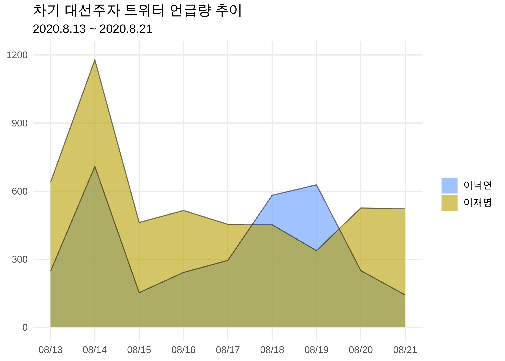
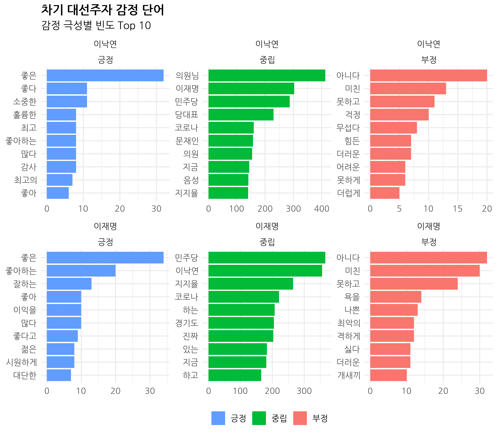
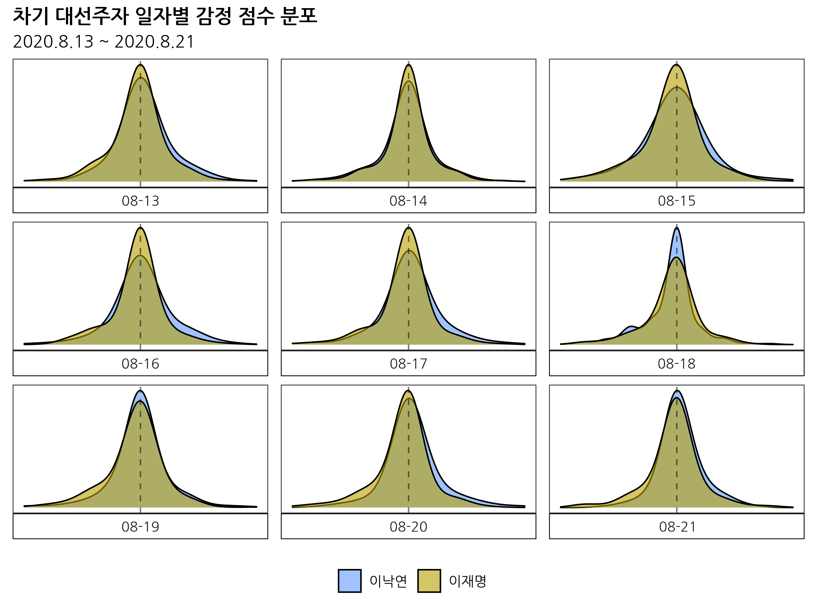

```{r setup, include=FALSE}
options(htmltools.dir.version = FALSE, 
        width = 80,
        # width = 70,
        
        max.print = 80,
        tibble.print_max = 40,
        
        tibble.width = 80,
        # tibble.width = 70,
        
        # pillar.min_chars = Inf, # tibble 문자 출력 제한
        servr.interval = 0.01) # Viewer 수정 반영 속도


knitr::opts_chunk$set(cache = T, 
                      warning = F, 
                      message = F,
                      dpi = 300, 
                      fig.height = 4)

xaringanExtra::use_tile_view()

library(knitr)
library(icon)
library(here)
```


```{r echo=FALSE}
rm(list = ls())

library(showtext)
font_add_google(name = "Nanum Gothic", family = "nanumgothic")
showtext_auto()
showtext_opts(dpi = 300) # opts_chunk$set(dpi=300)

# code highlighting
hook_source <- knitr::knit_hooks$get('source')
knitr::knit_hooks$set(source = function(x, options) {
  x <- stringr::str_replace(x, "^[[:blank:]]?([^*].+?)[[:blank:]]*#<<[[:blank:]]*$", "*\\1")
  hook_source(x, options)
})


# rmarkdown crayon setup ####
# options(crayon.enabled = T) # tibble과 출동. 개별 청크에서 설정
# message = T
# xaringan::moon_reader 충돌 -> knit
# ubuntu에서 불가. windows에서 knit
knitr::knit_hooks$set(message = function(x, options){
  paste0(
    "<pre class=\"r-output\"><code>",
    fansi::sgr_to_html(x = x, warn = FALSE),
    "</code></pre>"
  )
})

# crayon colour setup
num_colors <- function(forget=TRUE) 256
library(crayon)
assignInNamespace("num_colors", num_colors, pos="package:crayon")

```

class: title0

Do it! 쉽게 배우는 R 텍스트 마이닝

---

class: no-page-num

<br>

.pull-left[
&nbsp;&nbsp;&nbsp;&nbsp;&nbsp;&nbsp;&nbsp;&nbsp;
```{r, echo=FALSE, out.width="70%", out.height="70%"}
include_graphics("https://raw.githubusercontent.com/youngwoos/Doit_textmining/main/cover.png")
```
]

.pull-right[

<br>
<br>
<br>

`r fontawesome("github")` [github.com/youngwoos/Doit_textmining](https://github.com/youngwoos/Doit_textmining)

`r fontawesome("facebook-square")` [facebook.com/groups/datacommunity](https://facebook.com/groups/datacommunity)

- [네이버책](https://book.naver.com/bookdb/book_detail.nhn?bid=17891971)
  - [yes24](http://bit.ly/3oUuJOB)
  - [알라딘](http://bit.ly/3oXOSDn)
  - [교보문고](https://bit.ly/2LtNOcB)
]

---

class: title0

08 텍스트 마이닝 프로젝트:  
차기 대선 주자 SNS 여론 분석

---

class: title0-2

We'll make

<br-back-30>

```{r, echo=FALSE, out.width="53%"}

```

---

class: title0-2

We'll make

<br-back-30>

```{r, echo=FALSE, out.width="43%"}

```

---

class: title0-2

We'll make

<br-back-30>

```{r, echo=FALSE, out.width="50%"}

```

---

class: title0-2

and

<br-back-40>

```{r, echo=F, out.width="50%"}
include_graphics("Image/08/08_6_4.png")
```

---

<br>

.large2[.font-jua[목차]]

.large[.font-jua[08-1 SNS 언급량 추이 살펴보기]]([link](#08-1))

.large[.font-jua[08-2 SNS 이슈 알아보기]]([link](#08-2))

.large[.font-jua[08-3 감정 단어 살펴보기]]([link](#08-3))

.large[.font-jua[08-4 감정 경향 살펴보기]]([link](#08-4))

.large[.font-jua[08-5 감정 추이 살펴보기]]([link](#08-5))

.large[.font-jua[08-6 긍정, 부정 트윗 단어 비교하기]]([link](#08-6))


---

name: 08-1
class: title1

08-1 SNS 언급량 추이 살펴보기

---


##### SNS 데이터를 분석해서 사람들이 대통령 후보를 어떻게 생각하는지 알아보기

- 20대 대통령 선거 유력 후보: 이낙연 의원, 이재명 경기도지사


##### 분석 절차

- 1.트윗 작성 날짜 및 후보자별 언급 빈도를 구합니다.
- 2.선 그래프와 영역 차트를 만들어 추이를 살펴봅니다.

---


#### 기본적인 전처리

- 2020년 8월 13일~21일, 두 후보 언급한 트위터 데이터
- 두 후보를 함께 언급한 트윗이 있기 때문에 `bind_tweet`에는 중복된 행이 포함됨

```{r eval=F}
# 데이터 불러오기
library(dplyr)
library(readr)
bind_tweet <- bind_rows(
  read_csv("tweet_nak.csv") %>% mutate(candidate = "이낙연"),
  read_csv("tweet_jae.csv") %>% mutate(candidate = "이재명"))

glimpse(bind_tweet)
```

```{r echo=F, R.options=list(tibble.width=70)}
# 데이터 불러오기
library(dplyr)
library(readr)
bind_tweet <- bind_rows(
  read_csv(here::here("Data/tweet_nak.csv")) %>% mutate(candidate = "이낙연"),
  read_csv(here::here("Data/tweet_jae.csv")) %>% mutate(candidate = "이재명"))

glimpse(bind_tweet)
```

---


##### 전처리 절차

<br10>

- **사용자 아이디 태그 제거**
  - 트윗에는 사용자 아이디를 언급한 아이디 태그(@)가 있음
  - `textclean::replace_tag()`를 이용해 아이디 태그 제거
  - `stringr::str_to_lower()`를 이용해 소문자로 변환한 다음 적용


- **html 태그 제거**
  - 트윗에는 html 특수 문자가 포함되어 있어 출력하면 내용 알아보기 어려움
  - `textclean::replace_html()`을 이용해 html 특수 문자 제거
  - `stringr::str_squish()` 이용해 중복 공백 제거


- **날짜 변수 추가만들기**
  - `lubridate::date()`를 이용해 트윗 작성 시각에서 '년월일'을 추출한 변수 만들기
  - 트윗을 날짜별로 분석할 때 활용
  
  
---

##### 전처리 절차

<br10>

- **광고 트윗 제거** 
  - 트윗 광고에는 대부분 URL 링크가 있음
  - `"https://"`가 포함된 텍스트 제거


- **중복 트윗 제거**
  - 한 사용자나 여러 사용자가 내용이 같은 트윗을 반복 게시하는 경우가 있음
  - 내용이 같은 트윗은 후보별로 하나씩만 남기기


- **어뷰징 트윗 제거**
  - 트위터에는 극단적으로 트윗을 많이 올리는 사용자가 있음.
  - 이런 사용자가 작성한 트윗 모두 포함하면 분석 결과에 소수 의견 과도하게 반영되므로 제거하기
  - `slice_sample()`을 이용해 사용자당 하루 최대 5개만 남기기
  

---

```{r eval=F}
install.packages("lubridate")
library(lubridate)
library(textclean)
library(stringr)

set.seed(1234)
tweet <- bind_tweet %>%

  mutate(text = replace_tag(str_to_lower(text)),  # id 태그 제거
         text = str_squish(replace_html(text)),   # html 특수 문자 제거
         date = date(created_at)) %>%             # 날짜 변수 생성

  filter(!str_detect(text, "https://")) %>%       # 광고 트윗 제거

  group_by(candidate) %>%                         # 중복 글 제거
  distinct(text, .keep_all = T) %>%

  group_by(candidate, date, screen_name) %>%      # 사용자별 하루 최대 5개 추출
  slice_sample(n = 5) %>%
  ungroup()

glimpse(tweet)

```

---

```{r echo=F, R.options=list(tibble.width = 60)}
# install.packages("lubridate")
library(lubridate)
library(textclean)
library(stringr)

set.seed(1234)
tweet <- bind_tweet %>%

  mutate(text = replace_tag(str_to_lower(text)),  # id 태그 제거
         text = str_squish(replace_html(text)),   # html 특수 문자 제거
         date = date(created_at)) %>%             # 날짜 변수 생성

  filter(!str_detect(text, "https://")) %>%       # 광고 트윗 제거

  group_by(candidate) %>%                         # 중복 글 제거
  distinct(text, .keep_all = T) %>%

  group_by(candidate, date, screen_name) %>%      # 사용자별 하루 최대 5개 추출
  slice_sample(n = 5) %>%
  ungroup()

glimpse(tweet)

```

---

#### 트윗 빈도 추이

##### 1. 트윗 빈도 추이 선 그래프

- 날짜별로 어떤 후보를 언급한 트윗이 많은지 알아보기

.scroll-box-26[

```{r}
# 날짜, 후보별 빈도
frequency_date <- tweet %>%
  count(date, candidate)

frequency_date
```
]

---


```{r, out.width='80%'}
# 선 그래프
library(ggplot2)
ggplot(frequency_date, aes(x = date, y = n, col = candidate)) +
  geom_line()
```

---

##### 그래프 다듬기

```{r }
col_candidate <- c("#619CFF", "#B79F00")                      # 후보 색상 목록 생성
```
<br-back-10>

```{r p_frequency_date, fig.show='hide'}
ggplot(frequency_date, aes(x = date, y = n, col = candidate)) +  
  geom_line(size = 1) +
  geom_point(size = 2) +
  
  scale_x_date(date_labels = "%m/%d",                         # x축 날짜 포맷
               date_breaks  = "1 day") +                      # x축 날짜 간격
  scale_y_continuous(limits = c(0, 1200),                     # y축 범위
                     breaks = seq(0, 1200, 300)) +            # y축 간격
  scale_color_manual(values = col_candidate) +                # 선 색깔
  
  labs(title = "차기 대선주자 트위터 언급량 추이",            # 그래프 제목
       subtitle = "2020.8.13 ~ 2020.8.21",                    # 보조 제목
       x = NULL, y = NULL, col = NULL) +                      # 축 이름 삭제

  theme_minimal(12) +
  theme(text = element_text(family = "nanumgothic"),
        plot.title = element_text(size = 14, face = "bold"),  # 제목 폰트
        plot.subtitle = element_text(size = 12),              # 부제목 폰트
        panel.grid.minor.x = element_blank())                 # x축 보조축 삭제
```

---

`r fontawesome("lightbulb")` `theme_minimal(12)`: `theme_`로 시작하는 `ggplot2` 테마 함수에 숫자를 입력하면 그래프의 전체 폰트 <br>&nbsp;&nbsp;&nbsp;&nbsp;크기를 조정함
 
---
<br><br>
```{r ref.label='p_frequency_date', echo=F, out.width='80%', fig.align='center'}

```

---

##### 2. 트윗 빈도 추이 영역 차트

- `geom_area()`: 언급량 차이를 차이를 잘 표현하는 영역 차트(area chart) 만들기
  - `position = "dodge"`: 두 후보의 영역 충첩
  - `alpha = 0.6`: 투명하게 표현

```{r, out.width='58%'}
# 영역 그래프
ggplot(frequency_date, aes(x = date, y = n, fill = candidate)) +
  geom_area(position = "dodge", alpha = 0.6)
```

---

##### 그래프 다듬기

```{r p_frequency_date_area, fig.show='hide'}
ggplot(frequency_date, aes(x = date, y = n, fill = candidate)) +
  geom_area(position = "dodge", alpha = 0.6) +
  geom_line(size = 0.5, alpha = 0.5) +
  
  scale_x_date(date_labels = "%m/%d", date_breaks  = "1 day") +
  scale_y_continuous(limits = c(0, 1200),
                     breaks = seq(0, 1200, 300)) +
  scale_fill_manual(values = col_candidate) +
  
  labs(title = "차기 대선주자 트위터 언급량 추이",
       subtitle = "2020.8.13 ~ 2020.8.21",
       x = NULL, y = NULL, fill = NULL) +
  
  theme_minimal(12) +
  theme(text = element_text(family = "nanumgothic"),
        plot.title = element_text(size = 14, face = "bold"),
        plot.subtitle = element_text(size = 12),            
        panel.grid.minor.x = element_blank(),
        panel.grid.minor.y = element_blank())  # y축 보조축 삭제
```

---

---
<br><br>
```{r ref.label="p_frequency_date_area", echo=F, out.width='80%', fig.align='center'}
```

---
name: 08-2
class: title1

08-2 SNS 이슈 알아보기
---

##### 8월 14일의 이슈 알아보기
- 트위터 언급량 추이 그래프를 보면 8월 14일에 유독 두 후보의 언급량이 많다
- 이날 무슨 일이 있었는지 알아보기


##### 분석 절차
- 1.관심 날짜와 그 외 날짜의 단어 빈도를 구합니다.
- 2.로그 오즈비를 이용해 관심 날짜에 상대적으로 많이 사용된 단어를 추출합니다.
- 3.트윗의 내용을 살펴보고 관심 날짜에 무슨 일이 있었는지 알아봅니다.


---

##### 1. 띄어쓰기 기준 토큰화

```{r}
library(tidytext)
library(KoNLP)
word_tweet_raw <- tweet %>%
  unnest_tokens(input = text,
                output = word,
                token = "words",
                drop = F)
```

---

##### 2. 날짜 분류, 단어별 빈도 구하기

```{r}
frequency14 <- word_tweet_raw %>%
  mutate(category = ifelse(date == "2020-08-14", "target", "etc")) %>%
  filter(str_count(word) >= 2) %>%
  count(category, word, sort = T)

frequency14
```

---

##### 3. 로그 오즈비 구하기

- 분모에 `"etc"`, 분자에 `"target"`의 단어 빈도를 놓고 로그 오즈비를 구함
  - 관심 날짜에 상대적으로 많이 사용된 단어일수록 `log_odds_ratio`가 큰 값을 지님

```{r wide14, results='hide'}
# Wide form으로 변환
library(tidyr)
wide14 <- frequency14 %>%
  pivot_wider(names_from = category,
              values_from = n,
              values_fill = list(n = 0))

# 로그 오즈비 변수 추가
wide14 <- wide14 %>%
  mutate(log_odds_ratio = log(((target + 1) / (sum(target + 1))) /
                                ((etc  + 1) / (sum(etc    + 1)))))

# log_odds_ratio 높은 순 출력
wide14 %>%
  arrange(-log_odds_ratio) %>%
  head(20)
```

---

- '조사기관', '선호도', '여론조사': 여론조사와 관련된 일이 있었다

```{r ref.label="wide14", echo=F}
```
---

##### 4. 원문 살펴보기

- 2020년 8월 14일에 `"조사"`를 언급한 트윗을 추출해 내용 살펴보기
- 이날 발표된 차기 대선주자 지지도 조사 결과에서 이재명 경기도지사가 이낙연 의
원을 처음으로 역전

.scroll-box-26[
```{r}
# 트윗 내용 확인
tweet %>%
  filter(date == "2020-08-14" & str_detect(text, "조사")) %>%
  head(10) %>%
  pull(text)
```
]

---


#### 8월 18일~19일의 이슈 알아보기

- 8월 18일과 19일에 이낙연 의원의 언급량이 크게 상승함

##### 1. 날짜 분류하고 단어별 빈도 구하기

```{r}
frequency_nak1819 <- word_tweet_raw %>%
  mutate(category = ifelse(date >= "2020-08-18" &
                           date <= "2020-08-19", "target", "etc")) %>%
  filter(candidate == "이낙연" & str_count(word) >= 2) %>%
  count(category, word, sort = T)
```

---

##### 2. 로그 오즈비 구하기

```{r }
# Wide form으로 변환
wide_nak1819 <- frequency_nak1819 %>%
  pivot_wider(names_from = category,
              values_from = n,
              values_fill = list(n = 0))

# 로그 오즈비 변수 추가
wide_nak1819 <- wide_nak1819 %>%
  mutate(log_odds_ratio = log(((target + 1) / (sum(target + 1))) /
                                ((etc  + 1) / (sum(etc    + 1)))))

```

---

- `"음성판정"`, `"검사결과"`: 이낙연 의원에게 코로나19 검사와 관련된 일이 있었다

.scroll-box-26[

```{r}
# log_odds_ratio 높은 순 출력
wide_nak1819 %>%
  arrange(-log_odds_ratio) %>%
  head(20)
```
]

---

##### 3. 원문 살펴보기

- 로그 오즈비가 가장 높은 `"다행입니다"`를 언급한 트윗 살펴보기
- 이낙연 의원이 코로나19 검사 음성 판정을 받았다

.scroll-box-26[
```{r}
# 트윗 내용 확인
tweet %>%
  filter(date >= "2020-08-18" & date <= "2020-08-19" &
         candidate == "이낙연" & str_detect(text, "다행입니다")) %>%
  head(10) %>%
  pull(text)
```
]


---
name: 08-3
class: title1

08-3 감정 단어 살펴보기
---

##### 분석 절차
- 1.트윗에 감정 점수를 부여한 다음 감정 범주로 분류합니다.
- 2.감정 범주별로 자주 언급한 단어를 추출해 막대 그래프를 만듭니다.


#### 감정 단어 살펴보기

##### 1. 감정 점수, 감정 범주 부여하기


```{r eval=F}
# 감정 사전 불러오기
dic <- read_csv("files/knu_sentiment_lexicon.csv")

# 감정 점수 부여, 감정 극성 분류
word_tweet <- word_tweet_raw %>%
  left_join(dic, by = "word") %>%                             # 감정 점수 부여
  mutate(polarity = ifelse(is.na(polarity), 0, polarity),     # NA를 0으로 변환
         sentiment = ifelse(polarity ==  2, "긍정",           # 감정 범주 분류
                     ifelse(polarity == -2, "부정", "중립")))
```

```{r echo=F}
# 감정 사전 불러오기
dic <- read_csv(here::here("Data/knu_sentiment_lexicon.csv"))

# 감정 점수 부여, 감정 극성 분류
word_tweet <- word_tweet_raw %>%
  left_join(dic, by = "word") %>%                             # 감정 점수 부여
  mutate(polarity = ifelse(is.na(polarity), 0, polarity),     # NA를 0으로 변환
         sentiment = ifelse(polarity ==  2, "긍정",           # 감정 범주 분류
                     ifelse(polarity == -2, "부정", "중립")))
```

---

##### 2. 자주 언급한 감정 단어 살펴보기

- 후보 이름은 가장 많이 언급되지만 트윗 해석에 도움 안되므로 제거

```{r top10_word, results='hide'}
# 자주 언급한 단어 추출
top10_word <- word_tweet %>%

  # 불용어 제거
  filter(!(candidate == "이낙연" & str_detect(word, "이낙연")) &
         !(candidate == "이재명" & str_detect(word, "이재명"))) %>%

  filter(str_count(word) >= 2) %>%
  count(candidate, sentiment, word) %>%

  group_by(candidate, sentiment) %>%
  slice_max(n, n = 10, with_ties = F)

top10_word
```


---
```{r ref.label="top10_word", echo=F}
```

---

##### 3. 막대 그래프 만들기

```{r, p_top10_word_raw, fig.show='hide'}
ggplot(top10_word, aes(x = reorder_within(word, n, candidate),
                       y = n,
                       fill = sentiment)) +
  geom_col() +
  coord_flip() +
  facet_wrap(candidate ~ sentiment,  # 후보, 감정 범주별 그래프 생성
             scales = "free") +
  scale_x_reordered()
```

---
<br>
```{r ref.label="p_top10_word_raw", echo=F}
```
---


##### 그래프 다듬기

```{r}
col_sentiment <- c("#619CFF", "#00BA38", "#F8766D")  # 감정 색깔 목록
order_sentiment <- c("긍정", "중립", "부정")         # 감정 범주 목록

# 그래프 순서 지정
top10_word$sentiment <- factor(top10_word$sentiment,
                               levels = order_sentiment)
```
---

```{r p_top10_word, fig.show='hide'}
ggplot(top10_word, aes(x = reorder_within(word, n, candidate),
                       y = n,
                       fill = sentiment)) +
  geom_col() +
  coord_flip() +
  facet_wrap(candidate ~ sentiment,
             scales = "free") +
  scale_x_reordered() +
  scale_fill_manual(values = col_sentiment) +

  labs(title = "차기 대선주자 감정 단어",
       subtitle = "감정 극성별 빈도 Top 10",
       x = NULL, y = NULL, fill = NULL) +

  theme_minimal(12) +
  theme(text = element_text(family = "nanumgothic"),
        plot.title = element_text(size = 14, face = "bold"),
        plot.subtitle = element_text(size = 12),
        legend.position = "bottom")  # 범례 위치
```

---

```{r ref.label="p_top10_word", echo=F, fig.height=8, fig.width=8, out.width='65%', fig.align='center'}
```

---
name: 08
class: title1

08-4 감정 경향 살펴보기
---

#### 두 후보를 언급한 트윗이 전반적으로 어떤 감정 경향을 띠는지 알아보기

##### 분석 절차
- 1.트윗의 감정 점수로 히스토그램과 확률 밀도 함수 그래프를 만들어 분포를 살펴봅니다.
- 2.확률 밀도 함수 그래프를 날짜별로 만들어 트윗의 감정 점수 분포가 날짜에 따라 어떻게 다른지 
살펴봅니다.
- 3.감정 범주별 빈도와 비율을 막대 그래프로 만들어 어떤 감정을 담은 트윗이 많은지 살펴봅니다

---

#### 전반적인 감정 경향 살펴보기

```{r eval=F}
# 트윗 감정 점수 구하기
sentiment_tweet <- word_tweet %>%
  group_by(candidate, status_id) %>%
  summarise(score = sum(polarity)) %>%
  ungroup()

# 트윗 원문에 감정 점수 결합
tweet <- tweet %>%
  left_join(sentiment_tweet, by = c("candidate", "status_id"))

# 감정 점수 히스토그램
hist(tweet$score)
```


```{r, echo=F}
# 트윗 감정 점수 구하기
sentiment_tweet <- word_tweet %>%
  group_by(candidate, status_id) %>%
  summarise(score = sum(polarity)) %>%
  ungroup()

# 트윗 원문에 감정 점수 결합
tweet <- tweet %>%
  left_join(sentiment_tweet, by = c("candidate", "status_id"))
```


```{r p_tweet_hist, fig.width=6, fig.height=4, out.width='40%', fig.show='hide', echo=F}
# 감정 점수 히스토그램
hist(tweet$score)
```

---
<br>
```{r ref.label="p_tweet_hist", echo=F, fig.width=6, fig.height=4, out.width='70%', fig.align='center'}
```

---

##### 확률 밀도 함수 그래프 만들기

- 확률 밀도 함수 그래프(density plot)를 만들어 전반적으로 어떤 감정을 담은 트윗이 많은지 살펴보기
- `geom_density()`
  - `adjust`: 는 띠 너비(bandwidth)를 조정해 그래프를 평평하게 만들기
  - `alpha`: 투명도를 조정해 그래프 중첩된 부분 드러내기
  
```{r fig.width=6, fig.height=4, out.width='48%'}
ggplot(tweet, aes(x = score, fill = candidate)) +
  geom_density(adjust = 2, alpha = 0.6)
```

---

##### 그래프 다듬기


```{r p_tweet, fig.show='hide'}
ggplot(tweet, aes(x = score, fill = candidate)) +
  geom_density(adjust = 2, alpha = 0.6) +
  geom_vline(xintercept = 0,                   # 0점 위 세로선 표시
             linetype = "dashed",              # 점선 표시
             size = 0.5,
             alpha = 0.5) +

  scale_x_continuous(breaks = c(-5:5),         # x축 범위
                     limits = c(-5, 5)) +      # x축 간격
  scale_fill_manual(values = col_candidate) +

  labs(title = "차기 대선주자 감정 점수 분포",
       subtitle = "2020.8.13 ~ 2020.8.21",
       y = NULL, fill = NULL) +

  theme_minimal(12) +
  theme(text = element_text(family = "nanumgothic"),
        plot.title = element_text(size = 14, face = "bold"),
        plot.subtitle = element_text(size = 12),
        legend.position = "bottom",
        panel.grid = element_blank())          # 격자 삭제
```

---
<br>
```{r ref.label="p_tweet", echo=F, fig.align='center', out.width='80%', fig.width=7, fig.height=5}
```

---
- 이재명 경기도지사는 이낙연 의원에 비해 감정 점수가 낮거나 0에 가까운 트윗이 많다
- 이낙연 의원은 이재명 경기도지사에 비해 감정 점수가 높은 트윗이 많다

<br10>

```{r ref.label="p_tweet", echo=F, fig.align='center', out.width='70%', fig.width=7, fig.height=5}
```
---


#### 일자별 감정 경향 살펴보기

##### 일자별 확률 밀도 함수 그래프 만들기

```{r, out.width='70%'}
ggplot(tweet, aes(x = score, fill = candidate)) +
  geom_density() +
  facet_wrap(~ date)
```

---

##### 그래프 다듬기

```{r eval=F}
ggplot(tweet, aes(x = score, fill = candidate)) +
  geom_density(adjust = 2,
               alpha = 0.6) +

  geom_vline(xintercept = 0,
             linetype = "dashed",
             size = 0.5,
             alpha = 0.5) +

  facet_wrap(~ str_remove(date, "2020-"),                  # x축 년도 삭제
             scales = "free_y",
             ncol = 3,
             strip.position = "bottom") +

  scale_x_continuous(breaks = c(-5:5),
                     limits = c(-5, 5)) +
  scale_fill_manual(values = col_candidate) +
```

---

```{r eval=F}
labs(title = "차기 대선주자 일자별 감정 점수 분포",
       subtitle = "2020.8.13 ~ 2020.8.21",
       x = NULL, y = NULL, fill = NULL) +

  theme_bw(12) +
  theme(text = element_text(family = "nanumgothic"),
        plot.title = element_text(size = 14, face = "bold"),
        plot.subtitle = element_text(size = 12),
        legend.position = "bottom",
        panel.grid = element_blank(),
        axis.ticks = element_blank(),                      # 축 눈금 삭제
        axis.text = element_blank(),                       # 축 삭제
        strip.background = element_rect(colour = "black",  # 패널명 배경
                                        fill = "white"))
```


---


```{r, p_tweet_density, echo=FALSE, fig.width=8, fig.height=6, out.width='80%', fig.align='center'}
ggplot(tweet, aes(x = score, fill = candidate)) +
  geom_density(adjust = 2,
               alpha = 0.6) +

  geom_vline(xintercept = 0,
             linetype = "dashed",
             size = 0.5,
             alpha = 0.5) +

  facet_wrap(~ str_remove(date, "2020-"),                  # x축 년도 삭제
             scales = "free_y",
             ncol = 3,
             strip.position = "bottom") +

  scale_x_continuous(breaks = c(-5:5),
                     limits = c(-5, 5)) +
  scale_fill_manual(values = col_candidate) +

  labs(title = "차기 대선주자 일자별 감정 점수 분포",
       subtitle = "2020.8.13 ~ 2020.8.21",
       x = NULL, y = NULL, fill = NULL) +

  theme_bw(12) +
  theme(text = element_text(family = "nanumgothic"),
        plot.title = element_text(size = 14, face = "bold"),
        plot.subtitle = element_text(size = 12),
        legend.position = "bottom",
        panel.grid = element_blank(),
        axis.ticks = element_blank(),                      # 축 눈금 삭제
        axis.text = element_blank(),                       # 축 삭제
        strip.background = element_rect(colour = "black",  # 패널명 배경
                                        fill = "white"))
```

---
- 트윗의 감정 경향이 날짜별로 다르다
  - 대부분 이낙연 의원은 긍정적인 트윗이 많고 이재명 경기도지사는 부정적인 트윗이 많다
  - 8월 16일, 17일: 이낙연 의원을 긍정적으로 언급한 트윗이 많다
  - 8월 18일
     - 이낙연 의원은 감정 점수가 낮거나 0점에 가까운 트윗이 많다
     - 이재명 경기도지사는 감정 점수가 높은 트윗이 많다
    
```{r ref.label="p_tweet_density", echo=F, fig.width=8, fig.height=6, out.width='50%', fig.align='center'}
```
---
    
.box[

.info[`r icon_style(fontawesome("rocket"), fill = "#FF7333")` 감정 점수는 조심해서 해석해야 합니다]
- 특정 후보를 언급한 트윗의 감정 점수가 낮다고 해서 후보를 비판한 트윗이 많다고 할 수는 없다
- 단지 부정적인 감정을 표현하는 단어를 사용한 트윗이 많을 수도 있음
- 8월 18일~19일 
  - 이낙연 의원이 코로나19에 감염되었을까 봐 걱정하는 트윗이 많았음
  - '걱정', '불안'처럼 부정적인 감정 표현 단어 사용해서 감정 점수가 낮은 것. 비판 X
- 감정 점수만으로는 글쓴이가 무엇을 부정적으로 언급했는지 알 수 없기 때문에 해석 조심해야함


]


---

#### 감정 범주 살펴보기

##### 1. 감정 범주별 빈도와 비율 구하기


```{r frequency_sentiment, results='hide'}
# 감정 분류 변수 생성
tweet <- tweet %>%
  mutate(sentiment = ifelse(score >= 1, "긍정",
                     ifelse(score <= -1, "부정", "중립")))

# 후보, 감정별 빈도 및 비율
frequency_sentiment <- tweet %>%
  group_by(candidate) %>%
  count(sentiment) %>%
  mutate(ratio = n/sum(n))

frequency_sentiment

```

---
```{r ref.label="frequency_sentiment", echo=F}
```


---

##### 2. 감정 범주 빈도 막대 그래프 만들기

```{r, out.width='70%'}
ggplot(frequency_sentiment, aes(x = sentiment, y = n, fill = sentiment)) +
  geom_col() +
  facet_wrap(~ candidate)
```


---

##### 그래프 다듬기


```{r}
# 순서 설정
frequency_sentiment$sentiment <- factor(frequency_sentiment$sentiment,
                                        levels = order_sentiment)
```

---

##### 그래프 다듬기

```{r p_frequency_sentiment, fig.show='hide'}
library(scales)
ggplot(frequency_sentiment, aes(x = sentiment, y = n, fill = sentiment)) +
  geom_col(show.legend = F) +
  facet_wrap(~ candidate) +
  geom_text(aes(label = comma(n)), vjust = -0.5) +

  ylim(0, 3500) +
  scale_fill_manual(values = col_sentiment) +   # 막대 색깔

  labs(title = "차기 대선주자 트윗 감정 빈도",
       subtitle = "2020.8.13 ~ 2020.8.21",
       x = NULL, y = NULL) +

  theme_bw(12) +
  theme(text = element_text(family = "nanumgothic"),
        plot.title = element_text(size = 14, face = "bold"),
        plot.subtitle = element_text(size = 12),
        axis.text.y = element_blank(),
        axis.ticks.y = element_blank(),
        panel.grid = element_blank())
```

---
<br><br>
```{r ref.label="p_frequency_sentiment", echo=F, fig.align='center', out.width='80%'}
```

---

##### 3. 감정 범주 비율 누적 막대 그래프 만들기


```{r fig.width=6, fig.height=4, out.width='60%'}
ggplot(frequency_sentiment, aes(x = candidate, y = ratio, fill = sentiment)) +
  geom_col()
```

---

##### 그래프 다듬기

```{r eval=F}
# 막대 누적 순서 지정
frequency_sentiment$sentiment <- factor(frequency_sentiment$sentiment,
                                        levels = rev(order_sentiment))

ggplot(frequency_sentiment, aes(x = candidate, y = ratio, fill = sentiment)) +
  geom_col(show.legend = F, width = 0.7) +

  geom_text(aes(label = paste(sentiment, percent(ratio, accuracy = 0.1))),
            position = position_stack(vjust = 0.5)) +     # 수직 위치
  coord_flip() +
  scale_x_discrete(limits = c("이재명", "이낙연")) +

  labs(title = "차기 대선주자 트윗 감정 비율",
       subtitle = "2020.8.13 ~ 2020.8.21",
       x = NULL, y = NULL, fill = NULL) +
```

---

##### 그래프 다듬기

```{r eval=F}
theme_void(12) +
  theme(text = element_text(family = "nanumgothic"),
        plot.title = element_text(size = 14, face = "bold"),
        plot.subtitle = element_text(size = 12),
        legend.position = "bottom",
        axis.text.y = element_text(size = 12),            # y축 글자 크기
        plot.margin = margin(1, 1, 1, 1, unit = "line"))  # 여백 상우하좌, 단위
```

```{r p_frequency_sentiment2, fig.show='hide', echo=F}
# 막대 누적 순서 지정
frequency_sentiment$sentiment <- factor(frequency_sentiment$sentiment,
                                        levels = rev(order_sentiment))

ggplot(frequency_sentiment, aes(x = candidate, y = ratio, fill = sentiment)) +
  geom_col(show.legend = F, width = 0.7) +

  geom_text(aes(label = paste(sentiment, percent(ratio, accuracy = 0.1))),
            position = position_stack(vjust = 0.5)) +     # 수직 위치
  coord_flip() +
  scale_x_discrete(limits = c("이재명", "이낙연")) +

  labs(title = "차기 대선주자 트윗 감정 비율",
       subtitle = "2020.8.13 ~ 2020.8.21",
       x = NULL, y = NULL, fill = NULL) +

  theme_void(12) +
  theme(text = element_text(family = "nanumgothic"),
        plot.title = element_text(size = 14, face = "bold"),
        plot.subtitle = element_text(size = 12),
        legend.position = "bottom",
        axis.text.y = element_text(size = 12),            # y축 글자 크기
        plot.margin = margin(1, 1, 1, 1, unit = "line"))  # 여백 상우하좌, 단위
```

`r fontawesome("lightbulb")` `geom_text()`에 입력한 `percent()`: 값에 %를 붙여 비율로 표현하는 `scale` 패키지 함수. <br>&nbsp;&nbsp;&nbsp;&nbsp;`accuracy`는 반올림할 자릿수를 정하는 기능.

---
<br><br><br>
```{r ref.label="p_frequency_sentiment2", echo=F, fig.align='center', out.width='70%'}
```
---


<!-- ## 8.5 감정 추이 -->

<!-- 두 후보의 트윗 감정 범주 빈도가 날짜별로 어떻게 다른지, 감정 추이를 살펴보겠습니다. -->

<!-- ### 8.5.1 트윗 감정 추이 선 그래프 -->

<!-- 트윗을 `date`, `candidate`, `sentiment`별로 분류해 빈도를 구한 다음 선 그래프를 만들겠습니다. -->

<!-- ```{r} -->
<!-- # 날짜, 후보, 감정별 빈도 -->
<!-- sentiment_candidate <- tweet %>% -->
<!--   count(date, candidate, sentiment) -->

<!-- sentiment_candidate -->

<!-- ## 트윗 감정 추이 선 그래프 -->
<!-- ggplot(sentiment_candidate, aes(x = date, y = n, col = sentiment)) + -->
<!--   geom_line() + -->
<!--   geom_point() + -->
<!--   facet_wrap(~ candidate, nrow = 2, scales = "free_x") -->
<!-- ``` -->

<!-- 출력한 그래프를 보면 중립 트윗의 빈도가 압도적으로 많아 긍정 트윗과 부정 트윗의 추이가 잘 표현되지 않습니다. `sentiment_candidate`에서 중립 트윗을 제외한 다음 다시 선 그래프를 만들겠습니다. -->

<!-- ```{r} -->
<!-- # 중립 트윗 제외 -->
<!-- tweet_polar <- sentiment_candidate %>% -->
<!--   filter(sentiment != "중립") -->

<!-- ggplot(tweet_polar, aes(x = date, y = n, col = sentiment)) + -->
<!--   geom_line() + -->
<!--   geom_point() + -->
<!--   facet_wrap(~ candidate, nrow = 2, scales = "free_x") -->
<!-- ``` -->

<!-- #### 그래프 다듬기 -->

<!-- `ggplot2` 패키지 함수를 이용해 그래프를 보기 좋게 수정하겠습니다. -->

<!-- ```{r} -->
<!-- # 색깔 목록 생성 -->
<!-- col_polar <- c("#619CFF", "#F8766D") -->

<!-- ggplot(tweet_polar, aes(x = date, y = n, col = sentiment)) + -->
<!--   geom_line(size = 1) + -->
<!--   geom_point(size = 2) + -->
<!--   facet_wrap(~ candidate, nrow = 2, scales = "free_x") + -->

<!--   scale_x_date(date_labels = "%m/%d", -->
<!--                date_breaks  = "1 day") + -->
<!--   ylim(0, 250) + -->
<!--   scale_color_manual(values = col_polar) + -->

<!--   labs(title = "차기 대선주자 트윗 감정 추이", -->
<!--        subtitle = "2020.8.13 ~ 2020.8.21", -->
<!--        x = NULL, y = NULL, col = NULL) + -->

<!--   theme_minimal(12) + -->
<!--   theme(text = element_text(family = "nanumgothic"), -->
<!--         plot.title = element_text(size = 14, face = "bold"), -->
<!--         plot.subtitle = element_text(size = 12), -->
<!--         panel.grid.minor.x = element_blank(), -->
<!--         panel.spacing = unit(2, "lines"))  # 그래프 간격 -->

<!-- ``` -->

<!-- 출력한 그래프를 보면 두 후보를 언급한 트윗의 감정 빈도 추이를 알 수 있습니다. 이낙연 의원은 전반적으로 긍정, 부정 트윗의 빈도와 변화량이 비슷한데, 8월 18일에만 유독 부정 트윗의 빈도가 상승했습니다. 이재명 경기도지사는 일관되게 부정 트윗이 많고, 긍정, 부정 트윗의 변화량도 비슷합니다. -->


<!-- ### 8.5.2 트윗 감정 추이 영역 차트 -->

<!-- 트윗 감정 추이의 차이를 보다 잘 드러내기 위해 `tweet_polar`를 이용해 영역 차트를 만들겠습니다. -->

<!-- ```{r} -->
<!-- ggplot(tweet_polar, aes(x = date, y = n, fill = sentiment)) + -->
<!--   geom_area(position = "dodge", alpha = 0.7) + -->
<!--   facet_wrap(~ candidate, nrow = 2, scales = "free_x") -->
<!-- ``` -->

<!-- #### 그래프 다듬기 -->

<!-- `ggplot2` 패키지 함수를 이용해 그래프를 보기 좋게 수정하겠습니다. -->

<!-- ```{r} -->
<!-- ggplot(tweet_polar, aes(x = date, y = n, fill = sentiment)) + -->
<!--   geom_area(position = "dodge", alpha = 0.7) + -->
<!--   facet_wrap(~ candidate, nrow = 2, scales = "free_x") + -->

<!--   scale_x_date(date_labels = "%m/%d", date_breaks  = "1 day") + -->
<!--   ylim(0, 250) + -->
<!--   scale_fill_manual(values = col_polar) + -->

<!--   labs(title = "차기 대선주자 트윗 감정 추이", -->
<!--        subtitle = "2020.8.13 ~ 2020.8.21", -->
<!--        x = NULL, y = NULL, fill = NULL) + -->

<!--   theme_gray(12) + -->
<!--   theme(text = element_text(family = "nanumgothic"), -->
<!--         plot.title = element_text(size = 14, face = "bold"), -->
<!--         plot.subtitle = element_text(size = 12),  -->
<!--         panel.grid = element_blank(), -->
<!--         panel.spacing = unit(2, "lines"))  # 그래프 간격 띄우기 -->
<!-- ``` -->

<!-- 출력한 그래프를 보면 두 후보의 감정 추이를 쉽게 파악할 수 있습니다. 이낙연 의원은 전반적으로 긍정, 부정 트윗의 비중이 비슷합니다. 8월 13, 17, 20, 21일은 긍정 트윗이 조금 더 많았고, 8월 18일은 부정 트윗이 유독 많았습니다. 반면 이재명 경기도지사는 일관되게 부정 트윗의 양이 더 많았습니다. -->


<!-- ## 8.6 긍정, 부정 트윗 주요 단어 비교 -->

<!-- 로그 오즈비를 이용해 두 후보를 언급한 긍정 트윗과 부정 트윗에서 상대적으로 어떤 단어를 많이 사용했는지 비교해보겠습니다. -->

<!-- ### 8.6.1 긍정 트윗 주요 단어 비교 -->

<!-- #### 1. 감정 및 단어별 빈도 구하기 -->

<!-- 두 후보의 긍정 트윗에 사용된 단어가 어떻게 다른지 비교하겠습니다. `8.2.1`에서 트윗을 띄어쓰기 기준으로 토큰화한 `word_tweet_raw`를 이용해 두 글자 이상 한글 단어를 추출하겠습니다. 그런 다음 트윗의 감정 점수와 감정 범주가 들어있는 `tweet`을 결합하겠습니다. -->

<!-- ```{r} -->
<!-- # 두 글자 이상 한글 단어 추출 -->
<!-- word_sentiment_tweet <- word_tweet_raw %>% -->
<!--   filter(str_detect(word, "[가-힣]") & -->
<!--          str_count(word) >= 2) %>% -->

<!--   # tweet 결합 -->
<!--   left_join(tweet %>% select(candidate, status_id, score, sentiment), -->
<!--             by = c("candidate", "status_id")) -->
<!-- ``` -->

<!-- ```{r eval=F} -->
<!-- glimpse(word_sentiment_tweet) -->
<!-- ``` -->

<!-- ```{r echo=F} -->
<!-- glimpse(word_sentiment_tweet, width = 60) -->
<!-- ``` -->

<!-- `word_sentiment_tweet`을 이용해 감정 범주 및 단어별 빈도를 구하겠습니다. 우선 한 트윗에 같은 단어가 여러 번 사용돼 로그 오즈비가 높아지는 문제를 막기 위해 트윗별로 중복 단어를 제거하겠습니다. 그런 다음 `candidate`, `sentiment`, `word`별 빈도를 구하겠습니다. -->

<!-- ```{r} -->
<!-- # 감정 범주 및 단어별 빈도 구하기 -->
<!-- frequency_sentiment <- word_sentiment_tweet %>%   -->

<!--   group_by(status_id) %>%                        # 트윗별 분리 -->
<!--   distinct(word, .keep_all = T) %>%              # 중복 단어 제거 -->
<!--   ungroup() %>% -->

<!--   count(candidate, sentiment, word, sort = T) -->

<!-- frequency_sentiment -->
<!-- ``` -->


<!-- #### 2. 로그 오즈비 구하기 -->

<!-- `frequency_sentiment`에서 긍정 트윗만 추출한 다음 후보 이름을 제거하겠습니다. 후보 이름을 제거하는 이유는 빈도는 높지만 해석하는데 도움이 되지 않기 때문입니다. 그런 다음 Wide from으로 변환해 로그 오즈비를 구하겠습니다. 분모에 이재명 경기도지사, 분자에 이낙연 의원의 단어 빈도를 놓고 로그 오즈비를 구했으므로, 이낙연 의원을 언급한 트윗에서 많이 사용된 단어일수록 `log_odds_ratio`가 큰 값을 지니게 됩니다. -->

<!-- ```{r} -->
<!-- # Wide form으로 변환 -->
<!-- wide_pos <- frequency_sentiment %>% -->
<!--   filter(sentiment == "긍정" & !str_detect(word, "이낙연|이재명")) %>% -->
<!--   pivot_wider(names_from = candidate, -->
<!--               values_from = n, -->
<!--               values_fill = list(n = 0)) -->

<!-- # 로그 오즈비 구하기 -->
<!-- log_odds_pos <- wide_pos %>% -->
<!--   mutate(log_odds_ratio = log(((이낙연 + 1) / (sum(이낙연 + 1))) / -->
<!--                               ((이재명 + 1) / (sum(이재명 + 1))))) -->
<!-- ``` -->


<!-- #### 3. 불용어 목록 만들기 -->

<!-- `log_odds_pos`에서 로그 오즈비 기준 상하위 15개 단어를 추출해 내용을 확인한 다음 불용어 목록을 만들겠습니다. -->

<!-- ```{r eval=F} -->
<!-- # 불용어 확인 -->
<!-- log_odds_pos %>% -->
<!--   group_by(candidate = ifelse(log_odds_ratio > 0, "이낙연", "이재명")) %>% -->
<!--   slice_max(abs(log_odds_ratio), n = 15, with_ties = F) %>%  -->
<!--   select(word) %>%  -->
<!--   print(n = Inf) -->
<!-- ``` -->

<!-- ```{r echo=F} -->
<!-- # 불용어 확인 -->
<!-- log_odds_pos %>% -->
<!--   group_by(candidate = ifelse(log_odds_ratio > 0, "이낙연", "이재명")) %>% -->
<!--   slice_max(abs(log_odds_ratio), n = 15, with_ties = F) %>%  -->
<!--   select(word) %>%  -->
<!--   print(n = 5) -->
<!-- ``` -->


<!-- <!-- ```{r eval=F} --> -->
<!-- <!-- # 불용어 확인 --> -->
<!-- <!-- log_odds_pos %>% --> -->
<!-- <!--   filter(rank(log_odds_ratio, ties.method = "first") <= 15 | --> -->
<!-- <!--          rank(-log_odds_ratio, ties.method = "first") <= 15) %>% --> -->
<!-- <!--   arrange(-log_odds_ratio) %>% --> -->
<!-- <!--   select(word) %>% --> -->
<!-- <!--   print(n = Inf) --> -->
<!-- <!-- ``` --> -->

<!-- <!-- ```{r echo=F} --> -->
<!-- <!-- # 불용어 확인 --> -->
<!-- <!-- log_odds_pos %>% --> -->
<!-- <!--   filter(rank(log_odds_ratio, ties.method = "first") <= 15 | --> -->
<!-- <!--          rank(-log_odds_ratio, ties.method = "first") <= 15) %>% --> -->
<!-- <!--   arrange(-log_odds_ratio) %>% --> -->
<!-- <!--   select(word) %>%  --> -->
<!-- <!--   print(n = 5) --> -->
<!-- <!-- ``` --> -->


<!-- ```{r} -->
<!-- # 불용어 목록 생성 -->
<!-- stopword_pos <- c("것이고", "그건", "그는") -->
<!-- ``` -->


<!-- #### 4. 막대 그래프 만들기 -->

<!-- 불용어를 제외하고 로그 오즈비 기준 상하위 10개 단어를 추출해 막대 그래프를 만들겠습니다. -->

<!-- ```{r} -->
<!-- # 로그 오즈비 상하위 10개 단어 추출 -->
<!-- top10_pos <- log_odds_pos %>% -->
<!--   filter(!word %in% stopword_pos) %>% -->
<!--   group_by(candidate = ifelse(log_odds_ratio > 0, "이낙연", "이재명")) %>% -->
<!--   slice_max(abs(log_odds_ratio), n = 10, with_ties = F) -->

<!-- # 막대 그래프 생성 -->
<!-- ggplot(top10_pos, aes(x = reorder(word, log_odds_ratio), -->
<!--                       y = log_odds_ratio, -->
<!--                       fill = candidate)) + -->
<!--   geom_col() + -->
<!--   coord_flip() -->
<!-- ``` -->


<!-- <!-- ```{r} --> -->
<!-- <!-- # 로그 오즈비 상하위 10개 단어 추출 --> -->
<!-- <!-- top10_pos <- log_odds_pos %>% --> -->
<!-- <!--   filter(!word %in% stopword_pos) %>% --> -->
<!-- <!--   filter(rank(log_odds_ratio, ties.method = "first") <= 10 | --> -->
<!-- <!--          rank(-log_odds_ratio, ties.method = "first") <= 10) %>% --> -->
<!-- <!--   mutate(candidate = ifelse(log_odds_ratio > 0, "이낙연", "이재명")) %>% --> -->
<!-- <!--   arrange(-log_odds_ratio) --> -->

<!-- <!-- # 막대 그래프 생성 --> -->
<!-- <!-- ggplot(top10_pos, aes(x = reorder(word, log_odds_ratio), --> -->
<!-- <!--                       y = log_odds_ratio, --> -->
<!-- <!--                       fill = candidate)) + --> -->
<!-- <!--   geom_col() + --> -->
<!-- <!--   coord_flip() --> -->
<!-- <!-- ``` --> -->


<!-- #### 그래프 다듬기 -->

<!-- `ggplot2` 패키지 함수를 이용해 그래프를 보기 좋게 수정하겠습니다. 출력한 그래프를 보면 두 후보를 언급한 긍정 트윗에서 상대적으로 어떤 단어를 많이 사용했는지 알 수 있습니다. 뒤에서 주요 단어가 사용된 트윗을 추출해 단어가 어떤 의미로 사용됐는지 살펴보겠습니다. -->

<!-- ```{r} -->
<!-- ggplot(top10_pos, aes(x = reorder(word, log_odds_ratio), -->
<!--                       y = log_odds_ratio, -->
<!--                       fill = candidate)) + -->
<!--   geom_col() + -->
<!--   coord_flip() + -->
<!--   scale_fill_manual(values = col_candidate) + -->

<!--   labs(title = "차기 대선주자 긍정 트윗 주요 단어", -->
<!--        subtitle = "2020.8.13 ~ 2020.8.21", -->
<!--        x = NULL, y = NULL, fill = NULL) + -->

<!--   theme_minimal(12) + -->
<!--   theme(text = element_text(family = "nanumgothic"), -->
<!--         plot.title = element_text(size = 14, face = "bold"), -->
<!--         plot.subtitle = element_text(size = 12)) -->
<!-- ``` -->


<!-- #### 4. 롤리팝 차트 만들기 -->

<!-- 선분과 점을 이용해 막대 사탕 모양으로 표현한 그래프를 **롤리팝 차트(Lollipop chart)**라 합니다. 롤리팝 차트는 값을 세밀하게 표현하기 때문에 여러 값의 차이를 표현할 때 유용합니다. -->

<!-- 단어 로그 오즈비를 이용해 롤리팝 차트를 만들겠습니다. `ggplot2` 패키지의 `geom_segment()`와 `geom_point()`를 이용하면 롤리팝 차트를 만들 수 있습니다. 먼저 `geom_segment()`에 x, y축의 시작점과 끝점을 지정해 선분으로 연결합니다. 그런 다음 `geom_point()`를 이용해 점을 추가하면 롤리팝 차트가 완성됩니다. -->

<!-- ```{r} -->
<!-- # 단어 순서 지정해 factor 타입으로 변환 -->
<!-- top10_pos <- top10_pos %>% -->
<!--   ungroup() %>% -->
<!--   mutate(word = reorder(word, log_odds_ratio)) -->

<!-- # 롤리팝 차트 생성 -->
<!-- ggplot(top10_pos, aes(x = word, -->
<!--                       y = log_odds_ratio, -->
<!--                       col = candidate)) + -->
<!--   geom_segment(aes(x = word,                  # x축 시작점 -->
<!--                    xend = word,               # x축 끝점 -->
<!--                    y = 0,                     # y축 시작점 -->
<!--                    yend = log_odds_ratio)) +  # y축 끝점 -->
<!--   geom_point() + -->
<!--   coord_flip() -->
<!-- ``` -->

<!-- #### 그래프 다듬기 -->

<!-- `ggplot2` 패키지 함수를 이용해 그래프를 보기 좋게 수정하겠습니다. 다음 코드로 만든 그래프를 보면 로그 오즈비의 차이가 세밀하게 표현되어 단어 간 차이를 쉽게 비교할 수 있음을 알 수 있습니다. -->

<!-- ```{r} -->
<!-- ggplot(top10_pos, aes(x = word, -->
<!--                       y = log_odds_ratio, -->
<!--                       col = candidate)) + -->

<!--   geom_segment(aes(x = word, -->
<!--                    xend = word, -->
<!--                    y = 0, -->
<!--                    yend = log_odds_ratio), -->
<!--                size = 1.1) + -->

<!--   geom_point(size = 3.5) + -->
<!--   coord_flip() + -->
<!--   scale_color_manual(values = col_candidate) + -->

<!--   labs(title = "차기 대선주자 긍정 트윗 주요 단어", -->
<!--        subtitle = "2020.8.13 ~ 2020.8.21", -->
<!--        x = NULL, y = NULL, col = NULL) + -->

<!--   theme_minimal(12) + -->
<!--   theme(text = element_text(family = "nanumgothic"), -->
<!--         plot.title = element_text(size = 14, face = "bold"), -->
<!--         plot.subtitle = element_text(size = 12))  -->
<!-- ``` -->


<!-- #### 5. 원문 살펴보기 -->

<!-- 로그 오즈비가 높은 단어가 사용된 트윗을 추출해 내용을 살펴보겠습니다. -->


<!-- #### 이낙연 의원 긍정 트윗 -->

<!-- **7.2.3**에서 만든 `find_word()`를 이용해 이낙연 의원 긍정 트윗에서 관심 단어가 사용된 트윗을 추출해 내용을 살펴보겠습니다. -->


<!-- ```{r} -->
<!-- # 이낙연 의원 긍정 트윗 추출 -->
<!-- pos_nak <- tweet %>% -->
<!--   filter(sentiment == "긍정" & candidate == "이낙연") %>% -->
<!--   arrange(-score) -->
<!-- ``` -->


<!-- **"음성"** : 로그 오즈비가 가장 높은 `"음성"`이 사용된 트윗을 보면 대부분 이낙연 의원이 코로나19 검사 결과 음성 판정을 받아 다행이라는 내용임을 알 수 있습니다. -->

<!-- ```{r echo=F} -->
<!-- library(crayon) -->
<!-- source(here::here("rmd_etc/func_find_word.R")) -->
<!-- ``` -->

<!-- ```{r eval=F} -->
<!-- pos_nak %>% find_word(x = text, keyword = "음성") -->
<!-- ``` -->

<!-- ```{r echo=F} -->
<!-- pos_nak %>% find_word(x = text, keyword = "음성", n = 3) -->

<!-- ``` -->

<!-- > [편집] 결과 생략 표시, 폰트 적용 수정 - "음성" -->


<!-- <br> -->

<!-- **"의원님"** : 로그 오즈비가 두 번째로 높은 `"의원님"`이 사용된 트윗을 보면 대부분 이낙연 의원을 응원하는 내용임을 알 수 있습니다. -->

<!-- ```{r eval=F} -->
<!-- pos_nak %>% find_word(x = text, keyword = "의원님") -->
<!-- ``` -->

<!-- ```{r echo=F} -->
<!-- pos_nak %>% find_word(x = text, keyword = "의원님", n = 3) -->
<!-- ``` -->

<!-- > [편집] 결과 생략 표시, 폰트 적용 수정 - "의원님" -->


<!-- #### 이재명 경기도지사 긍정 트윗 -->

<!-- 이재명 경기도지사 긍정 트윗에서 관심 단어가 사용된 트윗을 추출해 내용을 살펴보겠습니다. -->

<!-- ```{r} -->
<!-- # 이재명 경기도지사 긍정 트윗 추출 -->
<!-- pos_jae <- tweet %>% -->
<!--   filter(sentiment == "긍정" & candidate == "이재명") %>% -->
<!--   arrange(-score) -->
<!-- ``` -->


<!-- **"경기도"** : 로그 오즈비가 가장 높은 `"경기도"`가 사용된 트윗을 보면 대부분 이재명 경기도지사가 경기도에서 시행한 정책을 다룬 내용임을 알 수 있습니다. -->

<!-- ```{r eval=F} -->
<!-- pos_jae %>% find_word(x = text, keyword = "경기도") -->
<!-- ``` -->

<!-- ```{r echo=F} -->
<!-- pos_jae %>% find_word(x = text, keyword = "경기도", n = 3) -->
<!-- ``` -->

<!-- > [편집] 결과 생략 표시, 폰트 적용 수정 - "경기도" -->

<!-- <br> -->

<!-- **"이익을"** : 로그 오즈비가 두 번째로 높은 `"이익을"`이 사용된 트윗을 보면 대부분 이재명 경기도지사와 관련된 정치적 이익을 다룬 내용들입니다. -->

<!-- ```{r eval=F} -->
<!-- pos_jae %>% find_word(x = text, keyword = "이익을") -->
<!-- ``` -->

<!-- ```{r echo=F} -->
<!-- pos_jae %>% find_word(x = text, keyword = "이익을", n = 3) -->
<!-- ``` -->

<!-- > [편집] 결과 생략 표시, 폰트 적용 수정 - "이익을" -->

<!-- 앞에서 출력한 트윗을 보면 긍정 트윗에서 추출했는데도 부정적인 내용이 많이 포함되어 있습니다. 이는 이재명 경기도지사를 언급한 트윗의 감정 점수가 대부분 낮기 때문입니다. 다음 코드의 출력 결과를 보면 `"이익을"`이 사용된 긍정 트윗의 감정 점수가 전반적으로 낮다는 것을 알 수 있습니다. -->


<!-- # "이익을" 언급한 트윗 -->

<!-- ```{r} -->
<!-- pos_jae %>% -->
<!--   filter(str_detect(text, "이익을")) %>% -->
<!--   select(score) -->
<!-- ``` -->

<!-- # "이익을" 언급하지 않은 트윗 -->
<!-- ```{r} -->
<!-- pos_jae %>% -->
<!--   filter(!str_detect(text, "이익을")) %>% -->
<!--   select(score) -->
<!-- ``` -->


<!-- ### 8.6.2 부정 트윗 주요 단어 비교 -->

<!-- 이번에는 두 후보의 부정 트윗에 사용된 단어를 비교하겠습니다. -->

<!-- #### 1. 로그 오즈비 구하기 -->

<!-- 감정 범주별 단어 빈도를 담은 `frequency_sentiment`에서 부정 트윗의 단어를 추출해 로그 오즈비를 구하겠습니다. -->

<!-- ```{r} -->
<!-- # Wide form으로 변환 -->
<!-- wide_neg <- frequency_sentiment %>% -->
<!--   filter(sentiment == "부정" & !str_detect(word, "이낙연|이재명")) %>% -->
<!--   pivot_wider(names_from = candidate, -->
<!--               values_from = n, -->
<!--               values_fill = list(n = 0)) -->

<!-- # 로그 오즈비 구하기 -->
<!-- log_odds_neg <- wide_neg %>% -->
<!--   mutate(log_odds_ratio = log(((이낙연 + 1) / (sum(이낙연 + 1))) / -->
<!--                               ((이재명 + 1) / (sum(이재명 + 1))))) -->
<!-- ``` -->


<!-- #### 2. 불용어 목록 만들기 -->

<!-- 로그 오즈비 기준 상하위 15개 단어를 추출해 내용을 확인한 다음 불용어 목록을 만들겠습니다. -->

<!-- ```{r eval=F} -->
<!-- # 불용어 확인 -->
<!-- log_odds_neg %>% -->
<!--   group_by(candidate = ifelse(log_odds_ratio > 0, "이낙연", "이재명")) %>% -->
<!--   slice_max(abs(log_odds_ratio), n = 15, with_ties = F) %>%  -->
<!--   select(word) %>%  -->
<!--   print(n = Inf) -->
<!-- ``` -->

<!-- ```{r echo=F, output.lines = 9} -->
<!-- log_odds_neg %>% -->
<!--   group_by(candidate = ifelse(log_odds_ratio > 0, "이낙연", "이재명")) %>% -->
<!--   slice_max(abs(log_odds_ratio), n = 15, with_ties = F) %>%  -->
<!--   select(word) %>%  -->
<!--   print(n = Inf) -->
<!-- ``` -->

<!-- ```{r echo=F, output.lines = 20:24} -->
<!-- log_odds_neg %>% -->
<!--   group_by(candidate = ifelse(log_odds_ratio > 0, "이낙연", "이재명")) %>% -->
<!--   slice_max(abs(log_odds_ratio), n = 15, with_ties = F) %>%  -->
<!--   select(word) %>%  -->
<!--   print(n = Inf) -->
<!-- ``` -->


<!-- <!-- ```{r eval=F} --> -->
<!-- <!-- # 불용어 확인 --> -->
<!-- <!-- log_odds_neg %>% --> -->
<!-- <!--   filter(rank(log_odds_ratio, ties.method = "first") <= 15 | --> -->
<!-- <!--          rank(-log_odds_ratio, ties.method = "first") <= 15) %>% --> -->
<!-- <!--   arrange(-log_odds_ratio) %>% --> -->
<!-- <!--   print(n = Inf) --> -->
<!-- <!-- ``` --> -->

<!-- <!-- ```{r echo=F, output.lines = 1:8} --> -->
<!-- <!-- log_odds_neg %>% --> -->
<!-- <!--   filter(rank(log_odds_ratio, ties.method = "first") <= 15 | --> -->
<!-- <!--          rank(-log_odds_ratio, ties.method = "first") <= 15) %>% --> -->
<!-- <!--   arrange(-log_odds_ratio) %>% --> -->
<!-- <!--   print(n = Inf) --> -->
<!-- <!-- ``` --> -->

<!-- <!-- ```{r echo=F, output.lines = 29:33} --> -->
<!-- <!-- log_odds_neg %>% --> -->
<!-- <!--   filter(rank(log_odds_ratio, ties.method = "first") <= 15 | --> -->
<!-- <!--          rank(-log_odds_ratio, ties.method = "first") <= 15) %>% --> -->
<!-- <!--   arrange(-log_odds_ratio) %>% --> -->
<!-- <!--   print(n = Inf) --> -->

<!-- <!-- ``` --> -->

<!-- > [편집] 가운데 ... 중복 삭제 -->

<!-- 출력 결과를 보면 이재명 경기도지사를 언급한 트윗에서 `"지금껏"`, `"겪어보지"`, `"쓰나미급"`이 많이 사용됐음을 알 수 있습니다. 이는 이재명 경기도지사가 코로나19 관련 기자회견에서 "지금껏 겪어보지 못한 쓰나미급 대충격 시작될 것"이라는 표현을 사용한 적이 있는데, 이 일이 트위터에서 많이 회자되었기 때문입니다. 다음 코드의 출력 결과를 보면 이 표현을 지적한 트윗이 많다는 것을 알 수 있습니다. -->

<!-- ```{r eval=F} -->
<!-- tweet %>% -->
<!--   filter(candidate == "이재명") %>% -->
<!--   find_word(x = text, keyword = "쓰나미급") -->
<!-- ``` -->

<!-- ```{r echo=F} -->
<!-- tweet %>% -->
<!--   filter(candidate == "이재명") %>% -->
<!--   find_word(x = text, keyword = "쓰나미급", n = 3) -->
<!-- ``` -->

<!-- > [편집] 결과 생략 표시, 폰트 적용 수정 - "쓰나미급" -->

<!-- 이 단어들은 같은 문장에서 나왔으므로 `"쓰나미급"`만 남겨두고 분석에서 제외하도록 불용어 목록으로 만들겠습니다. 의미를 파악하기 어려운 `"그건"`, `"주고"`도 불용어 목록에 포함하겠습니다. -->

<!-- ```{r} -->
<!-- # 불용어 목록 생성 -->
<!-- stopword_neg <- c("지금껏", "겪어보지", "대충격", "시작될", "그건", "주고") -->
<!-- ``` -->

<!-- #### 3. 막대 그래프 만들기 -->

<!-- 불용어를 제외하고 로그 오즈비 기준 상하위 10개 단어를 추출해 막대 그래프를 만들겠습니다. -->


<!-- ```{r} -->
<!-- # 로그 오즈비 상하위 10개 단어 추출 -->
<!-- top10_neg <- log_odds_neg %>% -->
<!--   filter(!word %in% stopword_neg) %>% -->
<!--   group_by(candidate = ifelse(log_odds_ratio > 0, "이낙연", "이재명")) %>% -->
<!--   slice_max(abs(log_odds_ratio), n = 10, with_ties = F) -->

<!-- # 막대 그래프 생성 -->
<!-- ggplot(top10_neg, aes(x = reorder(word, log_odds_ratio), -->
<!--                       y = log_odds_ratio, -->
<!--                       fill = candidate)) + -->
<!--   geom_col() + -->
<!--   coord_flip() + -->
<!--   scale_fill_manual(values = col_candidate) + -->

<!--   labs(title = "차기 대선주자 부정 트윗 주요 단어", -->
<!--        subtitle = "2020.8.13 ~ 2020.8.21", -->
<!--        x = NULL, y = NULL, fill = NULL) + -->

<!--   theme_minimal(12) + -->
<!--   theme(text = element_text(family = "nanumgothic"), -->
<!--         plot.title = element_text(size = 14, face = "bold"), -->
<!--         plot.subtitle = element_text(size = 12)) -->
<!-- ``` -->


<!-- <!-- ```{r} --> -->
<!-- <!-- # 로그 오즈비 상하위 10개 단어 추출 --> -->
<!-- <!-- top10_neg <- log_odds_neg %>% --> -->
<!-- <!--   filter(!word %in% stopword_neg) %>% --> -->
<!-- <!--   filter(rank(log_odds_ratio, ties.method = "first") <= 10 | --> -->
<!-- <!--          rank(-log_odds_ratio, ties.method = "first") <= 10) %>% --> -->
<!-- <!--   mutate(candidate = ifelse(log_odds_ratio > 0, "이낙연", "이재명")) %>% --> -->
<!-- <!--   arrange(-log_odds_ratio) --> -->


<!-- <!-- # 막대 그래프 생성 --> -->
<!-- <!-- ggplot(top10_neg, aes(x = reorder(word, log_odds_ratio), --> -->
<!-- <!--                       y = log_odds_ratio, --> -->
<!-- <!--                       fill = candidate)) + --> -->
<!-- <!--   geom_col() + --> -->
<!-- <!--   coord_flip() + --> -->
<!-- <!--   scale_fill_manual(values = col_candidate) + --> -->
<!-- <!--   theme_minimal(12) + --> -->
<!-- <!--   theme(text = element_text(family = "nanumgothic")) + --> -->
<!-- <!--   labs(title = "차기 대선주자 부정 트윗 주요 단어", --> -->
<!-- <!--        subtitle = "2020.8.13 ~ 2020.8.21", --> -->
<!-- <!--        x = NULL, y = NULL, fill = NULL) --> -->
<!-- <!-- ``` --> -->


<!-- #### 4. 롤리팝 차트 만들기 -->

<!-- 단어의 로그 오즈비를 보다 세밀하게 표현하기 위해 롤리팝 차트를 만들겠습니다. -->

<!-- ```{r} -->
<!-- # 단어 순서 지정해 factor 타입으로 변환 -->
<!-- top10_neg <- top10_neg %>% -->
<!--   ungroup() %>% -->
<!--   mutate(word = reorder(word, log_odds_ratio)) -->

<!-- # 롤리팝 차트 생성 -->
<!-- ggplot(top10_neg, aes(x = word, -->
<!--                       y = log_odds_ratio, -->
<!--                       col = candidate)) + -->

<!--   geom_segment(aes(x = word, -->
<!--                    xend = word, -->
<!--                    y = 0, -->
<!--                    yend = log_odds_ratio), -->
<!--                size = 1.1) + -->

<!--   geom_point(size = 3.5) + -->
<!--   coord_flip() + -->
<!--   scale_color_manual(values = col_candidate) + -->

<!--   labs(title = "차기 대선주자 부정 트윗 주요 단어", -->
<!--        subtitle = "2020.8.13 ~ 2020.8.21", -->
<!--        x = NULL, y = NULL, col = NULL) + -->

<!--   theme_minimal(12) + -->
<!--   theme(text = element_text(family = "nanumgothic"), -->
<!--         plot.title = element_text(size = 14, face = "bold"), -->
<!--         plot.subtitle = element_text(size = 12)) -->
<!-- ``` -->


<!-- #### 5. 원문 살펴보기 -->

<!-- 로그 오즈비가 높은 단어가 사용된 트윗의 내용을 살펴보겠습니다. 먼저 각 후보의 부정 트윗을 추출하겠습니다. -->

<!-- ```{r} -->
<!-- # 이낙연 의원 부정 트윗 추출 -->
<!-- neg_nak <- tweet %>% -->
<!--   filter(sentiment == "부정" & candidate == "이낙연") %>% -->
<!--   arrange(-score) -->

<!-- # 이재명 경기도지사 부정 트윗 추출 -->
<!-- neg_jae <- tweet %>% -->
<!--   filter(sentiment == "부정" & candidate == "이재명") %>% -->
<!--   arrange(-score) -->
<!-- ``` -->


<!-- #### 이낙연 의원 부정 트윗 -->


<!-- **"음성"** : 이낙연 의원 부정 트윗에서 로그 오즈비가 가장 높은 `"음성"`을 언급한 트윗을 추출하겠습니다. 출력 결과를 보면 이낙연 의원이 코로나19 확진 판정을 받을까봐 걱정하며 안타까운 심정을 표현한 내용이 많다는 것을 알 수 있습니다. -->

<!-- ```{r eval=F} -->
<!-- neg_nak %>% find_word(x = text, keyword = "음성") -->
<!-- ``` -->

<!-- ```{r echo=F} -->
<!-- neg_nak %>% find_word(x = text, keyword = "음성", n = 3) -->
<!-- ``` -->

<!-- > [편집] 결과 생략 표시, 폰트 적용 수정 - "음성" -->

<!-- <br> -->

<!-- **"의원님"** : 두 번째로 로그 오즈비가 높은 `"의원님"`을 언급한 트윗을 보면 주로 이낙연 의원의 정치 활동에 방해가 되는 일을 비판하는 내용임을 알 수 있습니다. -->

<!-- ```{r eval=F} -->
<!-- neg_nak %>% find_word(x = text, keyword = "의원님") -->
<!-- ``` -->

<!-- ```{r echo=F} -->
<!-- neg_nak %>% find_word(x = text, keyword = "의원님", n = 3) -->
<!-- ``` -->

<!-- > [편집] 결과 생략 표시, 폰트 적용 수정 - "의원님" -->


<!-- #### 이재명 경기도지사 부정 트윗 -->

<!-- **"경기도"** : 이재명 경기도지사 부정 트윗에서 로그 오즈비가 가장 높은 `"경기도"`를 언급한 트윗을 추출하겠습니다. 출력 결과를 보면 주로 경기도 행정을 비판하는 내용으로 구성된다는 것을 알 수 있습니다. -->

<!-- ```{r eval=F} -->
<!-- neg_jae %>% find_word(x = text, keyword = "경기도") -->
<!-- ``` -->


<!-- ```{r echo=F} -->
<!-- neg_jae %>% find_word(x = text, keyword = "경기도", n = 3) -->
<!-- ``` -->

<!-- > [편집] 결과 생략 표시, 폰트 적용 수정 - "경기도" -->

<!-- <br> -->

<!-- **"쓰나미급"** : 두 번째로 로그 오즈비가 높은 `"쓰나미급"`이 사용된 트윗을 보면 대부분 이재명 경기도지사가 '지금껏 겪어보지 못한 쓰나미급 대충격 시작될 것'이라고 표현한 것을 비판하는 내용이 주를 이루고 있습니다. -->

<!-- ```{r eval=F} -->
<!-- neg_jae %>% find_word(x = text, keyword = "쓰나미급") -->
<!-- ``` -->

<!-- ```{r echo=F} -->
<!-- neg_jae %>% find_word(x = text, keyword = "쓰나미급", n = 3) -->
<!-- ``` -->

<!-- > [편집] 결과 생략 표시, 폰트 적용 수정 - "쓰나미급" -->


<!-- #### SNS 데이터로 여론 파악하기 -->

<!-- 트위터 데이터를 이용해 사람들이 차기 대선 후보들을 어떻게 생각하는지 알아봤습니다. 두 후보의 트윗 언급량 추이를 알아보고, 언급량이 급상승한 특정 날짜의 이슈를 살펴봤습니다. 감정 분석을 이용해 두 후보에게 어떤 이미지가 있는지, 감정 추이는 어떻게 다른지 비교해봤습니다. -->

<!-- SNS 데이터를 분석하면 여론 동향을 파악할 수 있습니다. 특히 감정 분석을 하면 민감한 주제에 관해 사람들이 어떤 생각을 하는지 다양한 입장을 파악하는데 도움이 됩니다. 하지만 SNS에는 주제와 관련 없는 광고나 여론을 왜곡하려는 의도로 작성한 글도 많기 때문에 분석에 앞서 신중하게 분석 대상을 선별해야 합니다. 그래야만 텍스트의 의미를 분명하게 이해하고 다수의 의견을 골고루 살펴볼 수 있습니다. -->

